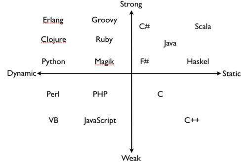

译者：[李秋豪](http://www.cnblogs.com/liqiuhao/) [王一航](https://github.com/wangyihang)

审校：[李秋豪](http://www.cnblogs.com/liqiuhao/)

V1.0 Thu Mar  1 00:49:04 CST 2018

<br />

# Reading 1: 静态检查

#### 今天课程的目标：

- 学习静态类型
- 了解好的软件应该具有的三个属性

<br />

## 冰雹序列

作为一个运行示例，我们先来了解一下“冰雹序列”，它是这样定义的：从正整数n开始，如果n是偶数，则下一个数是n/2，否则下一个数是3n+1，直到n等于1。这里有几个例子：

```
2, 1
3, 10, 5, 16, 8, 4, 2, 1
4, 2, 1
2n, 2n-1 , … , 4, 2, 1
5, 16, 8, 4, 2, 1
7, 22, 11, 34, 17, 52, 26, 13, 40, …? (会停止吗？)
```

由于存在3n+1这种变化，所以序列元素的大小可能会忽高忽低——这也是“冰雹序列”名称的来历，冰雹在落地前会在云层中忽上忽下。那么所有的序列都会最终“落地”变到1吗？（这个猜想称为[考拉兹猜想](https://en.wikipedia.org/wiki/Collatz_conjecture) ，现在还没有一个好的解决方法。）

<br />

## 计算冰雹序列

为了计算冰雹序列里的元素，我们可以在java和python中分别这样写：

```java
// Java
int n = 3;
while (n != 1) {
    System.out.println(n);
    if (n % 2 == 0) {
        n = n / 2;
    } else {
        n = 3 * n + 1;
    }
}
System.out.println(n);
```

```python
# Python
n = 3
while n != 1:
    print(n)
    if n % 2 == 0:
        n = n / 2
    else:
        n = 3 * n + 1
print(n)
```

有些东西值得一提（译者注：MIT大一学的是python，所以这里谈了一下java和python语法上的区别，懂的读者可以略过）：

- Java和Python的基本语法很相似，例如`while` 和 `if` 
- Java在每一个句子结束时要求以分号作为结尾。这看起来有些麻烦，但也给了你很多自由以便安排代码——例如你可以将一行代码写成两行然后以分号结束。
- Java在使用 `if` 和 `while`的时候，其中的条件判断需要用括号括起来。
- Java使用花括号将一个语句块分割开来——python是以缩进作为区分，所以你写一些别的空格符也是可以的。但是编程也是一种交流，你不仅要和编译器交流，还要和别的程序员交流，所以缩进也是必要的，我们在后面的课中会专门讲这个。

<br />

## 类型

在上面的代码中，Python和Java最大的不同就是Java需要指定变量`n`的类型：`int`

**类型**是一些值的集合，以及这些值对应的操作。

在Java中有5种**原始类型** ：

- `int` 例如5和-200这样的整数，但是其范围有限制，大概在±20亿）
- `long` （比int更大范围的整数）
- `boolean`对或错这两个值）
- `double` （浮点数，其表示的是实数的子集）
- `char` （单个字符例如 `'A'` 和 `'$'`）

Java也有**对象类型** ，例如：

- `String` 表示一串连续的字符。
- `BigInteger` 表示任意大小的整数。

从Java的传统来说，原始类型用小写字母，对象类型的起始字母用大写。

**操作符**是一些能接受输入并输出结果的功能。他们的语法各有区别，Java中常见的有下面这三种：

- *前缀、中缀、后缀操作符.* 例如， `a + b` 调用这样一种操作（映射） `+ : int × int → int` 

  ( `+` 是这个操作符的名字, `int × int` 描述了这两个输入, 最后的 `int` 描述的了输出)
- *一个对象的方法.* 例如， `bigint1.add(bigint2)` 调用这样一种操作（映射） `add: BigInteger × BigInteger → BigInteger`.
- *一个函数.* 例如： `Math.sin(theta)` 调用这样一种操作（映射） `sin: double → double`. 注意， `Math` 不是一个对象，它是一个包含`sin`函数的类。

有一些操作符可以对不同类型的对象进行操作，这时我们就称之为**可重载** （**overloaded**），例如Java中的算术运算符 `+`, `-`, `*`, `/` 都是可重载的。一些函数也是可重载的。大多数编程语言都有不容程度的重载性。

<br/>

## 静态类型

Java是一种**静态类型**的语言。所有变量的类型在编译的时候就已经知道了（程序还没有运行），所以编译器也可以推测出每一个表达式的类型。例如，如果`a`和`b`是`int`类型的，那么编译器就可以知道`a+b`的结果也是`int`类型的。事实上，Eclipse在你写代码的时候就在做这些检查，所以你就能够在编辑的同时发现这些问题。

在**动态类型**语言中（例如Python），这种类型检查是**发生在程序运行的时候**。

静态类型是**静态检查**的一种——检查发生在编译的时候。本课程的一个重要目标就是教会你避免bug的产生，静态检查就是我们知道的第一种方法。其中静态类型就阻止了一大部分和类型相关的bug——确切点说，就是将操作符用到了不对应的类型对象上。例如，如果你进行下面这个操作，试图将两个字符串进行算术乘法：

```
    "5" * "6"
```

那么静态类型检查就会在你编辑代码的时候发现这个bug，而不是等到你编译后运行程序的时候（编译也不通过）。

译者注：这里注意不要和强类型和弱类型弄混了，知乎上有一个问答可以参考一下：[弱类型、强类型、动态类型、静态类型语言的区别是什么？](https://www.zhihu.com/question/19918532)



（图片来自知乎）

<br/>

## 静态检查、动态检查、无检查

编程语言通常能提供以下三种自动检查的方法：

- **静态检查**: bug在程序运行前发现
- **动态检查**: bug在程序运行中发现
- **无检查**: 编程语言本身不帮助你发现错误，你必须通过特定的条件（例如输出的结果）检查代码的正确性。

很明显，静态检查好于动态检查好于不检查。

这里有一些“经验法则”，告诉你这静态和动态检查通常会发现什么bug：

**静态检查** :

- 语法错误，例如多余的标点符号或者错误的关键词。即使在动态类型的语言例如Python中也会做这种检查：如果你有一个多余的缩进，在运行之前就能发现它。
- 错误的名字，例如`Math.sine(2)`. (应该是 `sin`.)
- 参数的个数不对，例如 `Math.sin(30, 20)`.
- 参数的类型不对 `Math.sin("30")`.
- 错误的返回类型 ，例如一个声明返回`int`类型函数`return "30";` 

**动态检查** :

- 非法的变量值。例如整型变量x、y，表达式`x/y` 只有在**运行后y为0才会报错**，否则就是正确的。
- 无法表示的返回值。例如最后得到的返回值无法用声明的类型来表示。
- 越界访问。例如在一个字符串中使用一个负数索引。
- 使用一个`null`对象解引用。（`null`相当于Python中的`None`）

静态检查倾向于*类型错误* ，**即与特定的值无关的错误**。正如上面提到过的，一个类型是一系列值的集合，而静态类型就是保证变量的值在这个集合中，但是在运行前我们可能不会知道这个值的结果到底是多少。所以如果一个错误必须要特定的值来“触发”（例如除零错误和越界访问），编译器是不会在编译的时候报错的。

与此相对的，动态类型检查倾向于特定值才会触发的错误。

<br/>

## 原始类型并不是真正的数字！

在Java和许多其他语言中存在一个“陷阱”——原始数据类型的对象在有些时候并不像真正的数字那样得到应有的输出。结果就是本来应该被动态检查发现的错误没有报错。例如：

- **整数的除法**：`5/2`并不会返回一个小数，而是一个去掉小数部分的整数对象，因为除法操作符对两个整数对象运算后的结果还是整数，而整数对象是无法表示`5/2`的精确值的（而我们期望它会是一个动态检查能发现的错误）。
- **整形溢出：  **`int` 和 `long`类型的值的**集合是一个有限集合——它们有最大的值和最小的值**，当运算的结果过大或者过小的时候我们就很可能得到**一个在合法范围内的错误值。**
- **浮点类型中的特殊值：**在浮点类型例如`double`中有一些不是数的特殊值：`NaN` ( “Not a Number”), `POSITIVE_INFINITY` （正无穷）, and `NEGATIVE_INFINITY` （负无穷）.当你对浮点数进行运算的时候可能就会得到这些特殊值（例如除零或者对一个负数开更号），如果你拿着这些特殊值继续做运算，那你可能就会得到一个意想不到结果（译者注：例如拿NaN和别的数进行比较操作永远是False） 。

#### 阅读小练习

下面这些代码都有各自的bug，请你判断它们是静态错误还是动态错误还是无报错，但是得到错误的结果。

1.

```java
int n = 5;
if (n) {
  n = n + 1;
}
```

- [x] 静态错误


- [ ] 动态错误


- [ ] 无报错，但是得到错误的结果

2.

```java
int big = 200000; // 200,000
big = big * big;  // big should be 40 billion now
```

- [ ] 静态错误


- [ ] 动态错误


- [x] 无报错，但是得到错误的结果

3.

```java
double probability = 1/5;
```

- [ ] 静态错误


- [ ] 动态错误


- [x] 无报错，但是得到错误的结果

4.

```java
int sum = 0;
int n = 0;
int average = sum/n;
```

- [ ] 静态错误


- [x] 动态错误


- [ ] 无报错，但是得到错误的结果

5.

```java
double sum = 7;
double n = 0;
double average = sum/n;
```

- [ ] 静态错误


- [x] 动态错误


- [ ] 无报错，但是得到错误的结果

<br />

译者注：下面的四小节讲的是Java语言本身的一些性质，对Java很熟悉的同学可以跳过或略读。

<br />

## 数组和聚集类型

现在让我们把“冰雹序列”的结果存储在数据结构中而不仅仅是输出。在Java中有两种常用的线性存储结构：数组和列表。

数组是一连串类型相同的元素组成的结构，**而且它的长度是固定的（元素个数固定）**。例如，我们声明一个`int`类型的数组：

```java
int[] a = new int[100];
```

对于数组，常用的操作符有下： 

- 索引其中的一个元素： `a[2]`
- 赋予一个元素特定的值： `a[2]=0`
- 求这个数组的长度： `a.length` (注意和 `String.length()` 的区别—— `a.length` 不是一个类内方法调用，你不能在它后面写上括号和参数)

下面是我们利用数组写的第一个求“冰雹序列”的代码，它存在一些bug：

```java
int[] a = new int[100];  // <==== DANGER WILL ROBINSON
int i = 0;
int n = 3;
while (n != 1) {
    a[i] = n;
    i++;  // very common shorthand for i=i+1
    if (n % 2 == 0) {
        n = n / 2;
    } else {
        n = 3 * n + 1;
    }
}
a[i] = n;
i++;
```

相信很快你就能发现错误：幻数100？（译者注：幻数是指那些硬编码的数值）那如果n产生的“冰雹序列”非常长呢？像这样的bug称为越界访问，在Java中能够被动态检查检测出来，但是在C和C++这样的语言中则会造成 [缓冲区溢出](https://en.wikipedia.org/wiki/Buffer_overflow) （能通过编译），这也是很多漏洞的来源。

解决方法是使用`List`类型。列表类型是一个长度可变的序列结构。我们可以这样声明列表：

```java
List<Integer> list = new ArrayList<Integer>();
```

常用的操作符有下：

- 索引一个元素： `list.get(2)`
- 赋予一个元素特定的值： `list.set(2, 0)`
- 求列表的长度： `list.size()`

这里要注意`List`是一个接口，这种类型的对象无法直接用`new`来构造，必须用能够实现`List`要求满足的操作符的方法来构造。我们会在后来讲抽象数据类型的时候具体将价格这个。`ArrayList`是一个实类型的类（concrete type），它提供了`List`操作符的具体实现。当然，`ArrayList`不是唯一的实现方法（还有`LinkedList`  等），但是是最常用的一个）。你可以在Java API的文档里找到很多这方面的信息（Google Java 8 API，这里的API指“应用程序接口”，它会告诉你Java里面实现的很多有用的类和方法）。

另外要注意的是，我们要写`List<Integer>` 而不是 `List<int>`.因为`List`只会处理对象类型而不是原始类型。**在Java中，每一个原始类型都有其对应的对象类型**（原始类型使用小写字母名字，例如`int`，而对象类型的开头字母大写，例如`Integer`）。**当我们使用尖括号参量化一个类型时，Java要求我们使用对象类型而非原始类型**。在其他的一些情况中，Java会自动在原始类型和对等的对象类型之间相转换。例如在上面的代码中我们可以使用`Integer i = 0` 。

下面是用列表写的“冰雹序列”的实现：

```java
List<Integer> list = new ArrayList<Integer>();
int n = 3;
while (n != 1) {
    list.add(n);
    if (n % 2 == 0) {
        n = n / 2;
    } else {
        n = 3 * n + 1;
    }
}
list.add(n);
```

这样实现不仅看起来简洁，更重要的是安全，因为列表会自动扩充它自己以满足新添加的元素（当然，直到你的内存不够用为止）

<br />

## 迭代

对于在一个序列结构（例如列表和数组）遍历元素，Java和Python的写法差不多：

```java
// find the maximum point of a hailstone sequence stored in list
int max = 0;
for (int x : list) {
    max = Math.max(x, max);
}
```

`Math.max()` 是一个Java API提供的方便的函数。你可以在Google中搜索“java 8 Math”获得关于Math这个库的一些详细信息。

<br />

## 方法

在Java中，声明通常必须在一个方法中，而每个方法都要在一个类型中，所以写“冰雹序列”程序最简单可以这么写：

```java
public class Hailstone {
    /**
     * Compute a hailstone sequence.
     * @param n  Starting number for sequence.  Assumes n > 0.
     * @return hailstone sequence starting with n and ending with 1.
     */
    public static List<Integer> hailstoneSequence(int n) {
        List<Integer> list = new ArrayList<Integer>();
        while (n != 1) {
            list.add(n);
            if (n % 2 == 0) {
                n = n / 2;
            } else {
                n = 3 * n + 1;
            }
        }
        list.add(n);
        return list;
    }
}
```

下面介绍一些新的东西。

`public`意味着任何在你程序中的代码都可以访问这个类或者方法。其他的**类型修饰符**，例如`private` ，是用来确保程序的安全性的——它保证了可变类型不会被别处的代码所修改。我们会在后面的课程中详细提到。

`static`意味这这个方法没有`self`这个参数——Java会隐含的实现它，所以你不会看到这个参数。静态的方法不能通过对象来调用，例如`List` `add()` 方法 或者 `String` `length()`方法，它们要求先有一个对象。静态方法的正确调用应该使用类来索引，例如：

```java
Hailstone.hailstoneSequence(83)
```

另外，记得在定义的方法前面写上注释。这些注释应该描述了这个方法的功能，输入输出/返回，以及注意事项。记住注释不要写的啰嗦，而是应该直切要点，简洁明了。例如在上面的代码中，n是一个整型的变量，这个在声明的时候`int`已经体现出来了，就不需要进行注释。但是如果我们设想的本意是n不能为负数，而这个编译器（声明）是不能检查和体现出来的，我们就应该注释出来，方便阅读理解和修改。

这些东西我们会在后面的课程中详细介绍，但是你现在就要开始试着正确使用他们。

<br />

## 变化的值 vs. 可被赋值的改变

在下一篇阅读资料中我们会介绍“快照图”（*snapshot diagrams*），以此来辨别修改一个变量和修改一个值的区别。当你给一个变量赋值的时候，你实际上是在改变这个变量指向的对象（值也不一样）。

而当你对一个可变的值进行赋值操作的时候——例如数组或者列表——你实际上是在改变对象本身的内容。

变化是“邪恶”的，好的程序员会避免可改变的东西，因为这些改变可能是意料之外的。

不变性（Immutability）是我们这门课程的一个重要设计原则。不变类型是指那些这种类型的对象一旦创建其内容就不能被更改的类型（至少外部看起来是这样，我们在后面的的课程中会说一些替代方案）。思考一下在上面的代码中哪一些类型是可更改类型，哪一些不是？（译者注：例如`int`就是不变的，`List`就是可变的，给`int`类型的对象赋值就会让它指向一个新的对象）

Java也给我们提供了不变的索引：只要变量被初始化后就不能再次被赋值了——只要在声明的时候加上`final` ：

```java
final int n = 5;
```

如果编译器发现你的`final`变量不仅仅是在初始化的时候被“赋值”，那么它就会报错。换句话说，`final`会提供不变索引的静态检查。

正确的使用`final`是一个好习惯，就好像类型声明一样，这不仅会让编译器帮助你做静态检查，同时别人读起来也会更顺利一些。

在`hailstoneSequence`方法中有两个变量n和list，我们可以将它们声明为`final`吗？请说明理由。（译者注：n不行，list可以。因为我们需要改变n指向的对象，而`List`对象本身是可以更改的，我们也不需要改变list对应的对象）

```java
public static List<Integer> hailstoneSequence(final int n) { 
    final List<Integer> list = new ArrayList<Integer>();
```

<br />

## 记录你的设想

在文档中写下变量的类型记录了一个关于它的设想, 例如这个变量总是指向一个整型. 在编译的时候 Java 就会检查这个设想, 并且保证在你的代码中没有任何一处违背这个设想。

而使用 `final` 关键字去定义一个变量也是一种记录设想, 要求这个变量在其被赋值之后就永远不会再被修改, Java 也会对其进行静态地检查。

不幸的是 Java 并不会自动检查所有设想，例如:n 必须为正数。

为什么我们需要写下我们的设想呢? 因为编程就是不断的设想, 如果我们不写下他们, 就可能会遗忘掉他们, 而且如果以后别人想要阅读或者修改我们的软件, 他们就会很难理解代码, 不得不去猜测(译者注: 变量的含义/函数的描述/返回值描述等等)

所以在编程的时候我们必须朝着如下两个目标努力：

- 与计算机交流. 首先说服编译器你的程序语法正确并且类型正确, 然后保证逻辑正确, 这样就可以让它在运行的时候给我们正确的结果。
- 与其他人交流. 尽可能使你的程序易于理解, 所以当有人想要在将来某些时候修正它, 改进它或者对其进行适配的时候, 他们可以很方便地实现自己的想法。

<br />

## 黑客派（Hacking） vs. 工程派（Engineering）

我们已经在本门课程中编写了一些黑客风格的代码, 黑客派的编程风格可以理解为“放飞自我并且乐观的”（译者注：贬义）：

- 缺点: 在已经编写大量代码以后才测试它们
- 缺点: 将所有的细节都放在脑子里, 以为自己可以永远记住所有的代码, 而不是将它们编写在代码中
- 缺点: 认为 BUG 都不存在或者它们都非常容易发现和被修复.

而工程派对应的做法是（译者注：褒义）：

- 优点: 一次只写一点点, 一边写一边测试. 在将来的课程中, 我们将会探讨"测试优先编程" (test-first programming)
- 优点: 记录代码的设想、意图 (document the assumptions that your code depends on)
- 优点: 静态代码检查将会保护你的代码不沦为“愚蠢的代码”

#### 阅读小练习

思考下面这个Python片段：

```python
from math import sqrt
def funFactAbout(person):
  if sqrt(person.age) == int(sqrt(person.age)):
    print("The age of " + person.name + " is a perfect square: " + str(person.age))
```

这块代码做了哪些设想（能够正常运行不报错）？

- [x] `person` 一定有 `age` 和 `name` 这两个实例化变量


- [x] `person` 不是 `None`


- [x] `person.age` 不是负数


- [x] `person.age` 是整数


- [x] `person.name` 一定是字符串

如果这串代码用Java来写，下面的哪些设想可以用类型声明来限制，或者能够被编译器静态检查出来？

- [x] `person` 一定有 `age` 和 `name` 这两个实例化变量


- [ ] `person` 不是 `None`


- [ ] `person.age` 不是负数


- [x] `person.age` 是整数


- [x] `person.name` 一定是字符串

<br />

## 本门课程（6.031）的目标

本门课程的主要目标为学习如何生产具有如下属性的软件: 

- **安全健壮性**. 正确性 (现在看起来是正确的), 防御性 (将来也是正确的) 
- **可读性**. 我们不得不和以后有可能需要理解和修改代码的程序员进行交流 (修改 BUG 或者添加新的功能), 那个将来的程序员或许会是几个月或者几年以后的你, 如果你不进行交流, 那么到了那个时候, 你将会惊讶于你居然忘记了这么多, 并且这将会极大地帮助未来的你有一个良好的设计。
- **可改动性**. 软件总是在更新迭代的, 一些好的设计可以让这个过程变得非常容易, 但是也有一些设计将会需要让开发者扔掉或者重构大量的代码。

译者注：

- safe from bugs (SFB),
- easy to understand (ETU),
- ready for change (RFC).

当然也有其他的非常重要的关于软件的性质(例如: 性能, 实用性以及安全性), 并且他们可能会和上述三种性质是互相矛盾的。但是在 6.031 这门课程中, 我们重点关注上述三个重要性质, 并且软件开发者一般情况下会将这三种性质列于软件开发过程中的最重要的性质。

在这门课的学习中, 思考每一种编程语言的特性, 每一次编程练习, 每一个设计模式是非常值得的, 试着理解它们如何和上述三种特性关联起来。

#### 阅读小练习

上文中那些知识点能够帮助你**远离bug** SFB ？

- [x] 动态检查

- [x] 常量（final）

- [ ] 整型溢出

- [x] 静态类型

上文中那些知识点能够帮助你**的代码易于理解和阅读** ETU ？

- [x] documented assumptions in comments

- [x] 常量（final）

- [ ] 整型溢出

- [ ] 静态类型

上文中那些知识点能够帮助你**的代码能够被方便的更改** RFC ？

- [x] documented assumptions in comments

- [ ] 长度固定的数组

- [x] 方法（methods）

<br />

## 我们为什么选择Java作为本课程的编程语言

如果你已经学过了课程 6.009, 我们假设你已经对 Python 语言轻车熟路了, 那么为什么在这门课程中, 我们没有使用 Python 语言而是使用了 Java 呢? 

**安全性**是首要原因, Java 有静态检查机制 (主要检查变量类型, 同时也会检查函数的返回值和函数定义时的返回值类型是否匹配). 我们在这门课中学习软件开发, 而在软件开发中一个主要原则就是远离 BUG, Java 拨号安全性达到了 11 (Java dials safety up to 11), 这让 Java 成为一个非常好的用来进行软件工程实践的语言. 当然, 在其他的动态语言中也可以写出安全的代码, 例如 Python, 但是如果你学习过如何在一个安全的, 具有静态代码检查机制的语言, 你就可以更加容易地理解这一过程。

**普遍性**是另一个原因, Java 在科学研究/教育/工业界广泛被使用. Java 可以在许多平台运行, 不仅仅是 Windows/Mac/Linux. Java 也可以用来进行 web 开发 (不仅可以在服务端使用, 也可以在客户端使用), 而且原生安卓系统也是基于 Java 开发. 尽管其他的编程语言也有更加适合用来进行编程教学 (Scheme 和 ML 浮现在脑海中), 但是令人是让的是这些语言并没有在现实世界中被广泛使用. 你的简历上的 Java 经验将会被认为是一个非常有利的技能. 但是注意请不要理解错了, 你从本门课程中学到的并不是仅限定于 Java 语言, 这些知识是可以被套用在任何编程语言中的. 本门课程中最重要内容: 安全性, 清晰性, 抽象, 工程化的本能, 这些知识将会让你游刃有余地应对各种编程语言的新潮流。

任何情况下, 一个好的程序员必须能**熟练使用多种编程语言**, 编程语言是一种工具, 而你必须使用正确的工具来完成你的工作. 在你完成你在 MIT 的学习生涯之前你肯定会学到其他的编程语言技能 (例如: JavaScript, C/C++, Scheme, Ruby, ML 或者 Haskell) 所以我们正在通过学习第二门语言来入门。

作为普遍性的一个结果, Java 有大量的有趣而且有用的**库** (包括 Java 本身自带的库, 以及在网络上的库), 也有非常多的免费并且完美的**工具** (IDE 例如 Eclipse; 编辑器, 编译器, 测试框架, 性能分析工具, 代码覆盖率检测工具, 代码风格检查工具). 即使是 Python , 它的生态系统也没有 Java 的更加丰富。

后悔使用  Java 的几个原因. 

- 它很啰嗦, 这个特性使得在黑板上写出代码样例是非常麻烦的. 
- 它很臃肿, 在这些年中已经积累了非常多的不同的功能和特性.
- 它存在一些内部矛盾, 例如: `final` 关键字在不同的上下文中会有不同的含义, `static` 关键字在 Java 中和静态代码检查并没有任何关系
- 它受到C / C ++等老式语言的影响, 原始数据类型和 `switch` 语句就是很好的例子
- 它并没有一个像 Python 一样的解释器, 可以允许你在解释器中编写一些短小的测试代码来学习这门语言

但是总体来说, Java 对现在来说还是一款比较适合用来学习如何编写安全的, 易于理解的, 对改变友好的代码的编程语言, 以上就是我们课程的目标；）

<br />

## 总结

我们今天主要介绍的思想为**静态代码检查**, 下面是该思想如何和我们的目标进行关联

- **安全健壮性**. 静态代码检查可以通过捕捉类型错误等其他BUG帮助我们在运行代码之前就发现它们
- **可读性**. 它可以帮助我们理解, 因为所有的类型在代码中被明确定义 (译者注: 相比于 Python/PHP 这类动态变量类型的语言)
- **可改动性**. 静态代码检查可以在你在修改你的代码的时候定位出也需要被修改的地方, 例如: 当你改变一个变量的类型或者名称的时候, 编译器立即就会在所有使用到这个变量的地方显示错误, 提示你也需要更新它们
