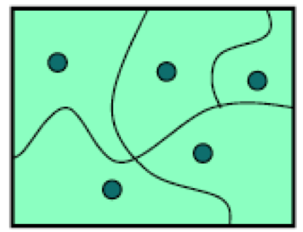
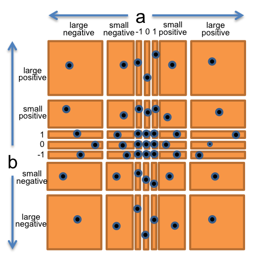
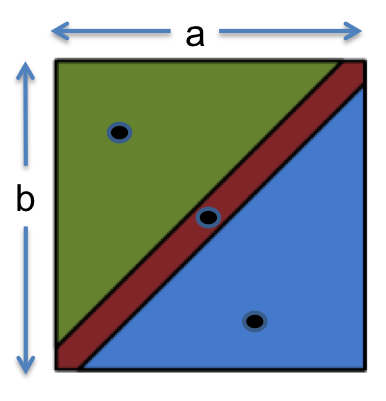

# 测试 (Test)

译者：[李秋豪](http://www.cnblogs.com/liqiuhao/) [江家伟](http://jiangjiawei.pw/blog/)

审校：[李秋豪](http://www.cnblogs.com/liqiuhao/)

```
V1.0 Tue Mar  6 01:54:34 CST 2018
```

#### 本次课程的目标

- 理解测试的意义，并了解“测试优先编程”的过程
- 能够使用“分区”的方法选择合适的输入输出测试用例
- 能够通过代码覆盖率来评价一个测试的好坏
- 理解黑盒/白盒测试、单元/集成测试、自动化回归测试。

<br />

## 验证（Validation）

“测试”是“验证”的一种例子。而验证的目的就是发现程序中的问题，以此提升你对程序正确性的信心。验证包括：

- **形式推理**，即通过理论推理证明程序的正确性。形式推理目前还缺乏自动化的工具，通常需要漫长的手工计算。即使是这样，一些关键性的小程序也是需要被证明的，例如操作系统的调度程序、虚拟机里的字节码解释器，或者是 [文件系统](http://www.csail.mit.edu/crash_tolerant_data_storage).
- **代码审查.** 即让别人仔细的阅读、审校、评价你的代码，这也是发现bug的一个常用方法，我们会在下一个reading里面介绍这种方法。
- **测试**.即选择合适的输入输出用例，通过运行程序检查程序的问题。

即使是最优的验证，程序也不可能达到十全十美，这里列出了一般情况下程序的*剩余缺陷率residual defect rates*(软件发行时存在的bug比率) ，这里的单位是每 kloc (每一千行代码):

- 1 - 10 defects/kloc: 常见的工业级软件。
- 0.1 - 1 defects/kloc: 高质量验证后的软件。例如Java的官方库可能就是这个级别。
- 0.01 - 0.1 defects/kloc: 最高级别、军工/安全关键软件。例如NASA或者像Praxis这样的公司（译者注：1.欧洲著名的电力行业信息化解决方案专家，隶属于世界第三大的电力集团E.ON,总部位于德国。2.美国教师资格证考试 这里不知道说的是第一个还是第二个（体现一下幽默感？））

这看起来让人沮丧，想一想，如果你写了100万行的大型程序，那你很可能没检查出1000个bug！

<br />

### 为什么软件测试很困难

这里有一些在工业界测试产品常用的方法，可是它们在软件行业无法发挥应有的作用。

**尽力测试（尝试所有的可能）：**这通常是不可行的，因为大多数情况下输入空间会非常大，例如仅仅是一个浮点数乘法`a*b` ，其总共的取值就有2^64种可能性！

**随机测试 (试一下看看行不行)：** 这通常难以发现bug，除非这个程序到处都是bug以至于随便一个输入都能崩溃。即使我们修复了测试出来的bug，随机的输入也不能使我们对程序的正确性很确定。

**基于统计方法的测试：**遗憾的是，这种方法对软件不那么奏效。在物理系统里，工程师可以通过特定的方法加速实验的进程，例如在一天的时间里打开关闭一个冰箱门一千次，以此来模拟几年的正常使用，最终得到产品的”失败率“。以后的测试结果也将会集中分布在这个比率左右，工程师们就对这个比率进行进一步的研究。但是**软件的行为通常是离散且不可预测的**。程序可能在上一秒还完全正常的工作，突然就崩溃了，也可能对于大多数输入都没问题，对于一个值就崩溃了（没有预兆，更谈不上失败率，所以很难提前做好监测的准备），例如 [有名的奔腾处理器除法bug](http://www.willamette.edu/~mjaneba/pentprob.html) ，在90亿次的除法中才可能会有一个错误。

综上，我们必须系统而且小心的选择测试用例，这也是下面要讲的。

<br />

#### 阅读小练习

**测试基础**

阿丽亚娜5型火箭，为欧洲空间局研发的民用卫星一次性运载火箭，名称来源于神话人物阿丽雅杜妮（Ariadne）的法语拼写。1996年6月4日，在风和日丽的法属圭亚那太空发射场，阿丽亚娜5型运载火箭首航，计划运送4颗太阳风观察卫星到预定轨道。但在点火升空之后的40秒后，在4000米高空，这个价值5亿美元的运载系统就发生了爆炸，瞬间灰飞烟灭化为乌有。

爆炸原因由于火箭某段控制程序直接移植自阿丽亚娜4型火箭，其中一个需要接收64位数据的变量为了节省存储空间而使用了16位字节，从而在控制过程中产生了整数溢出，导致导航系统对火箭控制失效，程序进入异常处理模块，引爆自毁。

这个故事告诉了我们什么？

- [x] 即使是高度关键性的程序也可能有bug
- [ ] 测试所有可能输入是解决这样的问题的最好办法
- [x] 与很多物理工程学上的系统不同，软件的行为是离散的
- [x] 静态检查有助于发现这个bug

<br />

### 测试应该具备的心态（Putting on Your Testing Hat）

测试需要一个正确的态度：当你在写一个程序的时候，你的心态一定是让这个程序正常运行，但是**作为一个测试者，你应该想方设法让程序崩溃**。

这是一个隐晦但重要的区别，一个优秀的测试员会“挥舞的重锤敲打代码可能有问题的地方”，而不是“小心的呵护它”。

<br />

## 测试优先编程（Test-first Programming）

测试开始的时间应该尽量早，并且要频繁地测试。当你有一大堆未经验证的代码时，不要把测试工作留到最后。把测试工作留到最后只会让调试的时间更久并且调试过程更加痛苦，因为你的代码将会充斥着bug。反之，如果你在编码的过程中就进行测试，情况就会好的多。

在测试优先编程中，测试程序先于代码完成。编写一个函数应该按如下步骤进行：

1. 为函数写一个规格说明。
2. 为上一步的规格说明写一些测试用例。
3. 编写实际代码。一旦你的代码通过了所有你写的测试用例，这个函数就算完成了。

**规格说明**描述了这个函数的输入输出行为。它确定了函数参数的类型和对它们的所有约束（例如`sqrt`函数的参数必须是非负的）。它还定义了函数的返回值类型以及返回值和输入之间的关系。你已经在这门课中对许多问题都查看并使用过规格说明。在代码中，规格说明包括了函数签名和一些描述函数功能的注释。我们将会在接下来的几节课里讨论更多关于规格说明的问题。

先完成测试用例的编写能够让你更好地理解规格说明。规格说明也可能存在问题——不正确、不完整、模棱两可、缺失边界情况。先尝试编写测试用例，可以在你浪费时间实现一个有问题的规格说明之前发现这些问题。

<br />

## 通过分区的方法选择测试用例

选择合适的测试用例是一个具有挑战性但是有缺的问题。我们即希望测试空间足够小，以便能够快速完成测试，又希望测试用例能够验证尽可能多的情况。



为了达到这个目的，我们可以先将输入空间划分为几个**子域（subdomains）** ，每一个子域都是一类相似的数据。如上图所示，我们在每个子域中选取一些数据，它们合并起来就是我们需要的输入用例。

分区背后的原理在于同一类型的数据在程序中的行为大多类似，所以我们可以用一小部分代表整体的行为。这个方法的优点在于强迫程序相应输入空间里的不同地方，有效的利用了测试资源。

如果我们要确保测试的输出能够覆盖输出空间的不同地方，也可以将输出空间划分为几个子域（哪些输出代表程序发生了相似的行为）。大多数情况下，对输入分区就足够了

#### 例子1: `BigInteger.multiply()`

现在让我们来看一个例子。 [`BigInteger`](http://docs.oracle.com/javase/8/docs/api/?java/math/BigInteger.html) 是Java库中的一个类，它能够表示任意大小的整数。同时，它有一个`multiply` 方法，能够对两个BigInteger类型的值进行相乘操作：

```java
/**
 * @param val another BigInteger
 * @return a BigInteger whose value is (this * val).
 */
public BigInteger multiply(BigInteger val)
```

例如，计算ab的值：

```java
BigInteger a = ...;
BigInteger b = ...;
BigInteger ab = a.multiply(b);
```

这个例子显示即使只有一个参数，这个操作实际上有两个操作符：你调用这个方法所在的对象（上面是`a` ），以及你传入的参数（上面是`b` ）。（在`Python`中，接受方法调用的对象会显式以`self`被声明。在Java中你不需要声明这个对象，它隐式的被称作`this` ）我们可以把 `multiply` 看成一个有两个参数的方法，参数的类型是 `BigInteger` ，并且输出的类型也是 `BigInteger` 即： 

**multiply : BigInteger × BigInteger → BigInteger**

所以我们的输入空间是二维的，用二维点阵(a,b)表示。现在我们对其进行分区，想一想乘法是怎么工作的，我们可以将点阵初步分为以下四个区：

- a和b都是正整数
- a和b都是负整数
- a是正整数，b是负整数
- b是正整数，a是负整数

这里也有一些特殊的情况要单独分出来：0 1 -1

- a或b是1\\0\\-1

最后，作为一个认真的测试员，我们还要想一想BigInteger的乘法可能是怎么运算的：它可能在输入数据绝对值较小时使用 `int` 或 `long` ，这样运算起来快一些，只有当数据很大时才会使用更费劲的存储方法（例如列表）。所以我们也应该将对数据的大小进行分区：

- a或b较小
- a或b的绝对值大于`Long.MAX_VALUE` ，即Java原始整型的最大值，大约是2^63。

现在我们可以将上面划分的区域整合起来，得到最终划分的点阵：



- 0
- 1
- -1
- 较小正整数
- 较小负整数
- 大正整数
- 大负整数

所以我们一共可以得到 7 × 7 = 49 个分区，它们完全覆盖了a和b组成的所有输入空间。然后从这个”栅栏“里的每个区选取各自的测试用例，例如：

- (a,b) = (-3, 25) 代表 (小负整数, 小正整数)
- (a,b) = (0, 30) 代表  (0, 小正整数）
- (a,b) = (2^100, 1) 代表 (大正整数, 1)
- 等等

#### 例子2: `max()`

现在我们看看Java库中的另一个例子:针对整数`int `的`max()` 函数，它属于 [`Math`](http://docs.oracle.com/javase/8/docs/api/java/lang/Math.html) 类：

```java
/**
 * @param a  an argument
 * @param b  another argument
 * @return the larger of a and b.
 */
public static int max(int a, int b)
```

和上面的例子一样，我们先分析输入空间：

**max : int × int → int** （译者注：这里的乘号不代表乘法，而是一种封闭的二元运算关系，参见近世代数）



通过描述分析，我们可以将其分区为：

- a < b
- a = b
- a > b

所以可以选择以下测试用例：

- (a, b) = (1, 2) 代表 a < b
- (a, b) = (9, 9) 代表 a = b
- (a, b) = (-5, -6) 代表 a > b

### 注意分区之间的“边界”

bug经常会在各个分区的边界处发生，例如：

- 在正整数和负整数之间的0
- 数字类型的最大值和最小值，例如 `int` 和 `double` 
- 空集，例如空的字符串，空的列表，空的数组
- 集合类型中的第一个元素或最后一个元素

为什么这些边界的地方经常产生bug呢？一个很重要的原因就是程序员经常犯**“丢失一个（off-by-one mistakes）”**的错误。例如将`<=`写成`<` ，或者将计数器用0来初始化而不是1。另外一个原因就是边界处的值可能需要用特殊的行为来处理，例如当`int`类型的变量达到最大值以后，再对其加正整数反而会变成负数。

所以，我们在分区后，测试用例不要忘了加上边界上的值，现在重新做一下上面那个例子：

**max : int × int → int**.

分区:

- a与b的关系
  - a < b
  - a = b
  - a > b
- a的值
  - a = 0
  - a < 0
  - a > 0
  - a = 最小的整数
  - a = 最大的整数
- value of b
  - b = 0
  - b < 0
  - b > 0
  - b = 最小的整数
  - b = 最大的整数

现在我们再次选取测试用例覆盖上面的分区和边界值：

- (1, 2) 代表 a < b, a > 0, b > 0
- (-1, -3) 代表 a > b, a < 0, b < 0
- (0, 0) 代表 a = b, a = 0, b = 0
- (Integer.MIN_VALUE, Integer.MAX_VALUE) 代表 a < b, a = minint, b = maxint
- (Integer.MAX_VALUE, Integer.MIN_VALUE) 代表 a > b, a = maxint, b = minint

### 覆盖分区的两个极限情况

在分区后，我们可以选择“尽力（how exhaustive we want）”的程度来测试我们的分区，这里有两个极限情况：

- **完全笛卡尔乘积**
  即对每一个存在组合都进行测试。例如在第一个例子`multiply`中，我们一共使用了 7 × 7 = 49 个测试用例，每一个组合都用上了。对于第二个例子，就会是 3 × 5 × 5 = 75个测试用例。要注意的是，实际上有一些组合是不存在的，例如 a < b, a=0, b=0。
- **每一个分区被覆盖即可** 
  即每一个分区至少被覆盖一次。例如我们在第二个例子`max`中只使用了5个测试用例，但是这5个用例覆盖到了我们的三维输入空间的所有分区。

在实际测试中我们通常在这两个极限中折中，这种折中是基于人们的经验，对代码的获取度（黑白盒测试）、以及对代码的覆盖率，这些我们会在后面讲到。

#### 阅读小练习

**分区**

思考下面这个规格说明：

```java
/**
 * Reverses the end of a string.
 *
 *                          012345                     012345
 * For example: reverseEnd("Hello, world", 5) returns "Hellodlrow ,"
 *                               <----->                    <----->
 *
 * With start == 0, reverses the entire text.
 * With start == text.length(), reverses nothing.
 *
 * @param text    non-null String that will have its end reversed
 * @param start   the index at which the remainder of the input is reversed,
 *                requires 0 <= start <= text.length()
 * @return input text with the substring from start to the end of the string reversed
 */
public static String reverseEnd(String text, int start)
```

对于 `start` 参数进行测试，下面的哪一个分区是合理的 ?

- [ ] start = 0, start = 5, start = 100
- [ ] start < 0, start = 0, start > 0
- [x] start = 0, 0 < start < text.length(), start = text.length()
- [ ] start < text.length(), start = text.length(), start > text.length()

译者注：要特别注意的是，本文谈到的**都是对程序正确性进行测试，即输入都是规格说明里面的合法值**。至于那些非法的值则是对鲁棒性（robust）或者安全性的测试。

对于 `text` 参数进行测试，下面的哪一个分区是合理的 ?

- [ ] text 包含一些数字; text不包含字母, 但是包含一些数字; text 既不包含字母，也不包含数字
- [ ] text.length() = 0; text.length() > 0
- [x] text.length() = 0; text.length()-start 是奇数; text.length()-start 是偶数（译者注，这个选项是第二个的超集，多的地方在于奇数偶数的判断，原因在于如果一个字符串字符的个数是奇数个，那么中间的那个字符就不需要移动位置了，这可能需要特殊的行为来处理，也可能是bug产生的原因）
- [ ] 测试0到100个字符的所有字符串

<br />

## 用JUnit做自动化单元测试

一个良好的测试程序应该测试软件的每一个模块（方法或者类）。如果这种测试每次是对一个孤立的模块单独进行的，那么这就称为“单元测试”。单元测试的好处在于debug，如果你发现一个单元测试失败了，那么bug很可能就在这个单元内部，而不是软件的其他地方。

[JUnit](http://junit.org/junit4/) 是Java中一个被广泛只用的测试库，我们在以后的课程中也会大量使用它。一个JUnit测试单元是以一个方法（method）写出的，其首部有一个 `@Test`声明。一个测试单元通常含有对测试的模块进行的一次或多次调用，同时会用断言检查模块的返回值，比如 `assertEquals`, `assertTrue`, 和 `assertFalse`.i

例如，我们对上面提到的 `Math.max()` 模块进行测试，JUnit就可以这样写：

```java
@Test
public void testALessThanB() {
    assertEquals(2, Math.max(1, 2));
}

@Test
public void testBothEqual() {
    assertEquals(9, Math.max(9, 9));
}

@Test
public void testAGreaterThanB() {
    assertEquals(-5, Math.max(-5, -6));
}
```

要注意的是 `assertEquals` 的参数顺序很重要。它的第一个应该是我们期望的值，通常是一个我们算好的常数，第二个参数就是我们要进行的测试。如果你把顺序弄反了，JUnit可能会输出一些奇怪的错误报告。记住， [所有JUnit支持的断言](http://junit.org/junit4/javadoc/latest/org/junit/Assert.html) 都要写成这个顺序：第一个是期望值，第二个是代码测试结果。

如果一个测试断言失败了，它会立即返回，JUnit也会记录下这次测试的失败。一个测试类可以有很多 `@Test` 方法，它们可以各自独立的进行测试，即使有一个失败了，其它的测试也会继续进行。

<br />

## 写下你的测试策略

现在假设我们要测试`reverseEnd`这个模块：

```java
/**
 * Reverses the end of a string.
 *
 * For example:
 *   reverseEnd("Hello, world", 5)
 *   returns "Hellodlrow ,"
 *
 * With start == 0, reverses the entire text.
 * With start == text.length(), reverses nothing.
 *
 * @param text    non-null String that will have
 *                its end reversed
 * @param start   the index at which the
 *                remainder of the input is
 *                reversed, requires 0 <=
 *                start <= text.length()
 * @return input text with the substring from
 *               start to the end of the string
 *               reversed
 */
static String reverseEnd(String text, int start)
```

我们应该在测试时记录下我们的测试策略，例如我们是如何分区的，有哪些特殊值、边界值等等：

```java
/*
 * Testing strategy
 *
 * Partition the inputs as follows:
 * text.length(): 0, 1, > 1
 * start:         0, 1, 1 < start < text.length(),
 *                text.length() - 1, text.length()
 * text.length()-start: 0, 1, even > 1, odd > 1
 *
 * Include even- and odd-length reversals because
 * only odd has a middle element that doesn't move.
 *
 * Exhaustive Cartesian coverage of partitions.
 */
```

另外，每一个测试方法都要有一个小的注解，告诉读者这个测试方法是代表我们测试策略中的哪一部分，例如：

```java
// covers test.length() = 0,
//        start = 0 = text.length(),
//        text.length()-start = 0
@Test public void testEmpty() {
    assertEquals("", reverseEnd("", 0));
}
```

#### 阅读小测试

假设你在为 `max(int a, int b)` 写测试，它是属于`Math.java`的. 并且你将JUnit测试放在 `MathTest.java`文件中.

下面这些文字说明应该分别放在哪里？

**关于 `a` 参数的分区策略**

- [ ] 写在 `Math.java`开头的注释里

- [x] 写在 `MathTest.java`开头的注释里

- [ ] 写在 `max()` 开头的注释里

- [ ] 写在JUnit测试的注释里

**属性 `@Test`**

- [ ] 在 `Math` 之前

- [ ] 在 `MathTest` 之前

- [ ] 在`max()` 之前

- [x] 在 JUnit 测试之前

**注释 “代表 a < b”**

- [ ] 写在 `Math.java`开头的注释里

- [ ] 写在 `MathTest.java`开头的注释里

- [ ] 写在 `max()` 开头的注释里

- [x] 写在JUnit测试的注释里

**注释 “@返回a和b的最大值”**

- [ ] 写在 `Math.java`开头的注释里

- [ ] 写在 `MathTest.java`开头的注释里

- [x] 写在 `max()` 开头的注释里

- [ ] 写在JUnit测试的注释里

<br />

## 黑盒测试与白盒测试

回想上面提到的：*规格说明*是对函数行为的描述——参数类型、返回值类型和对它们的约束条件以及参数和返回值之间的关系。

**黑盒测试**意味着只依据函数的规格说明来选择测试用例，而不关心函数是如何实现的。这也是到目前为止我们的例子里一直在做的。我们在没有看实际代码的情况下分段并且寻找`multiply`和`max`的边界。

**白盒测试** 的意思是在考虑函数的实际实现方法的前提下选择测试用例。比如说，如果函数的实现中，对不同的输入采用不同的算法，那么你应该根据这些不同的区域来分类（译者注：将输入分为不同的类，每类输入将会触发代码实现中的一种处理算法）。如果代码实现中维护一个内部缓存来记录之前得到的输入的答案，那你应该测试重复的输入。

在做白盒测试时。你必须注意：你的测试用例不需要尝试规格说明中没有明确要求的实现行为。例如，如果规格说明中说“如果输入没有格式化，那么将抛出异常”，那么你不应该*特地*的检查程序是否抛出`NullPointerExpection`异常，因为当前的代码实现决定了程序有可能抛出这个异常。在这种情况下，规格说明允许任何异常被抛出，所以你的测试用例同样应该“宽容”地保留实现者的自由。我们将会在这门课接下来的课时中讨论更多关于规格说明的问题。

#### 阅读小练习

**黑盒测试 vs. 白盒测试**

思考下面这个方法：

```java
/**
 * Sort a list of integers in nondecreasing order.  Modifies the list so that 
 * values.get(i) <= values.get(i+1) for all 0<=i<values.length()-1
 */
public static void sort(List<Integer> values) {
    // choose a good algorithm for the size of the list
    if (values.length() < 10) {
        radixSort(values);
    } else if (values.length() < 1000*1000*1000) {
        quickSort(values);
    } else {
        mergeSort(values);
    }
}
```

下面哪一个是白盒测试中产生的边界值？

- [ ] `values = []` (the empty list)
- [ ] `values = [1, 2, 3]`
- [x] `values = [9, 8, 7, 6, 5, 4, 3, 2, 1, 0]`
- [ ] `values = [0, 0, 1, 0, 0, 0, 0]`

<br />

## 覆盖率

一种判断测试的好坏的方法就是看该测试对软件的测试程度。这种测试程度也称为“覆盖率”。以下是常见的三种覆盖率：

- **声明覆盖率**: 每一个声明都被测试到了吗？
- **分支覆盖率**:对于每一个`if` 或 `while` 等等控制操作，它们的分支都被测试过吗？
- **路径覆盖率**: 每一种分支的组合路径都被测试过吗？

其中，分支覆盖率要比声明覆盖率严格（需要更多的测试），路径覆盖率要比分支覆盖率严格。在工业界，100%的声明覆盖率一个普遍的要求，但是这有时也是不可能实现的，因为会存在一些“不可能到达的代码”（例如有一些断言）。100%的分支覆盖率是一种很高的要求，对于军工/安全关键的软件可能会有此要求 (e.g., [MC/DC](https://en.wikipedia.org/wiki/Modified_condition/decision_coverage), modified condition/decision coverage)。不幸的是，100%的路径覆盖率是不可能的，因为这会让测试用例空间以指数速度增长。

一个标准的方法就是不断地增加测试用例直到覆盖率达到了预定的要求。在实践中，声明覆盖通常用覆盖率工具进行计数。利用这样的工具，白盒测试会变得很容易，你只需要不断地调整覆盖的地方，直到所有重要的声明都被覆盖到。


在Eclipse中有一个好用的代码覆盖率工具 [EclEmma](http://www.eclemma.org/) 。如上图所示，EclEmma会将被执行过的代码用绿色标出，没有被执行的代码用红色标出。对于一个分支语句，如果它的一个分支一直没有被执行，那么这个分支判断语句会被标为黄色。例如上图中，我们发现`for`循环中的`if`语句每一次都是假的，我们下一步要做的就是调整测试用例使得这个判断可以为真。

#### 阅读小练习

**使用覆盖率工具**

对于现在的Eclipse， [EclEmma](http://www.eclemma.org/) 已经安装了，我们直接使用即可。

现在我们创建一个类 `Hailstone.java` 

```java
public class Hailstone {
  public static void main(String[] args) {
    int n = 3;
    while (n != 1) {
        if (n % 2 == 0) {
            n = n / 2;
        } else {
            n = 3 * n + 1;
        }
    }
  }
}
```

利用[EclEmma](http://www.eclemma.org/) 运行main函数， Run → Coverage As → Java Application.并改变n的初始化值，观察[EclEmma](http://www.eclemma.org/) 标出行颜色的变化。

**当`n = 3`时，`n = n/2`这一行是什么颜色 ?**

绿

**当`n = 16`时，`n = 3 * n + 1`这一行是什么颜色 ?**

红

**当`n`的初始值是多少时，行`while (n != 1)`会变成黄色 ?**

1

<br />

## 单元测试 vs. 集成测试和桩（Stubs）

我们已经讨论过“单元测试”——对孤立的模块进行测试。这使得debugging变得简单，当一个单元测试报错是，我们只需要在这个单元找bug，而不是在整个程序去找。

与此相对应的，“集成测试”是对于组合起来的模块进行测试，甚至是整个程序。如果集成测试报错，我们就只能在大的范围去找了。但是这种测试依然是必要的，**因为程序经常由于模块之间的交互而产生bug**。例如，一个模块的输入是另一个模块的输出，但是设计者在设计模块的时候将输入输出类型弄错了。另外，如果我们已经做好单元测试了，即我们可以确性各个单元独立的正确性，我们的搜索bug的范围也会小很多。

下面假设你在设计一个搜索引擎。其中有两个模块 `getWebPage()`, `extractWords()` ，其中 `getWebPage()`负责下载网页，`extractWords()` 负责将页面内容拆成一个个词汇：

```java
/** @return the contents of the web page downloaded from url 
 */
public static String getWebPage(URL url) {...}

/** @return the words in string s, in the order they appear, 
 *          where a word is a contiguous sequence of 
 *          non-whitespace and non-punctuation characters 
 */
public static List<String> extractWords(String s) { ... }
```

而这两个模块又是被另一个模块 `makeIndex()`作为网络爬虫的一部分使用的：

```java
/** @return an index mapping a word to the set of URLs 
 *          containing that word, for all webpages in the input set 
 */
public static Map<String, Set<URL>> makeIndex(Set<URL> urls) { 
    ...
    for (URL url : urls) {
        String page = getWebPage(url);
        List<String> words = extractWords(page);
        ...
    }
    ...
} 
```

我们的测试可以分为：

- 对`getWebPage()`进行单元测试，输入不同的 URLs
- 对`extractWords()`进行单元测试，输入不同的字符串
- 对 `makeIndex()` 进行单元测试，输入不同的 URLs

测试员有时会犯这样一个错误：`extractWords()` 的测试用例依赖于`getWebPage()` 的正确性。正如前面所提到的，单元测试应该尽可能将模块孤立起来。如果我们在对`extractWords()` 的测试输入进行分区后，其值中包含有 `getWebPage()` 的输出，**那么如果`getWebPage()` 本身就有bug，程序的测试将变得不可信**！正确的做法应该是先组建好独立的测试用例，例如一些下载好的网页，将其作为测试用例进行测试。

注意到 `makeIndex()` 的单元测试并不能完全孤立，因为我们在测试它的时候实际上也测试了它调用的模块。如果测试失败，这些bug也可能来自于它调用过的模块之中——这也是为什么我们要先单元测试 `getWebPage()` 和 `extractWords()` ，这样一来我们就能确定bug出现在链接这些模块的代码之中。

如果我们要做更高于 `makeIndex()`这一层的测试，我们将它调用的模块写成**桩** 。例如，一个 `getWebPage()` 的桩不会真正去访问网页，而是返回一个预先设置好的网页（mock web page），不管参数URL是什么。一个类的桩通常被称为“模拟对象”（ mock object）。在构建大型系统的时候桩是一种重要的手段，但是在本门课程中我们不会使用它。


译者注：关于mocks、stubs、fakes这些概念，可以参考：

- https://en.wikipedia.org/wiki/Mock_object
- [软件测试中Mock和Stub](http://blog.csdn.net/wangjianno2/article/details/52177481)

<br />

## 自动化测试和回归测试

没有什么能比自动化更能让测试简单的东西了。**自动化测试（Automated testing）**是指自动地运行测试对象，输入对应的测试用例，并记录结果的测试。

能够进行自动化测试的代码称作测试驱动（test driver，也被称作test harness 或者 test runner）。一个测试驱动不应该在测试的时候停下来等待你的输入，而是自动调用模块输入测试用例进行测试，最后的结果应该是“测试完成，一切正常”或者“这些测试发了报错：.....”。一个好的测试架构，例如JUnit，允许你构建这样的测试驱动。

注意到自动化测试架构比如JUnit让测试变得简单，但是你还是要自己去构建好的测试用例。“自动化生成测试用例”是一个很难的问题，目前还处于活跃的研究之中。

要特别注意的是，当你修改你的代码后，别忘了重新运行之前的自动化测试。软件工程师经常遭遇修改大型/复杂程序所带来的痛苦，不论是修改一个bug、增加一个新的功能、优化一段代码的性能，都有可能带来新的问题。无论什么时候，自动化测试都能保证软件最重要的底线——行为和结果是正确的，即使只是一小段测试。我们称修改代码带来新的bug的现象为“回归”，而在修改后重新运行所有的测试称为“回归测试”。

一个好的测试应该是能发现bug的，你应该不断的充实你的测试用例。所以无论什么时候修改了一个bug，记得将导致bug的输入添加到你的测试用例里，并在以后的回归测试中去使用它——毕竟这个bug已经出现了，说明它可能是一个很容易犯的错误。

这些思想也是“测试优先debugging”的核心，当bug出现时，立刻将触发bug的输入存放到测试用例中，当你修复bug后，再次运行**这些** （译者注：注意不仅是触发bug的输入）测试，如果它们都通过的话，你的debug也就完成了。

在实践中，自动化测试和回归测试通常结合起来使用。因为回归测试只有自动化才可行（不然大量的测试没法实现）。反过来，如果你已经构建了自动化测试，你通常也会用它来防止回归的发生。所以**自动化回归测试(automated regression testing)**是软件工程里的一个“最佳实践”（best-practice）。

#### 阅读小练习

**回归测试**

以下哪一个选项是对回归测试的最好定义 ?

- [x] 当你改变代码后应该再次进行测试

- [ ] 代码的每一个模块都应该有能够完全测试它的测试

- [ ] 测试应该在写代码之前完成，以此来检查你写的规格说明

- [ ] 当新的测试报错时，你应该重新运行之前的所有版本的代码直到找到开始引入这个bug的版本。


**自动化测试**

什么情况下应该重新运行所有的 JUnit 测试?

- [x] 在使用 git add/commit/push之前

- [x] 在优化一个函数的性能后

- [ ] 在使用覆盖率工具时

- [x] 在修改一个bug后


**测试方法**

以下哪一些方法/思想对于“测试优先编程”中未写代码之前选择测试用例是有帮助的？

- [x] 黑盒
- [ ] 回归
- [ ] 静态类型
- [x] 分区
- [x] 分区边界
- [ ] 白盒
- [ ] 覆盖率


<br />

## 总结

在这个reading中，我们学到了以下知识：

- 测试优先编程——在写代码前先写好测试用例，尽早发现bug。
- 利用分区与分区边界来选择测试用例。
- 白盒测试与声明覆盖率。
- 单元测试——将测试模块隔离开来。
- 自动化回归测试杜绝新的bug产生。

还记得好软件具备的三个属性吗？试着将它们和这篇reading的内容联系起来：

- **远离bug** 测试的意义在于发现程序中的bug，而“测试优先编程”的价值在于尽可能早的发现这些bug。
- **易读性** 额.......测试并不会使代码审查变得容易，但是我们也要注意正确书写测试注释。
- **可改动性** 我们针对改动后的程序进行测试时只需要依赖规格说明中的行为描述。（译者注：再说一遍，这里的测试针对的是正确性而不是鲁棒性）。另外，当我们完成修改后，自动化回归测试能够帮助我们杜绝新的bug产生。
