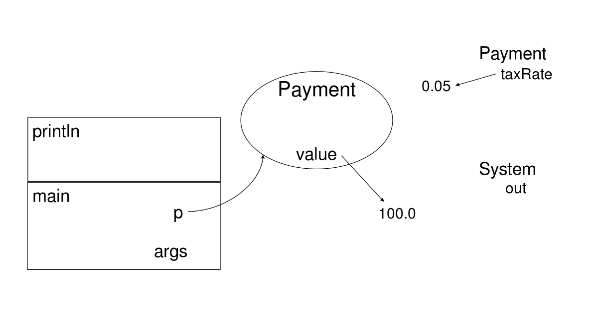

**本文内容来自[MIT_6.031_sp18: Software Construction](http://web.mit.edu/6.031/www/sp18/)课程的Readings部分，采用[CC BY-SA 4.0](http://creativecommons.org/licenses/by-sa/4.0/)协议。**

由于我们学校（哈工大）大二软件构造课程的大部分素材取自此，也是推荐的阅读材料之一，于是打算做一些翻译工作，自己学习的同时也能帮到一些懒得看英文的朋友。另外，该课程的阅读资料中有许多练习题，但是没有标准答案，所给出的答案均为译者所写，有错误的地方还请指出。

<br />

------

<br />

译者：[李秋豪](http://www.cnblogs.com/liqiuhao/)

审校：

V1.0 Thu Mar  8 22:58:41 CST 2018

<br />

#### 本次课程的目标

- 代码评审：阅读并讨论别人写的代码。
- 好代码的书写原则：你在代码评审的过程中应遵循的标准，不管编程目的或编程语言是什么。

<br />

## 代码评审

代码评审是一种系统的对别人代码的研究，和论文审校很类似。

代码评审有两个主要目的：

- **提升代码质量。** 找出存在及潜在的bug，分析代码的清晰度以及代码是否严格遵循了当前工程的标准。
- **提升程序员的水平。** 代码评审是提升程序员水平的一个重要方法，通过它可以学习到语言新的特性、工程上新的设计以及一些新的实现方法。特别是在开源项目中，很多交流都是在代码评审这种环境下进行的。

代码评审已经在开源项目中运用很深了，例如Apache 和 [Mozilla](http://blog.humphd.org/vocamus-1569/?p=1569). 同样的，代码评审在工业界也应用很广，在Google，如果你的代码没有另一个程序员的评审签字，你是没办法将它提交的。

在本课程中，我们会在“Problem sets”环节上进行一系列的代码评审，详细的信息可参考 [Code Reviewing document](http://web.mit.edu/6.031/www/sp18/general/code-review.html) 。（译者注：这是MIT要求学生之间相互进行代码评审并打分。我们学校没有进行这项活动）

### 风格标准

大多数公司或者大的项目都会要求代码风格具有统一的标准。这些标准可能会非常细化，例如缩进应该是几个空格，花括号应该怎么对齐。这些问题上的争论通常会导致 [神圣的战争](http://www.outpost9.com/reference/jargon/jargon_23.html#TAG897) （译者注：例如vim和emacs哪一个更好），毕竟它们关乎于个人的口味或者审美观。

在本门课程中，我们对代码风格没有一个统一的要求。如果你是刚开始写Java，我们推荐你遵循 [Google Java Style](http://google.github.io/styleguide/javaguide.html) ，它在工业界运用的很广，可读性也不错，例如：

```java
if (isOdd(n)) {    
    n = 3*n + 1;
}
```

- 在关键词(`if`)后面留空格，但是在函数调用(`isOdd`)后不留空格
- 在行的末尾写`{` ，而 `}` 自己单独一行
- 无论是空块还是只有一行，都要用`{`…`}`包括起来

不过，我们不会要求你遵循花括号的放置风格，毕竟每个程序员都有自己的口味。但是要注意，一旦遵循某一种风格后就要一直这样写，不要一会这样一会那样。同时，应该优先遵守所在项目规定的风格，如果你在进行代码评审的时候擅自改动别人的代码风格，你的搭档会恨死你的；）总之，团队合作优先。

同时，有一些代码风格是跟我们这门课程的三个目标息息相关的（译者注：远离bug、易读性、可改动性），它们可不止花括号放在哪这么简单。这篇阅读的剩下部分将探讨这些规则，而你在进行代码评审或是自己写代码的时候也应该注意这些规则。但是，代码评审可不仅仅是看别人的代码风格，我们在后续的课程还会讲到很多别的事情，例如规格说明、抽象数据类型、并发编程和线程安全等等，这些都是代码评审的原材料。

<br />

## 难闻的（Smelly）例子 #1

程序员通常会将差代码描述为“难闻的”（bad smell）。“代码卫生”（Code hygiene）则是另一个描述这方面的词。现在让我从一个“难闻的”代码开始吧：

```java
public static int dayOfYear(int month, int dayOfMonth, int year) {
    if (month == 2) {
        dayOfMonth += 31;
    } else if (month == 3) {
        dayOfMonth += 59;
    } else if (month == 4) {
        dayOfMonth += 90;
    } else if (month == 5) {
        dayOfMonth += 31 + 28 + 31 + 30;
    } else if (month == 6) {
        dayOfMonth += 31 + 28 + 31 + 30 + 31;
    } else if (month == 7) {
        dayOfMonth += 31 + 28 + 31 + 30 + 31 + 30;
    } else if (month == 8) {
        dayOfMonth += 31 + 28 + 31 + 30 + 31 + 30 + 31;
    } else if (month == 9) {
        dayOfMonth += 31 + 28 + 31 + 30 + 31 + 30 + 31 + 31;
    } else if (month == 10) {
        dayOfMonth += 31 + 28 + 31 + 30 + 31 + 30 + 31 + 31 + 30;
    } else if (month == 11) {
        dayOfMonth += 31 + 28 + 31 + 30 + 31 + 30 + 31 + 31 + 30 + 31;
    } else if (month == 12) {
        dayOfMonth += 31 + 28 + 31 + 30 + 31 + 30 + 31 + 31 + 30 + 31 + 31;
    }
    return dayOfMonth;
}
```

接下来的几节都会围绕这一代码段展开。

<br />

## 别写重复的代码（Don’t Repeat Yourself）

重复的代码很不安全。如果你在两个地方放置了相似的代码，那么一个最基本的风险就是如果一处出现了bug，另一处也非常可能有bug。而修复的时候经常只会修复一个地方而忽略了另一个地方。

避免重复就像你过马路的时候要避免被车撞一样。赋值-粘贴在编程中是一个很大的诱惑，而你在使用它的时候，“皮肤应该感觉到危险而震颤”。（译者注：这描述也是醉了）

别重复代码（[Don’t Repeat Yourself](http://en.wikipedia.org/wiki/Don't_repeat_yourself),）简称为DRY，现在已经成为了编程人员的一句咒语。

译者注（来自维基百科）：

> **一次且仅一次**（**once and only once**，简称**OAOO**）又称为**Don't repeat yourself**（不要重复你自己，简称**DRY**）或**一个规则，实现一次**（**one rule, one place**）是[面向对象编程](https://zh.wikipedia.org/wiki/%E9%9D%A2%E5%90%91%E5%AF%B9%E8%B1%A1%E7%BC%96%E7%A8%8B)中的基本原则，程序员的行事准则。旨在软件开发中，减少重复的信息。
>
> DRY的原则是──系统中的每一部分，都必须有一个单一的、明确的、权威的代表──指的是（由人编写而非机器生成的）代码和测试所构成的系统，必须能够表达所应表达的内容，但是不能含有任何重复代码。当DRY原则被成功应用时，一个系统中任何单个元素的修改都不需要与其逻辑无关的其他元素发生改变。此外，与之逻辑上相关的其他元素的变化均为可预见的、均匀的，并如此保持同步。
>
> 其起源已经不可考，一般认为这个原则最初由Andy Hunt和Dave Thomas在他们的书[The Pragmatic Programmer](http://book.douban.com/subject/1417047/)中提出。因为[极限编程](https://zh.wikipedia.org/wiki/%E6%9E%81%E9%99%90%E7%BC%96%E7%A8%8B)方法的创始者之一[肯特·贝克](https://zh.wikipedia.org/wiki/%E8%82%AF%E7%89%B9%C2%B7%E8%B2%9D%E5%85%8B)总结和宣传而使其广为人知。
>
> 违反**DRY**原则的解决方案通常被称为**WET**，其有多种全称，包括“write everything twice”（在每个地方写两次）、“we enjoy typing”（我们就是喜欢打字）或“waste everyone's time”（浪费大家的时间）。

上面 `dayOfYear` 这个例子充满了重复的代码，你能够试着将它们修复吗？

#### 阅读小练习

在 `dayOfYear()` 有一种重复是数值的重复，请问在 `dayOfYear()` 一共出现了几次四月份的天数？

9

正如上面所提到的，重复的代码会给修复带来麻烦，如果我们的日历讲二月份改为30天而不是28天，这段代码一共要修改几处？

10

另一种重复是代码 `dayOfMonth+=`的重复。假设你建立了一个数组：`int[] monthLengths = new int[] { 31, 28, 31, 30, ..., 31}` ，以下哪一种语句架构能够帮助你DRY，使得 `dayOfMonth+=` 仅出现一次呢？

- [x] `for (int m = 1; m < month; ++m) { ... }`
- [ ] `switch (month) { case 1: ...; break; case 2: ...; break; ... }`
- [ ] `while (m < month) { ...; m += 1; }`
- [ ] `if (month == 1) { ... } else { ... dayOfYear(month-1, dayOfMonth, year) ... }`

<br />

## 仅在需要的地方注释

一个好的开发者应该在代码中明智的添加注释。好的注释会使得代码易于修改，远离bug（因为一些重要的设想已经写出来了），并且减小了改动的难度。

一种重要的注释就是规格说明，通常出现在方法或者类的前部，一般会描述出类或方法的行为、参数、返回值、用法/例子等等。在Java中，规格说明通常按照Javadoc的标准来写：以 `/**` 开始，中间用 `@`-标出参数和返回值，最后以`*/`结尾。例如：

```java
/**
 * Compute the hailstone sequence.
 * See http://en.wikipedia.org/wiki/Collatz_conjecture#Statement_of_the_problem
 * @param n starting number of sequence; requires n > 0.
 * @return the hailstone sequence starting at n and ending with 1.
 *         For example, hailstone(3)=[3,10,5,16,8,4,2,1].
 */
public static List<Integer> hailstoneSequence(int n) {
    ...
}
```


另一种重要的注释就是标出是从哪引用的别的代码。这在实际编程中是非常重要的，当你从别的网站上引用代码的时候。同时，本门课程的要求 [6.031 collaboration policy](http://web.mit.edu/6.031/www/sp18/general/collaboration.html) 也是这样规定的。例如：

```java
// read a web page into a string
// see http://stackoverflow.com/questions/4328711/read-url-to-string-in-few-lines-of-java-code
String mitHomepage = new Scanner(new URL("http://www.mit.edu").openStream(), "UTF-8").useDelimiter("\\A").next();
```

其中的一个原因就是避免版权纠纷。你在Stack Overflow上引用的代码可能是用的公共版权协议，但是在别处的代码就未必了。另一个原因在于很多网站上的代码可能已经“过期”了，它可能不在符合现有的语言标准或者有更好的解决方案。例如这个[回答](https://stackoverflow.com/questions/4328711/read-url-to-string-in-few-lines-of-java-code?answertab=oldest#tab-top)就已经不适合现在的Java写法了。

有一些注释是不必要的。例如直接将代码行为翻译为英语（好像读者完全不懂Java一样）：

```java
while (n != 1) { // test whether n is 1   (don't write comments like this!)
   ++i; // increment i
   l.add(n); // add n to l
}
```

但是不易理解的代码应该被注释（例如实现一些特定的算法）：

```java
int sum = n*(n+1)/2;  // Gauss's formula for the sum of 1...n

// here we're using the sin x ~= x approximation, which works for very small x
double moonDiameterInMeters = moonDistanceInMeters * apparentAngleInRadians;
```


#### 阅读小练习

**仅在需要的地方注释**

下面哪一些注释是合理的？（独立思考每一个注释，就当其它注释不存在一样）

```java
/** @param month month of the year, where January=1 and December=12  [C1] */
public static int dayOfYear(int month, int dayOfMonth, int year) {
    if (month == 2) {      // we're in February  [C2]
        dayOfMonth += 31;  // add in the days of January that already passed  [C3]
    } else if (month == 3) {
        dayOfMonth += 59;  // month is 3 here  [C4]
    } else if (month == 4) {
        dayOfMonth += 90;
    }
    ...
    } else if (month == 12) {
        dayOfMonth += 31 + 28 + 31 + 30 + 31 + 30 + 31 + 31 + 30 + 31 + 31;
    }
    return dayOfMonth; // the answer  [C5]
}
```

- [x] C1

- [ ] C2

- [x] C3

- [ ] C4

- [ ] C5

<br />

## 快速报错/失败（Fail-fast）

快速报错是指代码应该尽可能快的将其中的bug暴露出来。因为问题暴露的越早（越接近），其修复工作也会越容易。正如我们在[第一篇阅读资料](http://www.cnblogs.com/liqiuhao/p/8486545.html)里看到的，静态检查比动态检查更早报错，动态检查比产生错误的结果（这也可能会影响接下来的计算）更早报错。

很明显， `dayOfYear` 这个函数并没有快速报错——如果你输入一个顺序不对的参数，它只会静悄悄的返回一个错误的值。事实上，依照 `dayOfYear` 参数的设计方法，一个不是美国本土的用户很可能输入一个顺序不对的参数。所以， `dayOfYear` 需要静态或者动态检查来检测这种错误。

#### 阅读小练习

**快速报错**

```java
public static int dayOfYear(int month, int dayOfMonth, int year) {
    if (month == 2) {
        dayOfMonth += 31;
    } else if (month == 3) {
        dayOfMonth += 59;
    } else if (month == 4) {
        dayOfMonth += 90;
    } else if (month == 5) {
        dayOfMonth += 31 + 28 + 31 + 30;
    } else if (month == 6) {
        dayOfMonth += 31 + 28 + 31 + 30 + 31;
    } else if (month == 7) {
        dayOfMonth += 31 + 28 + 31 + 30 + 31 + 30;
    } else if (month == 8) {
        dayOfMonth += 31 + 28 + 31 + 30 + 31 + 30 + 31;
    } else if (month == 9) {
        dayOfMonth += 31 + 28 + 31 + 30 + 31 + 30 + 31 + 31;
    } else if (month == 10) {
        dayOfMonth += 31 + 28 + 31 + 30 + 31 + 30 + 31 + 31 + 30;
    } else if (month == 11) {
        dayOfMonth += 31 + 28 + 31 + 30 + 31 + 30 + 31 + 31 + 30 + 31;
    } else if (month == 12) {
        dayOfMonth += 31 + 28 + 31 + 30 + 31 + 30 + 31 + 31 + 30 + 31 + 31;
    }
    return dayOfMonth;
}
```

假设现在的日期是2019年二月9号，`dayOfYear` 返回的正确答案应该是40。以下输入分别会导致什么结果呢？（静态错误、动态错误、不报错返回正确答案、不报错返回错误的答案）

```java
dayOfYear(2, 9, 2019)
```

不报错返回正确答案

```java
dayOfYear(1, 9, 2019)
```

不报错返回错误的答案

```java
dayOfYear(9, 2, 2019)
```

不报错返回错误的答案

```java
dayOfYear("February", 9, 2019)
```

静态错误

```java
dayOfYear(2019, 2, 9)
```

不报错返回错误的答案

```java
dayOfYear(2, 2019, 9)
```

不报错返回错误的答案

**更快速的报错**

以下哪一种措施会使得我们的报错更加快速呢？

```java
public static int dayOfYear(String month, int dayOfMonth, int year) { 
    ... 
}
```

更快报错——静态错误

```java
public static int dayOfYear(int month, int dayOfMonth, int year) {
    if (month < 1 || month > 12) {
        return -1;
    }
    ...
}
```

更快报错——动态错误

```java
public static int dayOfYear(int month, int dayOfMonth, int year) {
    if (month < 1 || month > 12) {
        throw new IllegalArgumentException();
    }
    ...
}
```

更快报错——动态错误

```java
public enum Month { JANUARY, FEBRUARY, MARCH, ..., DECEMBER };
public static int dayOfYear(Month month, int dayOfMonth, int year) {
    ...
}
```

更快报错——静态错误

```java
public static int dayOfYear(int month, int dayOfMonth, int year) {
    if (month == 1) {
        ...
    } else if (month == 2) {
        ...
    }
    ...
    } else if (month == 12) {
        ...
    } else {
        throw new IllegalArgumentException("month out of range");
    }
}
```

更快报错——动态错误

<br />

## 避免幻数

有一个笑话说的是计算机科学家只认识1和0这两个数字，有时候加上一个2.（译者注：好冷。。他的意思是尽量不要经常在代码中写1和0以外的常数）

除了这几个数以外的常数都被称为“ [幻数](https://en.wikipedia.org/wiki/Magic_number_(programming)#Unnamed_numerical_constants)”，因为它们就好像不知道从哪突然冒出来一样。

解决幻数的一个办法就是写注释，但是另一个更好的办法是声明一个具有合理名字的变量。

上面的`dayOfYear` 就充满了幻数：

- 月份2,.....,12如果用 `FEBRUARY`, …, `DECEMBER`.会更加容易理解
- `days-of-months` 30, 31, 28等等 如果用存储在数据结构中的数会更加容易理解，例如列表或者数组e.g. `MONTH_LENGTH[month]`.
- 前面的59和90实际上是程序员自己加起来算出的！**它们不仅没有注释，而且正确性依赖于程序员算术的正确性！** 永远不要在代码用硬编码你自己计算的数值，让程序去做所有的数值计算工作，例如`MONTH_LENGTH[JANUARY] + MONTH_LENGTH[FEBRUARY]`即易于理解又不会计算错误。

#### 阅读小练习

**避免幻数**

在以下代码中，你觉得2大概代表什么意思？

```java
if (month == 2) { ... }
```

- [ ] 2 可能代表一月

- [x] 2 可能代表二月

- [ ] 2 可能代表五月

- [ ] 2 可能代表公元二年


**当你要靠猜测的时候，会发生什么**

假设你正在阅读 turtle图形库中的一段代码，你对此并不熟悉：

```java
turtle.rotate(3);
```

仅仅通过这段代码，你觉得3表达了什么意思？

- [ ] 3可能代表顺时针3度

- [ ] 3可能代表逆时针3度

- [x] 3可能代表顺时针3弧度

- [ ] 3可能代表顺时针3圈


**用名字而非数字**

思考下面这段代码，它尝试画出一个正边形：

```java
for (int i = 0; i < 5; ++i) {
    turtle.forward(36);
    turtle.turn(72);
}
```

这些幻数使得这段代码脱离了我们定下的三个目标：远离bug、易读性、易改动性（safe from bugs (SFB), not easy to understand (ETU) and not ready for change (RFC)）。

对于下面这些重写的代码，你认为它们有哪些改进？（SFB, ETU, and/or RFC三个方面考虑）

```java
final int five = 5;
final int thirtySix = 36;
final int seventyTwo = 72;
for (int i = 0; i < five; ++i) {
    turtle.forward(thirtySix);
    turtle.turn(seventyTwo);
}
```

- [x] 没有提升（或者变差了）

- [ ] 远离bug

- [ ] 易读性

- [ ] 易改动性

```java
int[] numbers = new int[] { 5, 36, 72 }; 
for (int i = 0; i < numbers[0]; ++i) {
    turtle.forward(numbers[1]);
    turtle.turn(numbers[2]);
}
```

- [x] 没有提升（或者变差了）

- [ ] 远离bug

- [ ] 易读性

- [ ] 易改动性

```java
int x = 5;
for (int i = 0; i < x; ++i) {
    turtle.forward(36);
    turtle.turn(360.0 / x);
}
```

- [ ] 没有提升（或者变差了）

- [ ] 远离bug（译者注：其实这里也有一定的远离bug，如果把最后画出来不是一个正边形当做bug的话。不过这里的bug应该是指for循环中可能会添加修改x的代码，而x又是循环量）

- [ ] 易读性

- [x] 易改动性

```java
final double degreesInACircle = 360.0;
final int numSides = 5;
final int sideLength = 36;
for (int i = 0; i < numSides; ++i) {
    turtle.forward(sideLength);
    turtle.turn(degreesInACircle / numSides);
}
```

- [ ] 没有提升（或者变差了）

- [x] 远离bug

- [x] 易读性

- [x] 易改动性

<br />

## 每一个变量有且只有一个目的

在 `dayOfYear` 这个例子中， `dayOfMonth` 被用来做不同意义的值：一开始它是这个月的第几天，最后它是返回的结果（是今年的第几天）。

不要重利用参数，也不要重利用变量。在现在的计算机中，变量不是一个稀缺的资源。当你需要的时候就声明一个（命名一个易理解的名字），不需要它的时候就停止使用。如果你的变量在前面几行代表一个意思，在后面又代表另一个意思，你的读者会很困惑的。

另外，这不仅仅是一个易理解的问题，它也和我们的“远离bug”以及“可改动性”有关。

特别地，方法的参数不应该被修改（这和“易改动性”相关——在未来如果这个方法的某一部分想知道参数传进来的初始值，那么你就不应该在半路修改它）。所以应该使用`final`关键词修饰参数（这样Java编译器就会对它进行静态检查，防止重引用），然后在方法内部声明其他的变量使用。

```java
public static int dayOfYear(final int month, final int dayOfMonth, final int year) {
    ...
}
```

<br />

## “难闻的”例子 #2

在 `dayOfYear` 中有一个bug——它没有正确处理闰年。为了修复它，我们写了一个判断闰年的方法：

```java
public static boolean leap(int y) {
    String tmp = String.valueOf(y);
    if (tmp.charAt(2) == '1' || tmp.charAt(2) == '3' || tmp.charAt(2) == 5 || tmp.charAt(2) == '7' || tmp.charAt(2) == '9') {
        if (tmp.charAt(3)=='2'||tmp.charAt(3)=='6') return true; /*R1*/
        else
            return false; /*R2*/
    }else{
        if (tmp.charAt(2) == '0' && tmp.charAt(3) == '0') {
            return false; /*R3*/
        }
        if (tmp.charAt(3)=='0'||tmp.charAt(3)=='4'||tmp.charAt(3)=='8')return true; /*R4*/
    }
    return false; /*R5*/
}
```

这个代码中有bug吗？它的代码风格有什么问题（根据前面说过的）？

#### 阅读小练习

**2016**

当你判断2016年时会发生什么：

```java
leap(2016)
```

- [x] 在 R1处返回true

- [ ] 在 R2处返回false

- [ ] 在 R3处返回false

- [ ] 在 R4处返回true

- [ ] 在 R5处返回false

- [ ] 在程序运行前报错

- [ ] 在程序运行时报错


**2017**

当你判断2017年时会发生什么：

```java
leap(2017)
```

- [ ] 在 R1处返回true

- [x] 在 R2处返回false

- [ ] 在 R3处返回false

- [ ] 在 R4处返回true

- [ ] 在 R5处返回false

- [ ] 在程序运行前报错

- [ ] 在程序运行时报错


**2050**

当你判断2050年时会发生什么：

```java
leap(2050)
```

- [ ] 在 R1处返回true

- [x] 在 R2处返回false

- [ ] 在 R3处返回false

- [ ] 在 R4处返回true

- [ ] 在 R5处返回false

- [ ] 在程序运行前报错

- [ ] 在程序运行时报错


**10016**

当你判断10016年时会发生什么：

```java
leap(10016)
```

- [ ] 在 R1处返回true

- [ ] 在 R2处返回false

- [ ] 在 R3处返回false

- [ ] 在 R4处返回true

- [x] 在 R5处返回false

- [ ] 在程序运行前报错

- [ ] 在程序运行时报错


**916**

当你判断916年时会发生什么：

```java
leap(916)
```

- [ ] 在 R1处返回true

- [ ] 在 R2处返回false

- [ ] 在 R3处返回false

- [ ] 在 R4处返回true

- [ ] 在 R5处返回false

- [ ] 在程序运行前报错

- [x] 在程序运行时报错


**幻数**

在这个方法了幻数一共出现了几次（重复的也按多次算）？

12

**DRY**

假设你写了一个帮助方法：

```java
public static boolean isDivisibleBy(int number, int factor) { return number % factor == 0; }
```

接着 `leap()` 使用这个 `isDivisibleBy(year, ...)`方法重写，并且正确的使用 [leap year algorithm](http://en.wikipedia.org/wiki/Leap_year#Algorithm)中描述的算法，这时该方法中会出现几个幻数？

3

<br />

## 使用好的名称

好的方法名和变量名都是比较长而且能自我解释的。这种时候注释通常都不必要，因为名字就已经解释了它的用途。

例如，你可以这样写：

```java
int tmp = 86400;  // tmp is the number of seconds in a day (don't do this!)

```

或这样写：

```java
int secondsPerDay = 86400;

```

 通常来说， `tmp`, `temp`, 和 `data` 这样变量名是很糟糕的（最懒的程序员的标志）。每一个局部变量都是暂时的（temporary），每一个变量也都是数据（data）。所以这些命名都是无意义的。我们应该使用更长、更有描述性的命名。

每一种语言都有它自己的命名传统。在Python中，类通常是大写的，变量通常是小写，并且单词是用“_”来区分开的（words_are_separated_by_underscores）。在Java中：

- methodsAreNamedWithCamelCaseLikeThis （方法）
- variablesAreAlsoCamelCase （译者注：[驼峰命名法](https://baike.baidu.com/item/%E9%AA%86%E9%A9%BC%E5%91%BD%E5%90%8D%E6%B3%95/7794053?fr=aladdin&fromid=7560610&fromtitle=%E9%A9%BC%E5%B3%B0%E5%91%BD%E5%90%8D%E6%B3%95)）
- CONSTANTS_ARE_IN_ALL_CAPS_WITH_UNDERSCORES （常量）
- ClassesAreCapitalized （类）
- packages.are.lowercase.and.separated.by.dots （包）

ALL_CAPS_WITH_UNDERSCORES 是用来表示 `static final` 这样的常量，所有在方法内部声明的方法，包括用`final`修饰的，都使用camelCaseNames.

方法的名字通常都是动词，例如 `getDate` 或者 `isUpperCase`, 而变量和类的名字通常都是名词。尽量选用简洁的命名，**但是要避免缩写**：例如, `message` 而不是 `msg`,  `word`而不是 `wd`. 因为看你代码的程序员可能是非英语母语的！这些缩写可能在他们看来很难懂。

另外要避免使用一个字母当变量的名字，除了在一些传统上根据能看懂的情况。例如x和y在用于坐标系的时候就很清晰，i和j用于变量的循环变量的时候就很清晰。但是如果你的代码充斥了像 `e`, `f`, `g`, 和 `h`这样的单字母变量，读者会很难理解它们的用途的。


#### 阅读小练习

**更好的方法名**

```java
public static boolean leap(int y) {
    String tmp = String.valueOf(y);
    if (tmp.charAt(2) == '1' || tmp.charAt(2) == '3' || tmp.charAt(2) == 5 || tmp.charAt(2) == '7' || tmp.charAt(2) == '9') {
        if (tmp.charAt(3)=='2'||tmp.charAt(3)=='6') return true;
        else
            return false;
    }else{
        if (tmp.charAt(2) == '0' && tmp.charAt(3) == '0') {
            return false;
        }
        if (tmp.charAt(3)=='0'||tmp.charAt(3)=='4'||tmp.charAt(3)=='8')return true;
    }
    return false;
}
```

下面哪一个方法名比 `leap`这个名字 更合适?

- [ ] `leap`

- [x] `isLeapYear`

- [ ] `IsLeapYear`

- [ ] `is_divisible_by_4`


**更好的方法名**

下面哪一个变量名比 `tmp` 更合适?

- [ ] `leapYearString`

- [x] `yearString`

- [ ] `temp`

- [ ] `secondsPerDay`

- [ ] `s`

<br />

## 使用空白符帮助读者

注意使用前后一致的空格缩进。`leap`就是一个典型的反面例子。`dayofYear`就好的多。事实上， `dayOfYear`很好的将各个行用缩进进行了分隔，它们开始来很适合人们阅读。

在代码行中添加一些一致的空格有利于人们的阅读。`leap`这个例子就将很多代码“杂糅”在一起——记得加一些空格。

另外要注意的是，永远不要使用`Tab`**字符** （译者注：即`\t`）来进行缩进，只能使用空格字符。**这里强调的是不要使用`\t`字符，不是说键盘上的这个按键**（译者注：很多编辑器和IDE都会自动把`Tab`**按键**作为设置好几个连续的空格输入）。因为不同的工具在显示`\t`字符的时候长度不一样，有的是8个空格，有的是4个空格，有的是2个空格，所以在你用“git diff”或者其他的编辑器看同一份代码很可能就会显示的不一样。永远将你用的文本编辑器设置为按下`Tab`键输入空格而非`\t` 。

<br />

## “难闻的”例子 #3

下面是本次阅读的第三个例子，它呈现了我们剩下要讲的要点：

```java
public static int LONG_WORD_LENGTH = 5;
public static String longestWord;

public static void countLongWords(List<String> words) {
   int n = 0;
   longestWord = "";
   for (String word: words) {
       if (word.length() > LONG_WORD_LENGTH) ++n;
       if (word.length() > longestWord.length()) longestWord = word;
   }
   System.out.println(n);
}
```

<br />

## 不要使用全局变量

避免使用全局变量，现在我们把这个词拆开具体分析：

- “变量”，说明它的值是可以修改的
- “全局的”，说明它可以从程序的任何地方访问

[为什么全局变量是不好的](http://c2.com/cgi/wiki?GlobalVariablesAreBad) 列出了一系列全局变量的缺点，可以参考一下。

在Java中，全局变量被声明为 `public static` 。 `public` 修饰符代表它可以从任何地方访问，而 `static`代表这个变量只会有一个实例化的值。

然而，如果我们加上另一个关键词`final` ： `public static final`,并且这个变量的类型是不可更改的（immutable，译者注：参考[第二篇阅读“Java基础”](http://www.cnblogs.com/liqiuhao/p/8494132.html)），那么这个对象就变成了一个“全局常量”。一个全局常量可以在任何位置读取，但是永远不会被赋予新的值或对象，所以风险也就没有了。全局常量是很常见的，而且很有用。

通常来说，我们应该使用参数传递和返回值而非全局变量，或者将它们放到你调用的方法的所属类中。我们会在后面的阅读中介绍很多这样的方法。

### 在快照图中的各种变量

在我们画快照图的时候，区别不同种类的变量是很重要的（译者注：参考[第二篇阅读“Java基础”](http://www.cnblogs.com/liqiuhao/p/8494132.html)）：

- 方法里面的局部变量
- 一个实例化对象中的实例化变量
- 一个类中的静态变量

当方法被调用的时候，局部变量产生，当方法返回时，局部变量消失。如果一个方法被多次同时调用（例如递归），这些方法里面的局部变量互相独立，彼此不会影响。

当一个对象用`new`实例化后，对象中实例化的变量产生，当这个对象被垃圾回收时，这个变量消失。每一个实例化对象都有它自己的实例化变量。

当程序启动时（更准确点说是包含该静态变量的类被加载的时候），静态变量就产生了，它会一直存活到程序结束。

下面这个例子中使用到了上面三种变量：

```java
class Payment {
    public double value;
    public static double taxRate = 0.05;
    public static void main(String[] args) {
        Payment p = new Payment();
        p.value = 100;
        taxRate = 0.05;
        System.out.println(p.value * (1 + taxRate));
    }
}
```

下面这个快照图描述了各个变量之间的区别：



局部变量`p`和`args`显示在一个**栈帧**中，它们在`main`函数被调用的时候动态生成，`main`函数返回时它们也会跟着消失。而`println`是在`main`函数调用它的时候生成的。

实例化变量 `value` 会在每一个`Payment`类型的对象中出现。

静态变量 `taxRate` 出现在`Payment`类型的对象之外，因为它是属于`Payment`这个类的。任何数量的 `Payment` 类型的对象都可以被创建或销毁（同时它们含有的实例化变量 `value` 也会跟着一起创建和销毁），但是在整个程序中有且仅有一个`Payment`类，所以这里也有且仅有一个`Payment.taxRate` 变量。 `System.out` 是另一个在这段代码中使用到的静态变量，所以在快照图中也将它显示出来了。

#### 阅读小练习

**辨识出全局变量**

在上面第三个例子中，哪一些是全局变量？

- [ ] `countLongWords`

- [ ] `n`

- [x] `LONG_WORD_LENGTH`

- [x] `longestWord`

- [ ] `word`

- [ ] `words`


**`final`的效果**

使用`final`关键词是避开使用全局变量风险的一个办法。如果我们在第三个例子中分别对以下变量使用`final`关键词会发什么什么？

`n` -> 程序运行前报错

`LONG_WORD_LENGTH` -> 成为常量

`longestWord` -> 程序运行前报错

`word` -> 成为常量

`words` -> 成为常量


<br />

## 方法应该返回结果，而不是打印它

`countLongWords` 并不具备可更改性。它最后向控制台输出结果, `System.out`.这意味着如果你想在另一个地方使用它，其中结果可能会做其他的用途，例如参与运算而不是显示出来，程序就得重写。

通常来说，只有最高层的代码才会处理与人/控制台的交互。唯一的例外是debug的时候，你需要将一些关键值打印出来。但是这一部分代码不会是你设计的一部分，只有在debug的时候才能出现。

<br />

## 总结

代码评审是一种广泛应用的软件质量提升方法。它可以检测出代码中的各种问题，但是作为一个初学课程，这篇阅读材料只提及了下面几个好代码通用的原则：

- 不要重复你的代码(DRY)
- 仅在需要的地方做注释
- 快速失败/报错
- 避免使用幻数
- 一个变量有且仅有一个目的
- 使用好的命名
- 避免使用全局变量
- 返回结果而非打印它
- 使用空白符提升可读性

下面把今天学的内容和我们的三个目标联系起来：

- **远离bug.** 通常来说，代码评审使用人的审查来发现bug。DRY使得你只用在一处地方修复bug，避免bug的遗漏。注释使得原作者的假设很清晰，避免了别的程序员在更改代码的时候引入新的bug。快速报错/失败使得bug能够尽早发现，避免程序一直错更多。避免使用全局变量使得修改bug更容易，因为特定的变量只能在特定的区域修改。
- **易读性.** 对于隐晦或者让人困惑的bug，代码评审可能是唯一的发现方法，因为阅读者需要尝试理解代码。使用明智的注释、避免幻数、变量目的单一化、选择好的命名、使用空白字符都可以提升代码的易读性。
- **可更改性.** DRY的代码更具有可更改性，因为代码只需要在一处进行更改。返回结果而不是打印它使得代码更可能被用作新的用途。