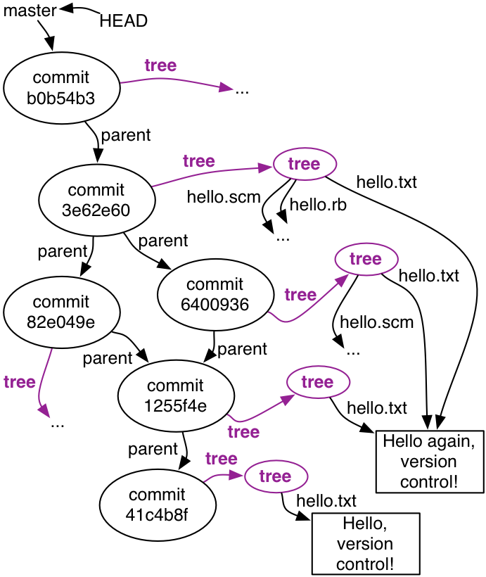

**本文内容来自[MIT_6.031_sp18: Software Construction](http://web.mit.edu/6.031/www/sp18/)课程的Readings部分，采用[CC BY-SA 4.0](http://creativecommons.org/licenses/by-sa/4.0/)协议。**

由于我们学校（哈工大）大二软件构造课程的大部分素材取自此，也是推荐的阅读材料之一，于是打算做一些翻译工作，自己学习的同时也能帮到一些懒得看英文的朋友。另外，该课程的阅读资料中有许多练习题，但是没有标准答案，所给出的答案均为译者所写，有错误的地方还请指出。

<br />

------

<br />

译者：[李秋豪](http://www.cnblogs.com/liqiuhao/)

审校：

V1.0 Mon Mar 12 22:44:59 CST 2018

<br />

*译者注：我觉得网上的这篇教程[Git教程 - 廖雪峰](https://www.liaoxuefeng.com/wiki/0013739516305929606dd18361248578c67b8067c8c017b000/) 更清楚详细的表达出了版本控制的缘由及对应操作，同时也非常简练，推荐大家看这个。所以这篇阅读资料只翻译了一个`git show`命令，完整的版本请参考[05: Version Control](http://web.mit.edu/6.031/www/sp18/classes/05-version-control/)*

<br />

**......（省略）**

<br />

### 为什么提交（commits）看起来像 `diffs`?

我们之前将一次提交定义为对整个工程的一次快照，但是如果你问Git，它返回的结果好像不是这样：

```bash
$ git show 1255f4e
commit 1255f4e4a5836501c022deb337fda3f8800b02e4
Author: Max Goldman <maxg@mit.edu>
Date:   Mon Sep 14 14:58:40 2015 -0400

    Change the greeting

diff --git a/hello.txt b/hello.txt
index c1106ab..3462165 100644
--- a/hello.txt
+++ b/hello.txt
@@ -1 +1 @@
-Hello, version control!
+Hello again, version control!

```

Git觉得我们提交的项目中大多数内容是没变的，于是它只会显示出改变的内容。实际上，这也和Git的存储方式相同——它只会存储改变后的文件，每次提交中没变的文件都会指向之前提交中的文件：（还记得之前提到过的值不能改变的对象(immutable object)吗？）



但是我们可以要求Git显示出指定提交中所有的文件：

```bash
$ git show 3e62e60:
tree 3e62e60:

hello.rb
hello.scm
hello.txt

```

看，仅仅一个分号就改变了整个输出。

我们更可以指定一个特定提交中的特定文件的内容：

```bash
$ git show 3e62e60:hello.scm
(display "Hello, version control!")

```

这也是恢复文件的一种方法：使用 `git show` 显示出你上次提交的时候文件的内容。

*译者注：`diff`命令的操作和阅读可以参考[diff详解,读懂diff结果](http://www.cnblogs.com/wangqiguo/p/5793448.html) 和 [diff命令](http://man.linuxde.net/diff)*

<br />

**......（省略）**

<br />