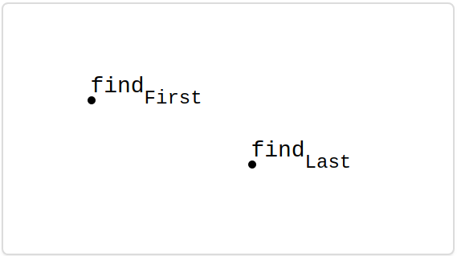
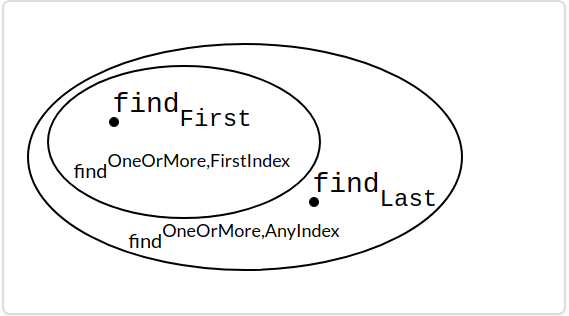
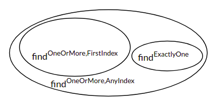
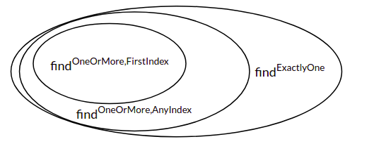
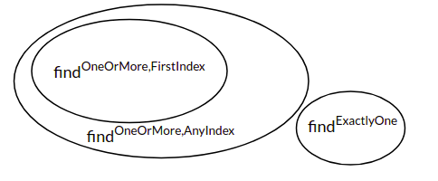
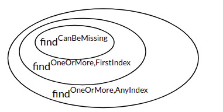
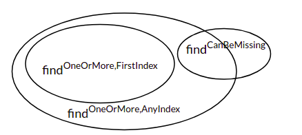
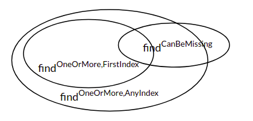
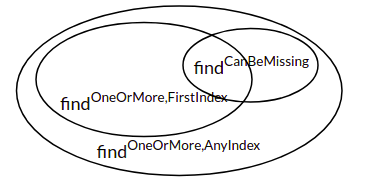
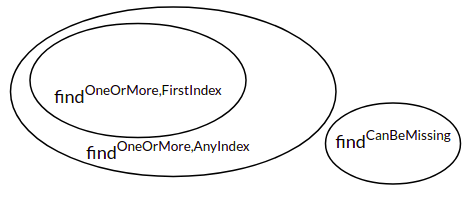

**本文内容来自[MIT_6.031_sp18: Software Construction](http://web.mit.edu/6.031/www/sp18/)课程的Readings部分，采用[CC BY-SA 4.0](http://creativecommons.org/licenses/by-sa/4.0/)协议。**

由于我们学校（哈工大）大二软件构造课程的大部分素材取自此，也是推荐的阅读材料之一，于是打算做一些翻译工作，自己学习的同时也能帮到一些懒得看英文的朋友。另外，该课程的阅读资料中有许多练习题，但是没有标准答案，所给出的答案均为译者所写，有错误的地方还请指出。

<br />

------

<br />

译者：[李秋豪](http://www.cnblogs.com/liqiuhao/)

审校：

V1.0 Tue Mar 20 00:49:34 CST 2018

<br />

#### 本次课程的目标

- 理解待决定（underdetermined）规格说明，并能够辨别评估待决定的规格说明。
- 理解声明性的规格说明和操作性的规格说明之间的区别，并能够写出声明性的规格说明。
- 理解前置条件、后置条件、及规格说明的“强度”，并能够比较两个规格说明之间的强度。
- 能够写出逻辑严密、前后连贯的规格说明。

<br />

## 介绍

在这篇阅读中我们会比较相似行为的不同规格说明，并从三个维度探讨它们之间的区别：

- 这个规格说明的**决定性**：它对输入输出的空间是否有严格的限制？例如要求输出只有一种可能，或者可以有多种可能性。
- 这个规格说明的**声明性**：它是否仅仅声明了输出应该是什么，或者还要求了实现的方法（输出是如何计算出的）。
- 这个规格说明的**强度**：它的实现方法是否仅限于一个小集合，或者有很多种满足要求的实现方法。

对于一个特定的模块，不同的规格说明会产生不同的效果，接下来我们就探讨如何设计出最好的的规格说明。

<br />

## 决定性的 vs. 待决定性的规格说明

回忆之前的阅读中我们定义的两个`find`函数：

```java
static int findFirst(int[] arr, int val) {
    for (int i = 0; i < arr.length; i++) {
        if (arr[i] == val) return i;
    }
    return arr.length;
}

```

```java
static int findLast(int[] arr, int val) {
    for (int i = arr.length - 1 ; i >= 0; i--) {
        if (arr[i] == val) return i;
    }
    return -1;
}

```

这里提一下，函数名中的后缀 `First` and `Last` 只是为了区分开它们实现方法，当被应用到实际的代码中时，它们都叫做`find`.

以下是`find`的一种可能的规格说明：

```java
static int findExactlyOne(int[] arr, int val)
- requires:
  val occurs exactly once in arr
- effects:
  returns index i such that arr[i] = val

```

这里的后缀名 `ExactlyOne`也仅是一种提示符，为了区分开同一模块的不同规格说明设计。

我们说，`findExactlyOne`是**完全决定性的**（fully deterministic）：当输入满足前置条件后，输出能够完全确定——仅仅只有一种可能的返回情况。不存在一个输入对应多种输出。

`findFirst` 和 `findLast` 的实现方法都满足这个规格说明的要求，所以如果有一个客户使用了这个规格说明的`find`模块，我们可以用 `findFirst` 和 `findLast` 进行等价替换。

下面是`find`的另一种规格说明：

```java
static int findOneOrMore,AnyIndex(int[] arr, int val)
- requires:
  val occurs in arr
- effects:
  returns index i such that arr[i] = val

```

这个规格说明就不是决定性的——当`val`出现多次时，它没有要求返回哪一个的下标。即它仅仅承诺了你可以根据返回的下标找到对应的`val` 。对于一个输入，这个模块有多种输出的可能性。

这里要注意一点，当我们说“非决定性”（underdetermined）的时候，并不是指“不确定性”（nondeterministic）。不确定性的代码是指一会的行为是这样，过一会又变成了那样（即使对于同一个输入）。有很多不确定的例子：例如一个依赖于随机数的函数，或者一个依赖于当前时间的程序。**但是一个非决定性的规格说明并不一定代表对应的模块的行为是非确定性的**，模块可以是由完全确定行为（一个输入就对应一个确定的输出）的代码写的。

在上面的例子中，规格说明没有要求返回值是多种可能的哪一个，我们既可以使用 `findFirst` 又可以使用 `findLast`实现这个模块，但是这两个实现方法本身是确定性的（译者注：确定性在算法层面，对于同一个输入，有同一个输出）。甚至，我们可以使用非确定性的代码满足规格说明，例如每次使用随机数决定返回多个下标中的哪一个。而使用者只会关注规格说明，他们无法确定模块会返回哪一种结果（译者注：决定性在使用者应用层面，他只能依赖规格说明的描述）。在大多数情况下，非决定性的规格说明会给实现者更多实现的自由，另外，一个非决定性的规格说明对应的模块大多是用确定性的代码实现的。

#### 阅读小练习

**Distinguished**

对于`findFirst`和`findLast`两种对`find`的实现方法：

```java
static int findFirst(int[] arr, int val) {
    for (int i = 0; i < arr.length; i++) {
        if (arr[i] == val) return i;
    }
    return arr.length;
}

```

```java
static int findLast(int[] arr, int val) {
    for (int i = arr.length - 1 ; i >= 0; i--) {
        if (arr[i] == val) return i;
    }
    return -1;
}

```

考虑下面这个规格说明：

```java
static int find(int[] arr, int val)
effects:

returns largest index i such that arr[i] = val, or -1 if no such i

```

以下哪一种输入会使`findFirst` 不满足规格说明？

- [x] `[ 1, 2, 2 ], 2`

- [ ] `[ 1, 2, 3 ], 2`

- [x] `[ 1, 2, 2 ], 4`

- [ ] 对于以上输入 `findFirst` 都可以满足规格说明!

以下哪一种输入会使`findLast`不满足规格说明？

- [ ] `[ 1, 2, 2 ], 2`

- [ ] `[ 1, 2, 3 ], 2`

- [ ] `[ 1, 2, 2 ], 4`

- [x] 对于以上输入 `findLast`都可以满足规格说明!

**Over/under**

在上文中我们提到了 `find` 的一种非决定性的规格说明:

```java
static int findOneOrMore,AnyIndex(int[] arr, int val)
- requires:
  val occurs in arr
- effects:
  returns index i such that arr[i] = val

```

当数组中含有多个`val`时，这个规格说明允许多种返回情况。

对于下面的每一个规格说明，判断它的决定性大于或小于 `findOneOrMore,AnyIndex` 的决定性，或者它是完全决定性的。

1.

```java
static int find(int[] arr, int val)
- requires:
  val occurs exactly once in arr
- effects:
  returns index i such that arr[i] = val

```

- [x] 完全决定性的

- [ ] 大于 `findOneOrMore,AnyIndex`, 但是不是完全决定性的

- [ ] 小于 `findOneOrMore,AnyIndex`

2.

```java
static int find(int[] arr, int val)
effects:

returns largest index i such that arr[i] = val, or -1 if no such i

```

- [x] 完全决定性的

- [ ] 大于 `findOneOrMore,AnyIndex`, 但是不是完全决定性的

- [ ] 小于 `findOneOrMore,AnyIndex`

3.

```java
static int find(int[] arr, int val)
- requires:
  val occurs in arr
- effects:
  returns largest index i such that arr[i] = val

```

- [ ] 完全决定性的

- [x] 大于 `findOneOrMore,AnyIndex`, 但是不是完全决定性的

- [ ] 小于 `findOneOrMore,AnyIndex`

<br />

## 声明性的 vs. 操作性的规格说明

笼统的说，规格说明分为两种：操作性的（Operational）规格说明给出了实现过程的步骤（就像伪代码一样），而声明性的（Declarative）规格说明不对实现过程进行要求，它们仅仅给出最后输出的属性和意义，以及它们和输入之间的关系。

在绝大多是情况下，声明性的规格说明更合适。它们通常会更简洁、更易懂、并且最重要的是，它们不会让使用者尝试依赖特定的实现方案（很多时候一个模块的实现方案会不得不改变）。例如，如果我们想要允许多种方案来实现`find` ，我们就不会在规格说明要求“从数组低位开始向上遍历搜索”。

有些时候，程序员想要给维护者（maintainer）模块的实现信息，于是他们将实现描述写在了规格说明中。要记住，规格说明是给使用者而非模块的开发者使用的，**如果你想要用描述模块的实现方法，将它们注释在模块里面。**

另外，对于一种声明性的规格说明，可以有多种描述方法，例如下面这几个声明性的规格说明都是等价的：

```java
static boolean startsWith(String str, String prefix)
effects:

returns true if and only if there exists String suffix such that prefix + suffix = str

```

```java
static boolean startsWith(String str, String prefix)
effects:

returns true if and only if there exists integer i such that str.substring(0, i) = prefix

```

```java
static boolean startsWith(String str, String prefix)
effects:

returns true if the first prefix.length() characters of str are the characters of prefix, false otherwise

```

我们要做的就是给使用者选择一个最清晰易懂的。

#### 阅读小练习

**Joint declaration**

给出下面这个规格说明：

```java
static String join(String delimiter, String[] elements)
effects:

append together the strings in elements, but at each step, if there are more elements left, insert delimiter

```

重写这个规格说明，使得它是声明性的而非操作性的。

- [ ] effects: 将所有的元素通过 `new StringJoiner(delimiter)`相加

- [ ] effects: 通过一个循环将各个元素和分隔符叠加起来

- [x] effects: 返回一个元素的连接体（元素保持原有顺序），并在各个元素中插入分隔符。

<br />

## 更强或更弱的规格说明

假设你想要改变一个方法——不管是它的实现方法还是规格说明本身。并且现在已经有使用者在依赖你之前的规格说明来使用方法了，你该怎么确定新的规格说明可以安全的替换原有的规格说明呢？

定义：规格说明S2强于（等于）规格说明S1，如果：

- S2的前置条件弱于或等价于S1的
- S2的后置条件强于或等于S1的后置条件。

如果S2强于S1，那么任何S2的实现方法都可以拿来实现S1，并且在程序中可以安全的用S2的模块替换S1模块。

这两个条件实际上表现了一种思想：你可以弱化前置条件（译者注：即更容易满足前置条件，或者说满足前置条件的集合扩大了），这会让使用者的限制更少（译者注：例如不用对模块的输入先进行一些检查），也可以强化后置条件（译者注：在使用者看来，就是模块的返回更清晰，更有保证性，不用对多种可能情况进行处理）。

例如，对于 `find`的规格说明：

```java
static int findExactlyOne(int[] a, int val)
- requires:
  val occurs exactly once in a
- effects:
  returns index i such that a[i] = val

```

可以被替换为：

```java
static int findOneOrMore,AnyIndex(int[] a, int val)
- requires:
  val occurs at least once in a
- effects:
  returns index i such that a[i] = val

```

可以看到，他的前置条件变弱了。而这个规格说明可以继续加强：

```java
static int findOneOrMore,FirstIndex(int[] a, int val)
- requires:
  val occurs at least once in a
- effects:
  returns lowest index i such that a[i] = val

```

即强化了后置条件。

那么下面这个规格说明呢？

```java
static int findCanBeMissing(int[] a, int val)
- requires:
  nothing
- effects:
  returns index i such that a[i] = val, or -1 if no such i

```

我们试着将它和 `findOneOrMore,FirstIndex`比较，它的前置条件更弱。但是它的后置条件也更弱——对于满足 `findOneOrMore,FirstIndex`的输入， `findOneOrMore,FirstIndex`承诺返回最小下标，但是`findCanBeMissing`没有做任何承诺。**所以它们是不可比较的**。

在下面的练习中我们会继续用 `findCanBeMissing` 和其他的规格说明进行比较。

<br />

## 图示化规格说明

I试着将Java中的全部方法想象成一个太空，太空中的每一个星星就是一个方法。在这里我们先将上面提到的 `findFirst` 和 `findLast` 画出来。记住，对于 `findFirst` 和 `findLast` ，**它们的算法/行为是固定的，不能在这个空间中表示一个范围**，所以我们用点来表示实际的方法。 



而一个规格说明会在这个太空中描述出一个范围，在这个范围中的实现方法都满足规格说明的要求（即前置条件和后置条件），而在范围之外的不满足规格说明的要求。

 `findFirst` 和 `findLast` 都是满足 `findOneOrMore,AnyIndex`的，所以它们都在 `findOneOrMore,AnyIndex`描述的范围内：


我们可以想象使用者站在地上向天空望去：规格说明就好像星云的规定边界一样

- 实现者可以自由的在一个星云中移动（即改变实现方案/代码），例如提升原有算法的性能或修复一个bug，而不必担心这种改变会导致使用者的不变。
- 使用者只选取某一个星云，而不在意或依赖到底是其中的哪一个星星。他们可以自由的将模块应用在各个环境（只要满足规格说明）。

该如何描述两个规格说明之间的关系呢？现在假设有S1和S2两个规格说明，它们一开始的强度是一样的：

- 我们先从加强后置条件考虑，如果S2的后置条件变的强于S1的后置条件。那么S2就是强于S1的。

  想一想**强化后置条件**对于实现者来说意味着什么：更少的自由度，因为输入的空间变小了。例如之前的规格说明是`findOneOrMore,AnyIndex` ，而更改后的规格说明变成了 `findOneOrMore,FirstIndex` 。所以以前在“星云”内的实现方案现在可能在新的星云之外了。

  那么，是否存在一种实现方案，它在 `findOneOrMore,FirstIndex` 之内但是在`findOneOrMore,AnyIndex`之外呢？这是不可能的，因为所有满足`findOneOrMore,FirstIndex` 的实现方案都强于 `findOneOrMore,AnyIndex` 的要求。

- 接着想一想**弱化前置条件**，这也会使S2变得更强。实现方案需要处理更多的可能输入空间，如果之前它们没有在意这写数据范围，现在可能就会暴露出一些bug。

对于一个更强的规格说明，它在图示中能描绘的实现范围更小，而一个更弱的规格说明描述的实现范围更大：



在上图中，由于`findLast` 是从数组的最后一个元素开始遍历，所以它不符合`findOneOrMore,FirstIndex`的后置条件，即它会在`findOneOrMore,FirstIndex`描绘的范围之外。

而对于一个既不强于S1也不弱于S1的规格说明S3，它和S1的范围可能是有重叠的（即存在实现方案即满足S1，也满足S3），也可能是没有重叠的。在这两种情况下，S1和S3都是不可比较的。

#### 阅读小练习

**Bulking up**

当一个规格说明被强化后：

- [x] 满足它的实现方案会变少

- [ ] 满足它的实现方案会变多

- [ ] 更少的使用者

- [x] 更多的使用者

- [ ] 以上都不是


**Strength is truth**

以下关于A和B规格说明的关系的描述哪一个是对的？

- [x] 1. A强于B，且A的前置条件更弱

- [x] 2. A强于B，且前置条件相同

- [ ] 3. A强于B，且A的前置条件更强

- [ ] 4. A强于B，且前置条件不可比较

- [x] 5. A和B不可比较


**Finding findExactlyOne**

下面是 `find` 的各种规格说明：

```java
static int findExactlyOne(int[] a, int val)
- requires:
  val occurs exactly once in a
- effects:
  returns index i such that a[i] = val

```

```java
static int findOneOrMore,AnyIndex(int[] a, int val)
- requires:
  val occurs at least once in a
- effects:
  returns index i such that a[i] = val

```

```java
static int findOneOrMore,FirstIndex(int[] a, int val)
- requires:
  val occurs at least once in a
- effects:
  returns lowest index i such that a[i] = val

```

```java
static int findCanBeMissing(int[] a, int val)
- requires:
  nothing
- effects:
  returns index i such that a[i] = val, or -1 if no such i

```

对于前三个规格说明，下面哪一个图的描述是正确的？

- [ ] 1.
- [ ] 2.
- [x] 3.
- [ ] 4.

**Finding findCanBeMissing**

 `findCanBeMissing`和  `findExactlyOne`是何种关系？

- [ ] `findCanBeMissing` 弱于 `findExactlyOne`

- [x] `findCanBeMissing` 强于 `findExactlyOne`

- [ ] `findCanBeMissing` 和 `findExactlyOne` 不可比较

How does `findCanBeMissing` compare to `findOneOrMore,AnyIndex`?

- [ ] `findCanBeMissing` 弱于 `findOneOrMore,AnyIndex`

- [x] `findCanBeMissing` 强于 `findOneOrMore,AnyIndex`

- [ ] `findCanBeMissing` 和 `findOneOrMore,AnyIndex` 不可比较

How does `findCanBeMissing` compare to `findOneOrMore,FirstIndex`?

- [ ] `findCanBeMissing` 弱于 `findOneOrMore,FirstIndex`

- [ ] `findCanBeMissing `强于 `findOneOrMore,FirstIndex`

- [x] `findCanBeMissing` 和 `findOneOrMore,FirstIndex` 不可比较


**Found**

下面关于 `findCanBeMissing` 的描述哪一个是正确的？

- [ ] 1.

- [ ] 2.

- [ ] 3.

- [x] 4.

- [ ] 5.

<br />

## 设计好的规格说明

什么因素对一个方法的设计最重要？毫无疑问是初期该方法的规格说明设计。

一个好的规格设计应该简洁清楚、结构明确、易于理解的。

但是，规格说明的具体内容是很难用一套固定的设计规则描述的，不过这里我们有一些有用的指导方针。

### 规格说明应该逻辑明确

规格说明不应当有很多种情况（或者if-else判断）、也不应该有很多参数，布尔类型1的标志也是不好的。思考下面这个规格说明：

```java
static int sumFind(int[] a, int[] b, int val)
effects:

returns the sum of all indices in arrays a and b at which val appears

```

这个设计合理吗？可能不是：它的逻辑不明确，因为它尝试将两个毫不相干的事情一起完成（在两个数组里面查找并将下标相加）。将这两件事情用两个分别的模块来完成会更合理。一个在两个数组中查找对应的下标，另一个将这两个下标相加然后输出结果。

下面是另外一个例子，[“代码评审”](http://www.cnblogs.com/liqiuhao/p/8531425.html)中的 `countLongWords` 方法：

```java
public static int LONG_WORD_LENGTH = 5;
public static String longestWord;

/**
 * Update longestWord to be the longest element of words, and print
 * the number of elements with length > LONG_WORD_LENGTH to the console.
 * @param words list to search for long words
 */
public static void countLongWords(List<String> words)
```

除了槽糕的使用全局变量和打印而非返回结果（译者注：这两个问题都在[“代码评审”](http://www.cnblogs.com/liqiuhao/p/8531425.html)这个阅读中谈到了）。这个规格说明的逻辑也是有问题的——它试着同时完成两件事：找到最长的词和统计符合长度要求的词的个数。

将这两件事情用两个不同的方法完成不仅会更加简单（易于理解），也会在其他的上下文中方便复用。

### 调用的结果应该清晰

思考下面这个规格说明，它将一个值放在一个映射中：

```java
static V put(Map<K,V> map, K key, V val)
- requires:
  val may be null, and map may contain null values
- effects:
  inserts (key, val) into the mapping, overriding any existing mapping for key, and returns old value for key, unless none, in which case it returns null

```

注意到前置条件中并没有规定key键对应值不能是`null` 。但是后置条件中将`null`作为一个特殊条件来返回。这意味着如果返回值是`null` ，那么使用者就不能判断到底是这个key对应的值是`null` ，还是这个key值以前不存在。因此，这不是一个好的设计，它会产生歧义。

### 规格说明应该足够“强”

译者注：这里的强主要指后置条件的强度

当然，规格说明应该保证对于一般的输入（满足前置条件的空间）它会满足要求，这里要说的是对于一些前置条件之外的特殊情况的处理。

例如，对于一个错误的输入，抛出异常并且允许任意的更改就是毫无意义的。因为使用者无法确定模块在抛出异常前对对象做了哪些更改。这里有一个规格说明就描述了这样的缺项（并且它的描述是操作性的，这也不好）：

```java
static void addAll(List<T> list1, List<T> list2)
effects:

adds the elements of list2 to list1, unless it encounters a null element, at which point it throws a NullPointerException

```

如果异常 `NullPointerException` 被抛出，使用者就得想方设法找到是`list2`中的哪一个`null`元素导致了异常的发生（`list1`被做了哪些改变）。（译者注：这些应该在抛出时进行描述）

### 规格说明也应该足够“弱”

译者注：这里的强度主要指前置条件的强度

思考下面这个规格说明，该模块试着打开一个文件：

```java
static File open(String filename)
effects:

opens a file named filename

```

这是一个不好的规格说明。它缺乏一些重要的细节：这个文件打开后是进行写还是读操作？这个文件是已经存在的吗？（如果不存在的话，这个模块会进行创建吗？）并且它的强度太大了（译者注：前置条件过弱），毕竟这个模块是不能保证正确打开一个文件的。例如，模块所在的进程可能没有打开这个文件权限，或者这个文件的已经损坏了，操作系统拒绝打开它（译者注：即有很多程序不能控制的因素决定的打开是否成功）。所以，这个规格说明应该更弱一些，例如说明使用者应该具有该文件的读/写权限，这个文件存在等等。

### 规格说明应该尽可能使用抽象的数据类型

我们之前在[“Java基础”](http://www.cnblogs.com/liqiuhao/p/8494132.html)中谈到了Java的聚合类型，里面说到了对数据抽象的要求说明例如 `List` 和 `Set` 以及具体的实现方法例如 `ArrayList` 和 `HashSet`.

在规格说明中使用抽象的数据类型会给使用者和实现者更多的自由。在Java中，这通常意味着使用接口类型，例如 `Map` 或 `Reader` 而不是具体的实现类型例如 `HashMap` 或 `FileReader` 。现在考虑下面这个规格说明：

```java
static ArrayList<T> reverse(ArrayList<T> list)
effects:

returns a new list which is the reversal of list, i.e. newList[i] = list[n-i-1] for all 0 ≤ i < n, where n = list.size()

```

这个规格说明强制使用者传入一个 `ArrayList` ，并且强制实现者返回一个 `ArrayList` ，即使`List`实现方法有很多种。从描述上看，对应模块的行为应该不会依赖于 `ArrayList`的实现特性。所以这里最好写成更抽象的数据类型`List` 。
 <br />
####使用前置条件还是后置条件

另一个设计的问题就是是否使用前置条件，如果使用的话，是否需要模块在一开始对参数进行检查，判断其符合前置条件后再进行后续工作。事实上，使用前置条件的一个最常见的要求就是输入必须精确满足前置条件，因为模块检查参数的资源代价可能会很大。

正如上面所提到的，“重量级”的前置条件会让使用者不方便，因为他们必须确保输入不违反前置条件的要求，如果违反了，从错误中恢复的方法将是不可预测的。所以使用者大多不喜欢前置条件，这也是为什么Java API 类趋向于（作为后置条件）在参数不合法的时候抛出一个非检查的异常。这样的手段使得发现bug更加容易。通常情况下，**快速失败/报错**总是更好的（即离bug越近越好），而不是让错误的参数继续参与剩下的运算。例如，`atan(y, x)`可能会要求输入不能是(0,0)（但不是前置条件），**但是它依然会接受这种参数并抛出一个明确的异常，而不是让这个参数参与剩下的计算并返回一个“垃圾值”。**

有时候，检查参数是不可行的，这个时候前置条件就是必须的了。例如我们想用二分查找的办法实现`find` ，我们会要求这个数组是已经排序过的了。如果强制要求模块检查这个数组是否已经排好序，这个带来的线性复杂度相对于我们要实现的目标是承受不起的。

关于是否使用前置条件是一个工程上的判断。关键点在于检查需要使用的资源量以及这个模块被使用的范围。当这个模块仅仅在类的内部使用时，我们设置前置条件，仔细检查所有的调用是否合理。但是如果这个方法是公开的，并且会被其他的开发者使用，那么使用前置条件就不那么合理。像Java API一样，你应该抛出一个异常。

<br />

## 关于访问控制

> 阅读: [**Packages**](http://docs.oracle.com/javase/tutorial/java/package/index.html)
>
> 阅读: [**Controlling Access**](http://docs.oracle.com/javase/tutorial/java/javaOO/accesscontrol.html)

在之前的阅读中，我们一直在使用public的方法，也没有对此进行特别的考虑。一个方法是public还是private取决于这个类的功能。公共的方法可以被程序中其他的部分访问。将一个方法公开就相当于你想让方法所在的类为其他的类提供对应的服务。如果你将所有的方法设置为公开访问的——包括那些本来只设计在内部使用的方法，未来更改这个类就会变得很困难，因为外部可能会依赖这个类的内部实现。总之，这会让你的代码不具备**可改动性** 。

将一个内部使用的方法设置为公开访问也会让类的接口变得复杂。保持内部方法私有会让接口简洁而且符合逻辑，这会让你的代码**易于理解** 。

在接下来的几个阅读中，当我们开始使用类的内部状态时，我们会看到更多的使用private修饰的理由，这会让你的代码**远离bug** 。

<br />

## 类方法和实例方法（static vs. instance）

> 阅读: [**the static keyword**](http://www.codeguru.com/java/tij/tij0037.shtml#Heading79)

同时，我们也一直在使用static方法而没有过多的考虑。类方法是指那些不与特定的类实例（对象）相关联的方法（译者注：或者说没有this指针），而实例方法（没有static修饰）必须通过特定的对象来调用。

实例方法的规格说明和类方法的规格说明是一样的，但它们通常会利用实例对应的具体属性。

例如，下面这个非常熟悉的规格说明：

```java
static int find(int[] arr, int val)
- requires:
  val occurs in arr
- effects:
  returns index i such that arr[i] = val

```

如果这里不是使用 `int[]`，而是一个`IntArray` 对象呢？那么`IntArray` 必须提供一个实例方法，对应的规格说明就会是：

```java
int find(int val)
- requires:
  val occurs in this array
- effects:
  returns index i such that the value at index i in this array is val

```

在以后的课程中我们会讨论很多关于实例方法的规格说明的内容。

- #### 阅读小练习

  **Show me a sign**

  下面哪一些选项代表了好的规格说明的属性？

  - [x] 该规格说明是声明性的
  - [ ] 该规格说明是操作性的
  - [ ] 规格说明的强度应该越大越好
  - [ ] 规格说明的强度应该越弱越好
  - [ ] 模块的实现应该允许忽略错误的参数
  - [x] 模块的实现应该允许根据具体的参数选择不同的算法
  - [ ] 规格说明应该强调使用者对于模块具体实现的理解

  **That’s an odd way of looking at it**

  ```java
  public static int secondToLastIndexOf(int[] arr, int val)
  - requires:
    val appears in arr an odd number of times
  - effects:
    returns the 2nd-largest i such that arr[i] == val

  ```

  关于上面这个规格说明，以下哪一些批评是合理的？

  - [x] 这个规格说明的定义有问题，我们无法实现它（译者注：当输入的数组只有一个元素的时候）
  - [x] 这个规格说明的逻辑不对（译者注：odd number、2nd-largest都不合理，应该使用更一般化的要求）
  - [ ] 这个规格说明不是决定性的
  - [ ] 这个规格说明不是操作性的

  **Behavioral oddities**

  ```java
  public static int secondToLastIndexOf(int[] arr, int val)
  - requires:
    val appears in arr an odd number of times
  - effects:
    returns the 2nd-largest i such that arr[i] == val

  ```

  思考下面这些对于 `secondToLastIndexOf`的测试用例：

  `[ 1, 3, 4 ], 3` 返回 `1`

  - [ ] 合理的测试用例
  - [ ] 如果前置条件变弱，这个测试用例就是合理的
  - [ ] 如果前置条件变弱，后置条件变强，这个测试用例就是合理的
  - [x] 如果后置条件变弱，这个测试用例就是合理的

  `[ 1, 3, 3, 4 ], 3` 返回 `1`

  - [ ] 合理的测试用例
  - [x] 如果前置条件变弱，这个测试用例就是合理的
  - [ ] 如果前置条件变弱，后置条件变强，这个测试用例就是合理的
  - [ ] 如果后置条件变弱，这个测试用例就是合理的

  `[ 1, 3, 3, 3, 4 ], 3` 返回 `2`

  - [x] 合理的测试用例
  - [ ] 如果前置条件变弱，这个测试用例就是合理的
  - [ ] 如果前置条件变弱，后置条件变强，这个测试用例就是合理的
  - [ ] 如果后置条件变弱，这个测试用例就是合理的

  `[ 3, 3, 3, 3 ], 3` 抛出一个异常

  - [ ] 合理的测试用例
  - [ ] 如果前置条件变弱，这个测试用例就是合理的
  - [x] 如果前置条件变弱，后置条件变强，这个测试用例就是合理的
  - [ ] 如果后置条件变弱，这个测试用例就是合理的

  **Odd doc**

  ```java
  public static int secondToLastIndexOf(int[] arr, int val)
  - requires:
    val appears in arr an odd number of times
  - effects:
    returns the 2nd-largest i such that arr[i] == val

  ```

  （首先这是一个糟糕的规格说明）在下面选取合适的行组成这个规格说明在代码中的注释：

  - [x] `/*`
  - [ ] `/**`
  - [x] `* Finds the second-to-last occurrence of a value in an array.`
  - [ ] `* Find j, the largest index such that arr[j] == val.`
  - [ ] `* Then find i, the largest index such that i < j and arr[i] == val.`
  - [x] `* @param arr array to search`
  - [ ] `* @param arr fixed-size array of integers to search`
  - [ ] `* @param val value to search for`
  - [x] `* @param val value to search for, requires val appears in arr an odd number of times`
  - [ ] `* @return index i`
  - [x] `* @return second-largest index i such that arr[i] == val`
  - [x] `*/`

  <br />

  ## 总结

  规格说明在使用者和实现者之间起着一道防火墙的作用——对于人和代码之间也是一样。正如上篇阅读谈到的（译者注：[“规格说明”](http://www.cnblogs.com/liqiuhao/p/8566500.html)），这使得独立开发成为可能：使用者可以在不阅读模块源码的情况下将源码应用到各个地方，使用者可以不在意模块被使用的环境（只要他们都遵循规格说明的要求）。

  在实际使用中，声明性的规格说明是最重要的。前置条件（弱化规格说明）使得使用者更困难（确保输入合法），但是**合理的使用**会使得实现者能够做出一些假设，从而选择更合适的实现方案。

  和往常一样，试着将这篇阅读的知识点和我们的三个目标联系起来：

  - **远离bug**. 如果没有规格说明，即使是最小的更改都有可能使得整个程序崩溃，改动起来也是很麻烦的。一个结构良好、逻辑明确的规格说明会最小化使用者和实现者之间的误解，并帮助我们进行静态检查、测试、代码评审等等。
  - **易于理解**. 一个好的规格说明会让使用者不必去阅读源码也能正确安全地使用模块。例如，你可能永远不会去阅读[Python `dict.update`](https://hg.python.org/cpython/file/7ae156f07a90/Objects/dictobject.c#l1990) ，但是通过阅读[对应的声明性规格说明](https://docs.python.org/3/library/stdtypes.html#dict.update)你就能很好的应用它。
  - **可改动性**. 一个合理的“弱”规格说明会给实现者一定的自由，而一个“强”的规格说明会给使用者一定的自由。我们甚至可以改变规格说明本身：只要我们是加强了它而不是削弱了它（减弱前置条件或者增强后置条件）。