**本文内容来自[MIT_6.031_sp18: Software Construction](http://web.mit.edu/6.031/www/sp18/)课程的Readings部分，采用[CC BY-SA 4.0](http://creativecommons.org/licenses/by-sa/4.0/)协议。**

由于我们学校（哈工大）大二软件构造课程的大部分素材取自此，也是推荐的阅读材料之一，于是打算做一些翻译工作，自己学习的同时也能帮到一些懒得看英文的朋友。另外，该课程的阅读资料中有许多练习题，但是没有标准答案，所给出的答案均为译者所写，有错误的地方还请指出。

<br />

------

<br />

译者：[李秋豪](http://www.cnblogs.com/liqiuhao/)

审校：

V1.0 Fri Mar 23 17:20:24 CST 2018

<br />

#### 本次课程的目标

#### Objectives

- 理解可变性(mutability)和可变对象
- 学会判断别名使用和理解可变性的危险
- 利用不变性使代码正确、易懂、可改动

*译者注：mutability还可以翻译为“易变性”（that can change; likely to change），“易”似乎也能突出使用应该谨慎，但后来我还是觉得“可变”更准确，所以就译为“可变性”。*

<br />

## 创建和使用对象

*译者注：麻神理工是先教的Python，Java并没有作为课程。所以这里提供了一组从Python到Java过渡资料。Java基础好的朋友这节可以跳过。*

> From [Ken Lambert’s tutorial *From Python to Java*](http://home.wlu.edu/~lambertk/pythontojava/), read the first 8 pages under *Defining Classes*:
>
> - [Class Structure](http://home.wlu.edu/~lambertk/pythontojava/ClassStructure.htm)
> - [Visibility Modifiers](http://home.wlu.edu/~lambertk/pythontojava/Visibility.htm)
> - [Instance Variables and Constructors](http://home.wlu.edu/~lambertk/pythontojava/InstanceVariables.htm)
> - [Defining Other Constructors](http://home.wlu.edu/~lambertk/pythontojava/OtherConstructors.htm)
> - [Instance Methods](http://home.wlu.edu/~lambertk/pythontojava/InstanceMethods.htm)
> - [Method Overloading](http://home.wlu.edu/~lambertk/pythontojava/Overloading.htm)
> - [Class (`static`) Variables and Methods](http://home.wlu.edu/~lambertk/pythontojava/ClassVariables.htm)
> - [Symbolic Constants (`final` Variables)](http://home.wlu.edu/~lambertk/pythontojava/FinalVariables.htm)
>
> Optional: if you want to see more examples, read these Java Tutorials pages:
>
> - [Declaring Classes](http://docs.oracle.com/javase/tutorial/java/javaOO/classdecl.html)
> - [Declaring Member Variables](http://docs.oracle.com/javase/tutorial/java/javaOO/variables.html)
> - [Providing Constructors for Your Classes](http://docs.oracle.com/javase/tutorial/java/javaOO/constructors.html)
> - [Understanding Class Members](http://docs.oracle.com/javase/tutorial/java/javaOO/classvars.html)
> - [Using the `this` Keyword](http://docs.oracle.com/javase/tutorial/java/javaOO/thiskey.html)
> - [Initializing Fields](http://docs.oracle.com/javase/tutorial/java/javaOO/initial.html)

#### 阅读小练习

**Classes and objects**

```python
class Tortoise:
    def __init__(self):
        self.position = 0

    def forward(self):
        self.position += 1

pokey = Tortoise()
pokey.forward()
print(pokey.position)
```

如果我们将 `Tortoise` 转换为Java，应该怎么进行声明？

`public class Tortoise`

**Under construction**

在Python中，我们通过声明 `__init__` 函数来初始化新的对象。

在Java中类似的声明应该怎么写？

`public Tortoise()`

我们应该怎么索引到一个新的 `Tortoise` 对象？

`Tortoise t = new Tortoise()`

**Methodical**

我们在一个 `Tortoise` 对象中声明一个 `forward` 方法：

```java
public void forward() {
    // self.position += 1 (Python)
}
```

以下哪一行代码可以达到代码中注释行的目的：

- [x] `position += 1;`

- [ ] `self.position += 1;`

- [x] `this.position += 1;`

- [ ] `Tortoise.position += 1;`


**On your mark**

在Python中，我们通过 `self.position = 0` 初始化 `Tortoise` 对象中 `position` 为0.

使用一行代码将 `position` 初始化：

```java
public class Tortoise {

    private int position = 0;      // (1)
    static int position = 0;       // (2)

    public Tortoise() {
        int position = 0;          // (3)
        int self.position = 0;     // (4)
        int this.position = 0;     // (5)
        int Tortoise.position = 0; // (6)
    }
    // ...
}
```

- [x] 1

- [ ] 2

- [ ] 3

- [ ] 4

- [ ] 5

- [ ] 6

或者用几行初始化 `position` ：

```java
public class Tortoise {

    private int position;          // (1)
    static int position;           // (2)

    public Tortoise() {
        self.position = 0;         // (3)
        this.position = 0;         // (4)
        Tortoise.position = 0;     // (5)
    }
    // ...
}
```

- [x] 1

- [ ] 2

- [ ] 3

- [x] 4

- [ ] 5


**Get set**

现在我们再声明另一个方法 `Tortoise` ：

```java
public void jump(int position) {
    // set this Tortoise's position to the input value
}
```

以下哪一行可以将代码中注释部分实现？

- [ ] `position = position;`

- [ ] `position = this.position;`

- [x] `this.position = position;`

- [ ] `this.position = this.position;`


**Static vs. instance**

假设我们想到记录和 `Tortoise` 类及对象有关的信息，下面哪一个声明是合理的？

记录有多少个对象已经被创建了：

- [ ] `int numberOfTortoisesInWorld;`
- [x] `static int numberOfTortoisesInWorld;`
- [ ] 在Java中不能这样声明

记录tortoise对象中shell的颜色：

- [x] `Color shell;`
- [ ] `static Color shell;`
- [ ] 在Java中不能这样声明

对象的母亲和父亲：

- [x] `Tortoise mother, father;`
- [ ] `static Tortoise mother, father;`
- [ ] 在Java中不能这样声明


<br />

## 可变性

回忆之前我们讨论过的“用快照图理解值与对象”（译者注：[“Java基础”](http://www.cnblogs.com/liqiuhao/p/8494132.html)），有一些对象的内容是不变的（immutable）：一旦它们被创建，它们总是表示相同的值。另一些对象是可变的（mutable）：它们有改变内部值对应的方法。

[`String`](http://docs.oracle.com/javase/8/docs/api/?java/lang/String.html) 就是不变对象的一个例子，一个[`String`](http://docs.oracle.com/javase/8/docs/api/?java/lang/String.html) 对象总是表示相同的字符串。而[`StringBuilder`](http://docs.oracle.com/javase/8/docs/api/?java/lang/StringBuilder.html) 则是可变的，它有对应的方法来删除、插入、替换字符串内部的字符，等等。

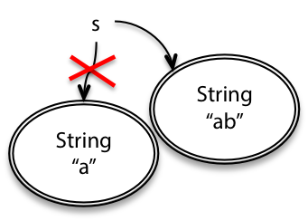

因为 `String` 是不变的，一旦被创建，一个 `String` 对象总是有一样的值。为了在一个 `String` 对象字符串后加上另一个字符串，你必须创建一个新的 `String` 对象：

```java
String s = "a";
s = s.concat("b"); // s+="b" and s=s+"b" also mean the same thing
```

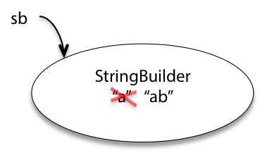

与此相对， `StringBuilder` 对象是可变的。这个类有对应的方法来改变对象，而不是返回一个新的对象：

```java
StringBuilder sb = new StringBuilder("a");
sb.append("b");
```

所以这有什么关系呢？在上面这两个例子中，我们最终都让`s`和`sb`索引到了`"ab"` 。当对象的索引只有一个时，它们两确实没什么去呗。但是当有别的索引指向同一个对象时，它们的行为会大不相同。例如，当另一个变量`t`指向`s`对应的对象，`tb`指向`sb`对应的对象，这个时候对`t`和`tb`做更改就会导致不同的结果：

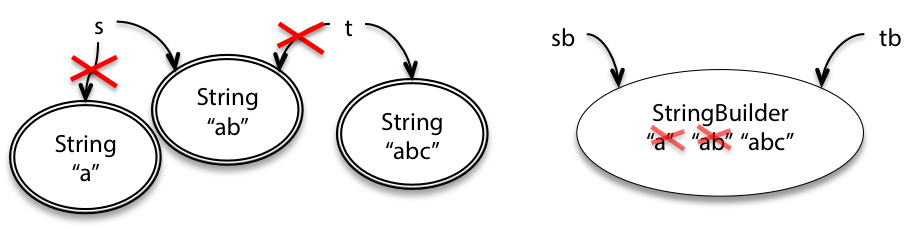

```java
String t = s;
t = t + "c";

StringBuilder tb = sb;
tb.append("c");
```

可以看到，改变`t`并没有对`s`产生影响，但是改变`tb`确实影响到了`sb` ——这可能会让编程者惊讶一下（如果他没有注意的话）。这也是下面我们会重点讨论的问题。

既然我们已经有了不变的 `String` 类，为什么还要使用可变的 `StringBuilder` 类呢？一个常见的使用环境就是当你要同时创建大量的字符串，例如：

```java
String s = "";
for (int i = 0; i < n; ++i) {
    s = s + i;
}
```

如果使用不变的字符串，这会发生很多“暂时拷贝”——第一个字符“0”实际上就被拷贝了n次，第二个字符被拷贝了n-1次，等等。总的来说，它会花费O(N^2)的时间来做拷贝，即使最终我们的字符串只有n个字符。

`StringBuilder` 的设计就是为了最小化这样的拷贝，它使用了简单但是聪明的内部结构避免了做任何拷贝（除非到了极限情况）。如果你使用`StringBuilder` ，可以在最后用 `toString()` 方法得到一个`String`的结果：

```java
StringBuilder sb = new StringBuilder();
for (int i = 0; i < n; ++i) {
  sb.append(String.valueOf(i));
}
String s = sb.toString();
```

优化性能是我们使用可变对象的原因之一。另一个原因是为了分享：程序中的两个地方的代码可以通过共享一个数据结构进行交流。

#### 阅读小练习

**Follow me**

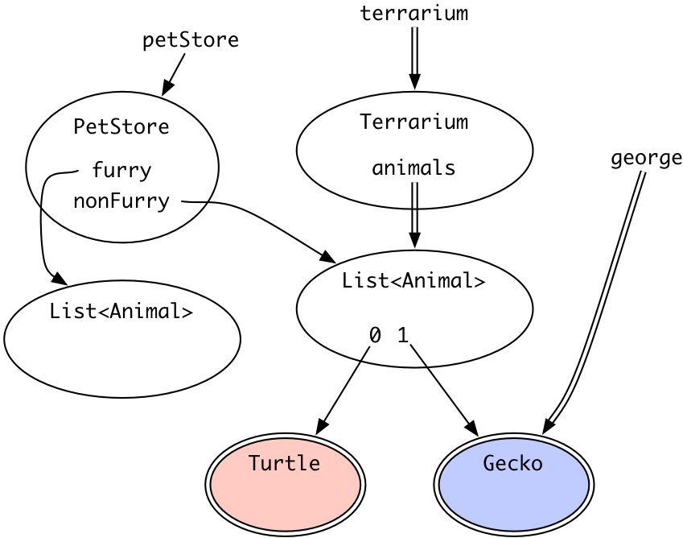

一个 `terrarium` 的使用者可以更改红色的 `Turtle` 对象吗？

- [ ] 不能，因为到 `terrarium` 的索引是不变的

- [x] 不能，因为 `Turtle` 对象是不变的

- [ ] 可以，因为从列表的0下标处到 `Turtle` 的索引是可变的。

- [ ] 可以，因为 `Turtle` 对象是可变的

一个 `george` 的使用者可以更改蓝色的  `Gecko` 对象吗？

- [ ] 不能，因为到`george` 的索引是不变的

- [x] 不能，因为 `Gecko` 对象是不变的

- [ ] 可以，因为从列表的1下标处到 `Gecko` 的索引是可变的。

- [ ] 可以，因为 `Gecko` 对象是可变的

一个 `petStore` 的使用者可以使得另一个 `terrarium` 的使用者无法访问蓝色的  `Gecko` 对象吗？选出最好的答案

- [ ] 不能，因为到 `terrarium` 的索引是不变的

- [ ] 不能，因为 `Gecko` 对象是不变的

- [ ] 可以，因为到 `petStore` 的索引是可变的

- [ ] 可以，因为 `PetStore`  对象是可变的

- [x] 可以，因为 `List` 对象是可变的

- [ ] 可以，因为从列表的1下标处到 `Gecko` 的索引是可变的。


<br />

## 可变性带来的风险

可变的类型看起来比不可变类型强大的多。如果你在“数据类型商场”购物，为什么要选择“无聊的”不可变类型而放弃强大的可变类型呢？例如 `StringBuilder` 应该可以做任何 `String` 可以做的事情，加上 `set()` 和 `append()` 这些功能。

答案是**使用不可变类型要比可变类型安全的多，同时也会让代码更易懂、更具备可改动性。**可变性会使得别人很难知道你的代码在干吗，也更难制定开发规定（例如规格说明）。这里举出了两个例子：

### #1: 传入可变对象

下面这个方法将列表中的整数相加求和：

```java
/** @return the sum of the numbers in the list */
public static int sum(List<Integer> list) {
    int sum = 0;
    for (int x : list)
        sum += x;
    return sum;
}
```

假设现在我们要创建另外一个方法，这个方法将列表中数的绝对值相加，根据DRY原则（[Don’t Repeat Yourself](http://www.cnblogs.com/liqiuhao/p/8531425.html)），实现者写了一个利用 `sum()`的方法：

```java
/** @return the sum of the absolute values of the numbers in the list */
public static int sumAbsolute(List<Integer> list) {
    // let's reuse sum(), because DRY, so first we take absolute values
    for (int i = 0; i < list.size(); ++i)
        list.set(i, Math.abs(list.get(i)));
    return sum(list);
}
```

注意到这个方法**直接改变了数组** —— 这对实现者来说很合理，因为利用一个已经存在的列表会更有效率。如果这个列表有几百万个元素，那么你节省内存的同时也节省了大量时间。所以实现者的理由很充分：DRY与性能。

但是使用者可能会对结果很惊奇，例如：

```java
// meanwhile, somewhere else in the code...
public static void main(String[] args) {
    // ...
    List<Integer> myData = Arrays.asList(-5, -3, -2);
    System.out.println(sumAbsolute(myData));
    System.out.println(sum(myData));
}
```

#### 阅读小练习

**Risky #1**

上面的代码会打印出哪两个数？

10

10 

让我们想想这个问题的关键点：

- **远离bug？**在这个例子中，很容易就会把指责转向 `sum­Absolute()` 的实现者，因为他可能违背了规格说明。但是，**传入可变对象真的（可能）会导致隐秘的bug。**只要有一个程序员不小心将这个传入的列表更改了（例如为了复用或性能），程序就可能会出错，而且bug很难追查。
- **易懂吗？**当阅读 `main()`的时候，你会对 `sum()` 和 `sum­Absolute()`做出哪些假设？对于读者来说，他能清晰的知道 `myData` 会被更改吗？

### #2: 返回可变对象

我们刚刚看到了传入可变对象可能会导致问题。那么返回一个可变对象呢？

 [`Date`](http://docs.oracle.com/javase/8/docs/api/?java/util/Date.html)是一个Java内置的类， 同时 [`Date`](http://docs.oracle.com/javase/8/docs/api/?java/util/Date.html)也正好是一个可变类型。假设我们写了一个判断春天的第一天的方法：

```java
/** @return the first day of spring this year */
public static Date startOfSpring() {
    return askGroundhog();
}
```

这里我们使用了有名的土拨鼠算法 (Harold Ramis, Bill Murray, et al. *Groundhog Day*, 1993).

现在使用者用这个方法来计划他们的派对开始时间：

```java
// somewhere else in the code...
public static void partyPlanning() {
    Date partyDate = startOfSpring();
    // ...
}
```

这段代码工作的很好。不过过了一段时间，`startOfSpring()`的实现者发现“土拨鼠”被问的不耐烦了，于是打算重写`startOfSpring()` ，使得“土拨鼠”最多被问一次，然后缓存下这次的答案，以后直接从缓存读取：

```java
/** @return the first day of spring this year */
public static Date startOfSpring() {
    if (groundhogAnswer == null) groundhogAnswer = askGroundhog();
    return groundhogAnswer;
}
private static Date groundhogAnswer = null;
```

（思考：这里缓存使用了`private static`修饰符，你认为它是全局变量吗？）

另外，有一个使用者觉得`startOfSpring()`返回的日期太冷了，所以他把日期延后了一个月：

```java
// somewhere else in the code...
public static void partyPlanning() {
    // let's have a party one month after spring starts!
    Date partyDate = startOfSpring();
    partyDate.setMonth(partyDate.getMonth() + 1);
    // ... uh-oh. what just happened?
}
```

（思考：这里还有另外一个隐秘的bug——`partyDate.getMonth() + 1`，你知道为什么吗？）

这两个改动发生后，你觉得程序会出现什么问题？更糟糕的是，谁会先发现这个bug呢？是这个 `startOfSpring()` ，还是 `partyPlanning()` ？ 或是在另一个地方使用 `startOfSpring()`的无辜者？

#### 阅读小练习

**Risky #2**

我们不知道`Date`具体是怎么存储月份的，所以这里用抽象的值 `...march...` 和 `...april...` 表示，`Date`中有一个`mounth`索引到这些值上。

以下哪一个快照图表现了上文中的bug？

- [ ] 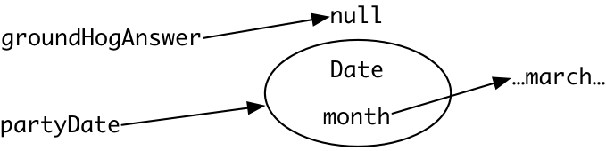

- [ ] 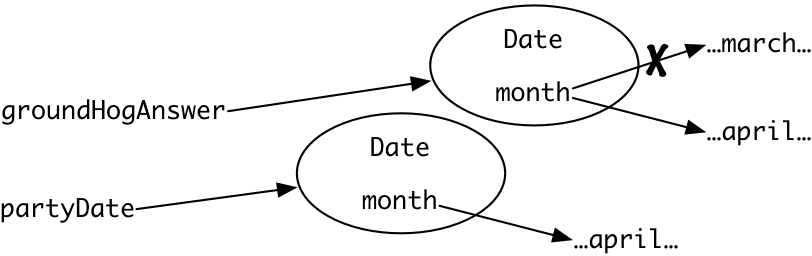

- [ ] 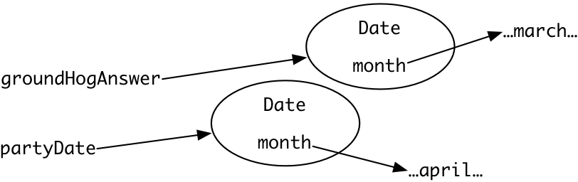

- [x] 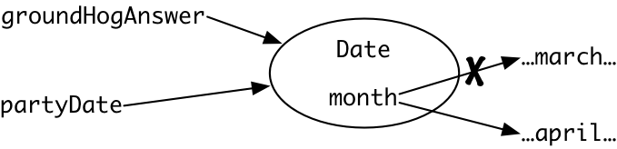

- [ ] 


**Understanding risky example #2**

`partyPlanning` 在不知不觉中修改了春天的起始位置，因为 `partyDate` 和 `groundhogAnswer` 指向了同一个可变`Date` 对象 。

更糟糕的是，这个bug可能不会在这里的 `partyPlanning()` 或 `startOfSpring()` 中出现。而是在另外一个调用 `startOfSpring()`的地方出现，得到一个错误的值然后继续进行运算。

上文中的缓存 `groundhogAnswer` 是全局变量吗？

- [ ] 是全局变量，这是合理的

- [ ] 是全局变量，这是不合理的

- [x] 不是全局变量


**A second bug**

上文中的代码在加上1月的时候存在另一个bug，请阅读 [Java API documentation for `Date.getMonth`](https://docs.oracle.com/javase/8/docs/api/java/util/Date.html#getMonth--) 和 [`setMonth`](https://docs.oracle.com/javase/8/docs/api/java/util/Date.html#setMonth-int-).

对于 `partyDate.getMonth()` ，它的哪一个返回值会导致bug的发生？

11

**NoSuchMonthException**

上面关于 `Date.setMonth` 文档中说： `month: the month value between 0-11`.那么当这个bug触发的时候**可能**会发生什么？

- [x] 这个方法不会做任何事情

- [x] 这个方法会按照我们原本的想法运行

- [x] 这个方法会使得 `Date` 对象不可用，并报告一个错误的值

- [ ] 这个方法会抛出一个已检查异常

- [x] 这个方法会抛出一个未检查异常

- [x] 这个方法会将时间设置为9/9/99

- [x] 这个方法会使得其他的 `Date` 对象也不可用

- [x] 这个方法永远不会返回


**SuchTerribleSpecificationsException**

在关于 `Date` 的文档中，有一句话是这样说的，“传入方法的参数并不一定要落在指定的区域内，例如传入1月32号意味着2月1号”。

这看起来像是前置条件...但它不是的！

下面哪一个选项表现了`Date`这个特性是不合理的？

- [ ] 不要写重复的代码 (DRY)
- [x] 快速失败/报错
- [ ] 土拨鼠算法
- [ ] 使用异常报告特殊结果
- [ ] 使用前置条件限制使用者


<br />


关键点：

- **远离bug？** 没有，我们产生了一个隐晦的bug。
- **可改动？** 很显然，这里的可改动指的是我们可以改动一部分代码而不用担心其他代码的改动，而不是可变对象本身的可改动性。在上面的例子中，我们在程序的两个地方做了改变，结果导致了一个隐晦的bug。

在上面举出的两个例子（ `List<Integer>` 和 `Date` ）中，如果我们采用不可变对象，这些问题就迎刃而解了——这些bug在设计上就不可能发生。

事实上，你绝对不应该使用`Date` ！而是使用 包[ `java.time`](http://docs.oracle.com/javase/8/docs/api/index.html?java/time/package-summary.html): [`LocalDateTime`](http://docs.oracle.com/javase/8/docs/api/?java/time/LocalDateTime.html), [`Instant`](http://docs.oracle.com/javase/8/docs/api/?java/time/Instant.html), 等等这些类，它们规格说明都保证了对象是不可变的。

这个例子也说明了使用可变对象可能会导致性能上的损失。因为为了在不修改规格说明和接口的前提下避开这个bug，我们必须让`startOfSpring()` 返回一个复制品：

```java
    return new Date(groundhogAnswer.getTime());
```

这样的模式称为**防御性复制** ，我们在后面讲抽象数据类型的时候会讲解更多关于防御性复制的东西。这样的方法意味着 `partyPlanning()` 可以自由的操控`startOfSpring()`的返回值而不影响其中的缓存。但是防御性复制会强制要求 `startOfSpring()` 为每一个使用者复制相同数据——即使99%的内容使用者都不会更改，这会很浪费空间和时间。相反，如果我们使用不可变类型，不同的地方用不同的对象来表示，相同的地方都索引到内存中同一个对象，这样会让程序节省空间和复制的时间。所以说，合理利用不变性对象（译者注：大多是有多个变量索引的时候）的性能比使用可变性对象的性能更好。

<br />

## 别名会让可变类型存在风险

事实上，如果你只在一个方法内使用可变类型而且该类型的对象只有一个索引，这时并不会有什么风险。而上面的例子告诉我们，如果一个可变对象有多个变量索引到它——这也被称作“别名”，这时就会有产生bug的风险。

#### 阅读小练习

**Aliasing 1**

以下代码的输出是什么？

```java
List<String> a = new ArrayList<>();
a.add("cat");
List<String> b = a;
b.add("dog");
System.out.println(a);
System.out.println(b);
```

- [ ] `["cat"]`

      `["cat", "dog"]`


- [x] `["cat", "dog"]`

      `["cat", "dog"]`


- [ ] `["cat"]`

      `["cat"]`


- [ ] `["dog"]`

      `["dog"]`


现在试着使用快照图将上面的两个例子过一遍，这里只列出一个轮廓：

- 在 `List` 例子中，一个相同的列表被`list`（在 `sum` 和 `sumAbsolute`中）和`myData`（在`main`中）同时索引。一个程序员（`sumAbsolute`的）认为更改这个列表是ok的；另一个程序员（`main`）希望列表保持原样。由于别名的使用，`main`的程序员得到了一个错误的结果。
- 而在`Date`的例子中，有两个变量 `groundhogAnswer` 和 `partyDate`索引到同一个`Date`对象。这两个别名出现在程序的不同地方，所以不同的程序员很难知道别人会对这个`Date`对象做哪些改变。

先在纸上画出快照图，但是你真正的目标应该是在脑海中构建一个快照图，这样以后你在看代码的时候也能将其“视觉化”。

<br />

## 更改参数对象的（mutating）方法的规格说明

从上面的分析来看，我们必须使用[之前提到过的格式](http://www.cnblogs.com/liqiuhao/p/8566500.html)对那些会更改参数对象的方法写上特定的规格说明。

下面是一个会更改参数对象的方法：

```java
static void sort(List<String> lst)
- requires:
  nothing
- effects:
  puts lst in sorted order, i.e. lst[i] ≤ lst[j] for all 0 ≤ i < j < lst.size()

```

而这个是一个不会更改参数对象的方法：

```java
static List<String> toLowerCase(List<String> lst)
- requires:
  nothing
- effects:
  returns a new list t where t[i] = lst[i].toLowerCase()

```

如果在*effects*内没有显式强调输入参数会被更改，在本门课程中我们会认为方法不会修改输入参数。事实上，这也是一个编程界的一个约定俗成的规则。

<br />

## 对列表和数组进行迭代

接下来我们会看看另一个可变对象——**迭代器** 。迭代器会尝试遍历一个聚合类型的对象，并逐个返回其中的元素。当你在Java中使用[`for (... : ...)` ](http://web.mit.edu/6.031/www/sp18/classes/02-basic-java/#iteration)这样的遍历元素的循环时，其实就隐式的使用了迭代器。例如：

```java
List<String> lst = ...;
for (String str : lst) {
    System.out.println(str);
}

```

会被编译器理解为下面这样：

```java
List<String> lst = ...;
Iterator<String> iter = lst.iterator();
while (iter.hasNext()) {
    String str = iter.next();
    System.out.println(str);
}

```

一个迭代器有两种方法：

- `next()` 返回聚合类型对象的下一个元素
- `hasNext()` 测试迭代器是否已经遍历到聚合类型对象的结尾

注意到`next()` 是一个会修改迭代器的方法（**mutator** method），它不仅会返回一个元素，**而且会改变内部状态**，使得下一次使用它的时候会返回下一个元素。

感兴趣的话，你可以读读[Java API中关于迭代器的定义](http://docs.oracle.com/javase/8/docs/api/?java/util/Iterator.html) .

### `MyIterator`

为了更好的理解迭代器是如何工作的，这里有一个`ArrayList<String>`迭代器的简单实现：

```java
/**
 * A MyIterator is a mutable object that iterates over
 * the elements of an ArrayList<String>, from first to last.
 * This is just an example to show how an iterator works.
 * In practice, you should use the ArrayList's own iterator
 * object, returned by its iterator() method.
 */
public class MyIterator {

    private final ArrayList<String> list;
    private int index;
    // list[index] is the next element that will be returned
    //   by next()
    // index == list.size() means no more elements to return

    /**
     * Make an iterator.
     * @param list list to iterate over
     */
    public MyIterator(ArrayList<String> list) {
        this.list = list;
        this.index = 0;
    }

    /**
     * Test whether the iterator has more elements to return.
     * @return true if next() will return another element,
     *         false if all elements have been returned
     */
    public boolean hasNext() {
        return index < list.size();
    }

    /**
     * Get the next element of the list.
     * Requires: hasNext() returns true.
     * Modifies: this iterator to advance it to the element 
     *           following the returned element.
     * @return next element of the list
     */
    public String next() {
        final String element = list.get(index);
        ++index;
        return element;
    }
}
```

`MyIterator` 使用到了许多Java的特性，例如构造体，static和final变量等等，你应该确保自己已经理解了这些特性。参考： [*From Python to Java*](http://home.wlu.edu/~lambertk/pythontojava/) 或 [*Classes and Objects* in the Java Tutorials](http://docs.oracle.com/javase/tutorial/java/javaOO/index.html) 

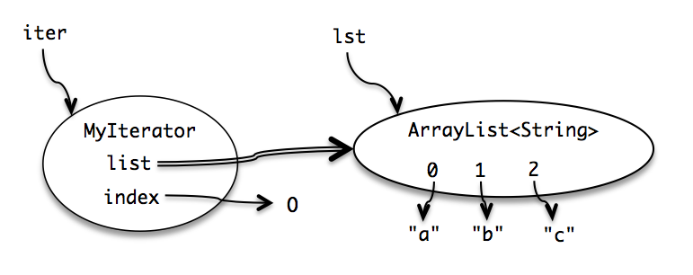

上图画出了 `MyIterator` 初始状态的快照图。

注意到我们将`list`的索引用双箭头表示，以此表示这是一个不能更改的final索引。但是list索引的 `ArrayList` 本身是一个可变对象——内部的元素可以被改变——将`list`声明为final并不能阻止这种改变。

那么为什么要使用迭代器呢？因为不同的聚合类型其内部实现的数据结构都不相同（例如连接链表、哈希表、映射等等），而迭代器的思想就是提供一个访问元素的通用中间件。通过使用迭代器，使用者只需要用一种通用的格式就可以遍历访问聚合类的元素，而实现者可以自由的更改内部实现方法。大多数现代语言（Python、C#、Ruby）都使用了迭代器。这是一种有效的**设计模式** （一种被广泛测试过的解决方案）。我们在后面的课程中会看到很多其他的设计模式。

#### 阅读小练习

**MyIterator.next signature**

迭代器的实现中使用到了实例方法（*instance methods*），实例方法是在一个实例化对象上进行操作的，它被调用时会传入一个隐式的参数`this` （就像Python中的`self`一样），通过这个`this`该方法可以访问对象的数据（fields）。

我们首先看看 `MyIterator`中的 `next` 方法：

```java
public class MyIterator {

    private final ArrayList<String> list;
    private int index;

    ...

    /**
     * Get the next element of the list.
     * Requires: hasNext() returns true.
     * Modifies: this iterator to advance it to the element 
     *           following the returned element.
     * @return next element of the list
     */
    public String next() {
        final String element = list.get(index);
        ++index;
        return element;
    }
}
```

`next`的输入是什么类型？

- [ ] `void` – 没有输入

- [ ] `ArrayList`

- [x] `MyIterator`

- [ ] `String`

- [ ] `boolean`

- [ ] `int`

`next`的输出是什么类型？

- [ ] `void` – 没有输出

- [ ] `ArrayList`

- [ ] `MyIterator`

- [x] `String`

- [ ] `boolean`

- [ ] `int`


**MyIterator.next precondition**

`next` 有前置条件 `requires: hasNext() returns true.`

`next `的哪一个输入被这个前置条件所限制？

- [ ] 都没有被限制

- [x] `this`

- [ ] `hasNext`

- [ ] `element`

当前置条件不满足时，实现的代码可以去做任何事。具体到我们的实现中，如果前置条件不满足，代码会有什么行为？

- [ ] 返回 `null`

- [ ] 返回列表中其他的元素

- [ ] 抛出一个已检查异常

- [x] 抛出一个非检查异常


**MyIterator.next postcondition**

`next`的一个后置条件是 `@return next element of the list`.

`next` 的哪一个输出被这个后置条件所限制？

- [ ] 都没有被限制

- [ ] `this`

- [ ] `hasNext`

- [x] 返回值

`next` 的另外一个后置条件是 `modifies: this iterator to advance it to the element following the returned element.`

什么会被这个后置条件所限制？

- [ ] 都没有被限制

- [x] `this`

- [ ] `hasNext`

- [ ] 返回值


<br />

## 可变性对迭代器的损害

现在让我们试着将迭代器用于一个简单的任务。假设我们有一个MIT的课程代号列表，例如`["6.031", "8.03", "9.00"]` ，我们想要设计一个 `dropCourse6` 方法，它会将列表中所有以“6.”开头的代号删除。根据之前所说的，我们先写出如下规格说明：

```java
/**
 * Drop all subjects that are from Course 6. 
 * Modifies subjects list by removing subjects that start with "6."
 * 
 * @param subjects list of MIT subject numbers
 */
public static void dropCourse6(ArrayList<String> subjects)
```

注意到 `dropCourse6` 显式的强调了它会对参数 `subjects` 做修改。

接下来，根据测试优先编程的原则，我们对输入空间进行分区，并写出了以下测试用例：

```java
// Testing strategy:
//   subjects.size: 0, 1, n
//   contents: no 6.xx, one 6.xx, all 6.xx
//   position: 6.xx at start, 6.xx in middle, 6.xx at end

// Test cases:
//   [] => []
//   ["8.03"] => ["8.03"]
//   ["14.03", "9.00", "21L.005"] => ["14.03", "9.00", "21L.005"]
//   ["2.001", "6.01", "18.03"] => ["2.001", "18.03"]
//   ["6.045", "6.031", "6.813"] => []

```

最后，我们实现`dropCourse6`方法：

```javascript
public static void dropCourse6(ArrayList<String> subjects) {
    MyIterator iter = new MyIterator(subjects);
    while (iter.hasNext()) {
        String subject = iter.next();
        if (subject.startsWith("6.")) {
            subjects.remove(subject);
        }
    }
}
```

但是当我们测试的时候，最后一个例子报错了：

```java
// dropCourse6(["6.045", "6.031", "6.813"])
//   expected [], actual ["6.031"]

```

`dropCourse6` 似乎没有将列表中的元素清空，为什么？为了追查bug是在哪发生的，我们建议你画出一个快照图，并逐步模拟程序的运行。 

#### 阅读小练习

**Draw a snapshot diagram**

现在画出一个初始（代码未执行）快照图。你需要参考上面`MyIterator` 类和 `dropCourse6()` 方法的代码实现。

在你的**初始**快照图中有哪些标签？

- [ ] `iter`

- [ ] `index`

- [x] `list`

- [x] `subjects`

- [ ] `subject`

- [x] `ArrayList`

- [ ] `List`

- [ ] `MyIterator`

- [x] `String`

- [ ] `dropCourse6`

现在执行第一条语句 `MyIterator iter = new MyIterator(subjects);` ，你的快照图中又有哪些标签？

- [x] `iter`

- [x] `index`

- [x] `list`

- [x] `subjects`

- [ ] `subject`

- [x] `ArrayList`

- [ ] `List`

- [x] `MyIterator`

- [x] `String`

- [ ] `dropCourse6`


**Entering the loop**

现在执行接下来的语句`String subject = iter.next()`.，你的快照图中添加了什么东西？

- [ ] 一个从 `subject` 到ArrayList `0` 下标的箭头

- [ ] 一个从 `subject` 到ArrayList `1` 下标的箭头

- [ ] 一个从`index` 到 `0` 的箭头

- [x] 一个从`index` 到 `1` 的箭头

这个时候`subject.startsWith("6.")` 返回是什么？

- [x] 真，因为 `subject` 索引到了字符串 `"6.045"` 

- [ ] 真，因为 `subject` 索引到了字符串 `"6.031"` 

- [ ] 真，因为 `subject` 索引到了字符串 `"6.813"`

- [ ] 假，因为 `subject` 索引到了其他字符串


**Remove an item**

现在画出在 `subjects.remove(subject)`语句执行后的快照图。

现在ArrayList `subjects` 是什么样子？

- [ ] 下标0对应 `"6.045"`

- [x] 下标0对应 `"6.031"`

- [ ] 下标0对应 `"6.813"`

- [ ] 没有下标0

- [ ] 下标1对应 `"6.045"`

- [ ] 下标1对应 `"6.031"`

- [x] 下标1对应 `"6.813"`

- [ ] 没有下标1

- [ ] 下标2对应 `"6.045"`

- [ ] 下标2对应 `"6.031"`

- [ ] 下标2对应 `"6.813"`

- [x] 没有下标2


**Next iteration of the loop**

现在进行下一次循环，执行语句 `iter.hasNext()` 和`String subject = iter.next()` ，此时 `subject.startsWith("6.")` 的返回是什么？

- [ ] 真，因为 `subject` 索引到了字符串 `"6.045"` 
- [ ] 真，因为 `subject` 索引到了字符串 `"6.031"` 
- [x] 真，因为 `subject` 索引到了字符串 `"6.813"`
- [ ] 假，因为 `subject` 索引到了其他字符串

在这个测试用例中，哪一个ArrayList中的元素永远不会被 `MyIterator.next()` 返回？

- [ ] `"6.045"`

- [x] `"6.031"`

- [ ] `"6.813"`

如果你想要解释这个bug是如何发生的，以下哪一些声明会出现在你的报告里？

- [x] `list` 和 `subjects` 是一对别名，它们都指向同一个 `ArrayList` 对象.

- [x] 一个列表在程序的两个地方被使用别名，当一个别名修改列表时，另一个别名处不会被告知。

- [ ] 代码没有检查列表中奇数下标的元素。

- [x] `MyIterator` 在迭代的时候是假设迭代对象不会发生更改的。


其实，这并不是我们设计的 `MyIterator`带来的bug。Java内置的 `ArrayList` 迭代器也会有这样的问题，在使用`for`遍历循环这样的语法糖是也会出现bug，只是表现形式不一样，例如：

```java
for (String subject : subjects) {
    if (subject.startsWith("6.")) {
        subjects.remove(subject);
    }
}
```

这段代码会抛出一个 [`Concurrent­Modification­Exception`](http://docs.oracle.com/javase/8/docs/api/?java/util/ConcurrentModificationException.html)异常，因为这个迭代器检测到了你在对迭代对象进行修改（你觉得它是怎么检测到的？）。

那么应该怎修改这个问题呢？一个方法就是使用迭代器的 `remove()` 方法（而不是直接操作迭代对象），这样迭代器就能自动调整迭代索引了：

```java
Iterator iter = subjects.iterator();
while (iter.hasNext()) {
    String subject = iter.next();
    if (subject.startsWith("6.")) {
        iter.remove();
    }
}

```

事实上，这样做也会更有效率，因为 `iter.remove()` 知道要删除的元素的位置，而 `subjects.remove()` 对整个聚合类进行一次搜索定位。

但是这并没有完全解决问题，**如果有另一个迭代器并行对同一个列表进行迭代呢？**它们之间不会互相告知修改！

#### 阅读小练习

**Pick a snapshot diagram**

以下哪一个快照图描述了上面所述**并行bug**的发生？

- [ ] 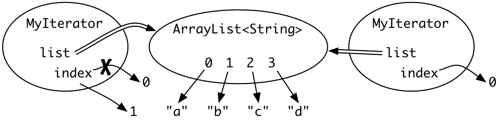

- [ ] 

- [x] 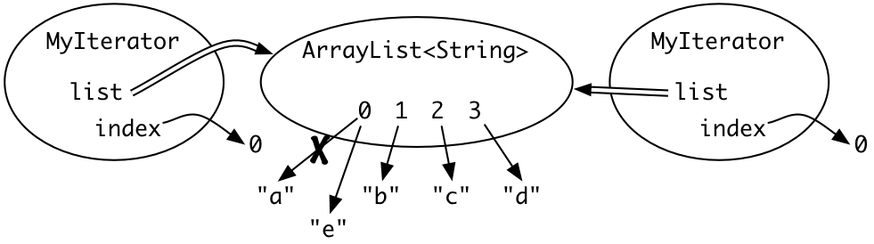

- [ ] 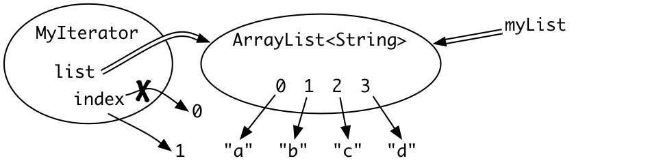

- [ ] 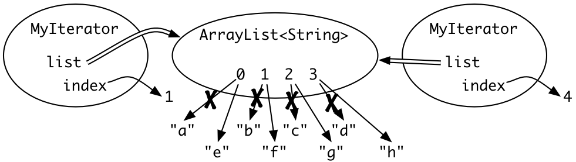


<br />

## 变化与契约（contract）

### 可变对象会使得契约（例如规格说明）变得复杂

这也是使用可变数据结构的一个基本问题。一个可变对象有多个索引（对于对象来说称作“别名”）意味着在你程序的不同位置（可能分布很广）都依赖着这个对象保持不变。

为了将这种限制放到规格说明中，规格不能只在一个地方出现，例如在使用者的类和实现者的类中都要有。现在程序正常运行依赖着每一个索引可变对象的人遵守相应制约。

作为这种非本地制约“契约”，想想Java中的聚合类型，它们的文档都清楚的写出来使用者和实现者应该遵守的制约。试着找到它对使用者的制约——你不能在迭代一个聚合类时修改其本身。另外，这是哪一层类的责任？[`Iterator`](http://docs.oracle.com/javase/8/docs/api/?java/util/Iterator.html)? [`List`](http://docs.oracle.com/javase/8/docs/api/?java/util/List.html)? [`Collection`](http://docs.oracle.com/javase/8/docs/api/?java/util/Collection.html)? 你能找出来吗？

同时，这样的全局特性也会使得代码更难读懂，并且正确性也更难保证。但我们不得不使用它——为了性能或者方便——但是我们也会为安全性付出巨大的代价。

### 可变对象降低了代码的可改动性

可变对象还会使得使用者和实现者之间的契约更加复杂，这减少了实现者和使用者改变代码的自由度。这里举出了一个例子。

下面这个方法在MIT的数据库中查找并返回用户的9位数ID：

```java
/**
 * @param username username of person to look up
 * @return the 9-digit MIT identifier for username.
 * @throws NoSuchUserException if nobody with username is in MIT's database
 */
public static char[] getMitId(String username) throws NoSuchUserException {        
    // ... look up username in MIT's database and return the 9-digit ID
}
```

假设有一个使用者：

```java
char[] id = getMitId("bitdiddle");
System.out.println(id);
```

**现在使用者和实现者都打算做一些改变：** 使用者觉得要照顾用户的隐私，所以他只输出后四位ID：

```java
char[] id = getMitId("bitdiddle");
for (int i = 0; i < 5; ++i) {
    id[i] = '*';
}
System.out.println(id);
```

而实现者担心查找的性能，所以它引入了一个缓存记录已经被查找过的用户：

```java
private static Map<String, char[]> cache = new HashMap<String, char[]>();

public static char[] getMitId(String username) throws NoSuchUserException {        
    // see if it's in the cache already
    if (cache.containsKey(username)) {
        return cache.get(username);
    }

    // ... look up username in MIT's database ...

    // store it in the cache for future lookups
    cache.put(username, id);
    return id;
}
```

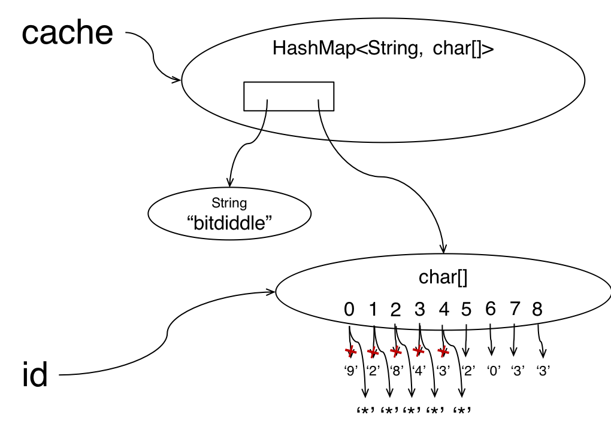

这两个改变导致了一个隐秘的bug。如上图所示，当使用者查找 `"bitdiddle"` 并得到一个字符数组后，实现者也缓存的是这个数组，他们两个实际上索引的是同一个数组（别名）。这意味着用户用来保护隐私的代码会修改掉实现者的缓存，所以未来调用 `getMitId("bitdiddle")` 并不会返回一个九位数，例如 “928432033” ，而是修改后的 “\*\*\*\*\*2033”。

**共享可变对象会增加契约的复杂度，**想想，如果这个错误被交到了“软件工程法庭”审判，哪一个人会为此承担责任呢？是修改返回值的使用者？还是没有保存好返回值的实现者？

下面是一种写规格说明的方法：

```java
public static char[] getMitId(String username) throws NoSuchUserException 
- requires:
  nothing
- effects:
  returns an array containing the 9-digit MIT identifier of username, or throws NoSuchUser­Exception if nobody with username is in MIT’s database. Caller may never modify the returned array.

```

**这是一个下下策这样的制约要求使用者在程序中的所有位置都遵循不修改返回值的规定！并且这是很难保证的。** 

下面是另一种写规格说明的方法：

```java
public static char[] getMitId(String username) throws NoSuchUserException 
- requires:
  nothing
- effects:
  returns a new array containing the 9-digit MIT identifier of username, or throws NoSuchUser­Exception if nobody with username is in MIT’s database.

```

**这也没有完全解决问题**. 虽然这个规格说明强调了返回的是一个新的数组，但是谁又知道实现者在缓存中不是也索引的这个新数组呢？如果是这样，那么用户对这个新数组做的更改也会影响到未来的使用。This spec at least says that the array has to be fresh. But does it keep the implementer from holding an alias to that new array? Does it keep the implementer from changing that array or reusing it in the future for something else?

下面是一个好的多的规格说明：

```java
public static String getMitId(String username) throws NoSuchUserException
- requires:
  nothing
- effects:
  returns the 9-digit MIT identifier of username, or throws NoSuchUser­Exception if nobody with username is in MIT’s database.

```

通过使用不可变类型String，我们可以**保证使用者和实现者的代码不会互相影响**。同时这也**不依赖用户认真阅读遵守规格说明**。不仅如此，这样的方法也给了实现者引入缓存的自由。

#### 阅读小练习

给出以下代码：

```java
public class Zoo {
    private List<String> animals;

    public Zoo(List<String> animals) {
        this.animals = animals;
    }

    public List<String> getAnimals() {
        return this.animals;
    }
}
```

**Aliasing 2**

下面的输出会是什么？

```java
List<String> a = new ArrayList<>();
a.addAll(Arrays.asList("lion", "tiger", "bear"));
Zoo zoo = new Zoo(a);
a.add("zebra");
System.out.println(a);
System.out.println(zoo.getAnimals());
```

- [x] `["lion", "tiger", "bear", "zebra"]`

      `["lion", "tiger", "bear", "zebra"]`


- [ ] `["lion", "tiger", "bear", "zebra"]`

      `["zebra", "lion", "tiger", "bear", "zebra"]`


- [ ] `["lion", "tiger", "bear"]`

      `["lion", "tiger", "bear", "zebra"]`


- [ ] `["lion", "tiger", "bear", "zebra"]`

      `["lion", "tiger", "bear"]`


**Aliasing 3**

接着上面的问题，下面的输出会是什么？

```java
List<String> b = zoo.getAnimals();
b.add("flamingo");
System.out.println(a);
```

- [ ] `["lion", "tiger", "bear"]`

- [ ] `["lion", "tiger", "bear", "zebra"]`

- [x] `["lion", "tiger", "bear", "zebra", "flamingo"]`

- [ ] `["lion", "tiger", "bear", "flamingo"]`


<br />

## 有用的不可变类型

既然不可变类型避开了许多危险，我们就列出几个Java API中常用的不可变类型：

- 所有的原始类型及其包装都是不可变的。例如使用[`BigInteger`](http://docs.oracle.com/javase/8/docs/api/?java/math/BigInteger.html)和 [`BigDecimal`](http://docs.oracle.com/javase/8/docs/api/?java/math/BigDecimal.html) 进行大整数运算。

- 不要使用可变类型 `Date` ，而是使用 [`java.time`](http://docs.oracle.com/javase/8/docs/api/index.html?java/time/package-summary.html) 中的不可变类型。

- Java中常见的聚合类 — `List`, `Set`, `Map` — 都是可变的：`ArrayList`, `HashMap`等等。但是 [`Collections`](http://docs.oracle.com/javase/8/docs/api/?java/util/Collections.html) 类中提供了可以获得不可修改版本（unmodifiable views）的方法：

  - [`Collections.unmodifiableList`](https://docs.oracle.com/javase/8/docs/api/java/util/Collections.html#unmodifiableList-java.util.List-)
  - [`Collections.unmodifiableSet`](https://docs.oracle.com/javase/8/docs/api/java/util/Collections.html#unmodifiableSet-java.util.Set-)
  - [`Collections.unmodifiableMap`](https://docs.oracle.com/javase/8/docs/api/java/util/Collections.html#unmodifiableMap-java.util.Map-)

  你可以将这些不可修改版本当做是对list/set/map做了一下包装。如果一个使用者索引的是包装之后的对象，那么 `add`, `remove`, `put`这些修改就会触发 [`Unsupported­Operation­Exception`](http://docs.oracle.com/javase/8/docs/api/?java/lang/UnsupportedOperationException.html)异常。

  当我们要向程序另一部分传入可变对象前，可以先用上述方法将其包装。要注意的是，**这仅仅是一层包装，如果你不小心让别人或自己使用了底层可变对象的索引，这些看起来不可变对象还是会发生变化！**

- `Collections` 也提供了获取不可变空聚合类型对象的方法，例如[`Collections.emptyList`](https://docs.oracle.com/javase/8/docs/api/java/util/Collections.html#emptyList--)

#### 阅读小练习

给出以下代码：

```java
List<String> arraylist = new ArrayList<>();
arraylist.add("hello");
List<String> unmodlist = Collections.unmodifiableList(arraylist);
// unmodlist should now always be [ "hello" ]
```

**Unmodifiable**

会出现什么类型的错误？

```java
unmodlist.add("goodbye");
System.out.println(unmodlist);
```

动态错误

**Unmodifiable?**

输出是什么？

```java
arraylist.add("goodbye");
System.out.println(unmodlist);
```

[ “hello” “goodbye” ]

**Immutability**

以下哪些选项是正确的？

- [ ] 如果一个类的所有索引都被final修饰，它就是不可变的

- [x] 如果一个类的所有实例化数据都不会改变，它就是不可变的

- [x] 不可变类型的数据可以被安全的共享

- [ ] 通过使用防御性复制，我们可以让对象变成不可变的

- [ ] 不可变性使得我们可以关注于全局而非局部代码


<br />

## 总结

在这篇阅读中，我们看到了利用可变性带来的性能优势和方便，但是它也会产生很多风险，使得代码必须考虑全局的行为，极大的增加了规格说明设计的复杂性和代码编写、测试的难度。

确保你已经理解了不可变对象（例如`String`）和不可变索引（例如 `final` 变量）的区别。画快照图能够帮助你理解这些概念：其中对象用圆圈表示，如果是不可变对象，圆圈有两层；索引用一个箭头表示，如果索引是不可变的，用双箭头表示。

本文最重要的一个设计原则就是**不变性** ：尽量使用不可变类型和不可变索引。接下来我们还是将本文的知识点和我们的三个目标联系起来：

- **远离bug**.不可变对象不会因为别名的使用导致bug，而不可变索引永远指向同一个对象，也会减少bug的发生。
- **易于理解**. 因为不可变对象和索引总是意味着不变的东西，所以它们对于读者来说会更易懂——不用一边读代码一边考虑这个时候对象或索引发生了哪些改动。
- **可改动性**. 如果一个对象或者索引不会在运行时发生改变，那么依赖于这些对象的代码就不用在其他代码更改后进行审查。