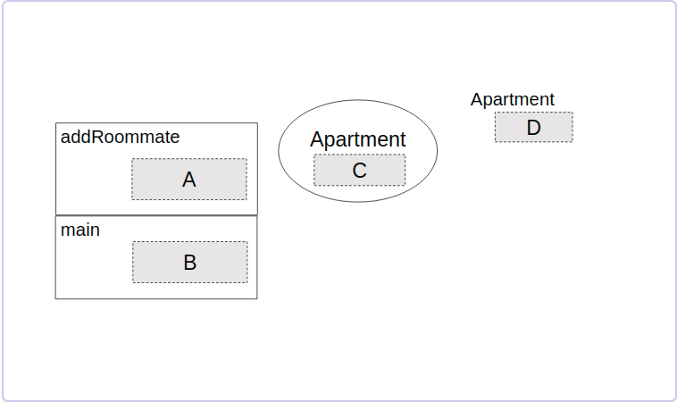

**本文内容来自[MIT_6.031_sp18: Software Construction](http://web.mit.edu/6.031/www/sp18/)课程的Readings部分，采用[CC BY-SA 4.0](http://creativecommons.org/licenses/by-sa/4.0/)协议。**

由于我们学校（哈工大）大二软件构造课程的大部分素材取自此，也是推荐的阅读材料之一，于是打算做一些翻译工作，自己学习的同时也能帮到一些懒得看英文的朋友。另外，该课程的阅读资料中有许多练习题，但是没有标准答案，所给出的答案均为译者所写，有错误的地方还请指出。

<br />

------

<br />

译者：[李秋豪](http://www.cnblogs.com/liqiuhao/)

审校：

V1.0 Sun Mar 25 13:32:29 CST 2018

<br />

#### 本次课程的目标

- 如何避开调试（debugging）
- 当你不得不进行调试时，如何确保它不会太复杂

<br />

## 第一道防御：让Bug无法产生

最好的防御策略就是在设计上让Bug无法产生。

我们之前已经谈到过[**静态检查**](http://www.cnblogs.com/liqiuhao/p/8486545.html) 。静态检查能够在编译期发现很多bug。

我们也看到了一些**动态检查**的例子。例如，Java会通过动态检查让数组越界访问的bug不可能存在。如果你试着越界访问一个数组或列表，Java就会在运行时报错。在一些更老的语言中，例如C和C++，这样的访问是允许的——可能会导致bug和 [安全漏洞](http://en.wikipedia.org/wiki/Buffer_overflow).

[**不可变性**](http://www.cnblogs.com/liqiuhao/p/8631733.html)也是另一种防止bug的设计策略。在创建时，一个不可变类型的对象的值就确定了，接下来可以保证不会发生改变。

字符串是一种不可变类型。你无法通过String内置的方法更改它内部存储的字符。因此，字符串可以被安全地传入/分享给程序的各个地方。

Java也提供了不变的索引：如果一个变量声明时用`final`修饰，那么它的索引一旦确定就不能更改了。在实践中，你应该尽可能对方法、参数、本地变量使用`final`。正如变量的类型一样，`final`也是一种良好的文档，它告诉了读者这个**变量索引的对象不会变为别的对象**，而且这种检查也是静态的，由编译器负责。

思考下面这个例子：

```java
final char[] vowels = new char[] { 'a', 'e', 'i', 'o', 'u' };
```

 `vowels` 变量被声明为`final` ，但是它指向的对象真的不会发生改变吗？以下哪一个语句是不合法的（会被编译器捕捉），哪一句又是合法的？

```java
vowels = new char[] { 'x', 'y', 'z' }; 
vowels[0] = 'z';
```

在下面的阅读小练习中你会找打答案。一定要注意`final`的含义，它仅仅确保了索引的对象不会变为别的对象，而对象本身的值是可能发生更改的。

#### 阅读小练习

**Final references, immutable objects**

思考下面的代码，它们按顺序执行：

```java
char vowel0 = 'a';
final char vowel1 = vowel0;

String vowel2 = vowel1 + "eiou";
final String vowel3 = vowel2;

char[] vowel4 = new char[] { vowel0, 'e', 'i', 'o', 'u' };
final char[] vowel5 = vowel4;
```

在上面的语句执行完后，再按顺序执行下面的语句，请选出合法的语句：

- [x] `vowel0 = 'y';`

- [ ] `vowel1 = vowel0;`

- [x] `vowel2 = "uoie" + vowel1;`

- [ ] `vowel3 = vowel2;`

- [ ] `vowel2[0] = 'x';`

- [ ] `vowel3[0] = 'x';`

- [x] `vowel4 = vowel5;`

- [ ] `vowel5 = vowel4;`

- [x] `vowel4[0] = 'x';`

- [x] `vowel5[0] = 'z';`


**Afterwards**

当上一个练习的合法语句全部执行完以后，各个变量的值分别是多少？

`vowel0`

y

`vowel1`

a

`vowel2`

uoiea

`vowel3`

aeiou

`vowel4`

zeiou

`vowel5`

zeiou

<br />

## 第二道防御：将Bug本地化

如果我们不能阻止bug产生，那么应该尽可能将它们的触发地点集中在一小块地方，这样以后找bug的时候会方便许多。当bug被本地化在一个小方法或模块的时候，我们可能只需要阅读代码就能发现bug。

我们之前已经讨论过了[**快速失败/报错**](http://www.cnblogs.com/liqiuhao/p/8531425.html) ：问题暴露的越早（或者离产生的地方越近），修复bug就会越容易。

现在看一个简单的例子：

```java
/**
 * @param x  requires x >= 0
 * @return approximation to square root of x
 */
public double sqrt(double x) { ... }
```

假设有一个人用负数去调用了`sqrt` .`sqrt`最合理的行为应该是什么？既然调用者没有满足前置条件，讲道理方法可以做任何事情：返回一个任意值、进入死循环、融化CPU等等。然而，我们应该尽早报告这个调用者的bug。例如，我们可以对这个前置条件做一个检查，如果不满足则抛出一个非检查异常`IllegalArgumentException` ：

```java
/**
 * @param x  requires x >= 0
 * @return approximation to square root of x
 */
public double sqrt(double x) { 
    if (! (x >= 0)) throw new IllegalArgumentException();
    ...
}
```

检查前置条件是**防御性编程的一个例子** 。程序往往都会有bug，而防御性编程减轻了bug的影响（即使你不知道bug在哪）。

<br />

## 断言

在实践中我们经常需要定义一套程式来进行这样的防御性检查，它们通常被称为`asser()` （断言）。

在Java中，`assert`是一种语句而非方法。最简单的断言语句会接受一个布尔表达式，如果这个表达式的值为假则抛出一个 `AssertionError` 。

```java
assert x >= 0;
```

断言也是一种很好的文档，它强制规定了特定时候程序应有的状态，例如 `assert x >= 0` 就是在说“在这行代码执行时，x不能是负数”。不过和注释文档不同，断言是可执行的，它会在运行的时候进行检查。

Java的段严重也可以包含一个描述语句，通常是字符串，也可以原始数据类型或者对象索引。在断言失败时，描述性的消息会打印出来，因此程序员可以根据描述语句进行跟踪调试。描述语句跟在布尔表达式后面，用冒号隔开，例如：

```java
assert x >= 0 : "x is " + x;
```

如果x为-1，这个断言就会失败并打印：

> `x is -1`

以及此时的栈帧情况（告诉你断言的位置和函数调用情况）。这些信息通常以及足够用来排除bug了。

**一个严重的问题是，Java默认关闭断言。。**

如果你在Java默认的环境下运行程序，你所有的断言都不会被检查！Java的设计者这么做是因为断言检查会带来性能上的损失。例如，我们写了一个二分查找方法，而该方法的前置条件是数组已经排序。所以我们的断言检查应该是一个线性的复杂度，这样就会改变整个方法的复杂度。但是，对于测试来说，这样的检查是必须的，因为断言检查会让你的调试更加简单。当程序发布时，这些测试断言就会被去除掉。另外，对于大多数应用来说，断言检查的性能损失和后续的代码比起来不算什么，所以它们还是值得的。

为了显式的打开断言，你需要在使用Java虚拟机的时候加上 `-ea` 参数。在Eclipse中，你需要进入 Run → Run Configurations → Arguments，然后在VM参数中添加 `-ea` 。如果想要将 `-ea` 设为默认参数，进入 Preferences → Java → Installed JREs → Edit → Default VM Arguments，然后加上 `-ea` 。这些在 [Getting Started](http://web.mit.edu/6.031/www/sp18/getting-started/#assertions-on) 中有详细描述。

在用JUnit进行测试时也最好将断言打开，你可以通过以下代码测试断言是否打开：

```java
@Test(expected=AssertionError.class)
public void testAssertionsEnabled() {
    assert false;
}
```

如果断言打卡， `assert false` 语句就会抛出一个 `AssertionError`。而测试前的`(expected=AssertionError.class)` 表示这个测试应该抛出`AssertionError`，所以测试会通过。如果断言关闭，那么就不会有`AssertionError`抛出，测试也不会通过。

注意到Java中的 `asser`语句并不等同于JUnit中的 `assertTrue()`, `assertEquals()`这些方法。虽然它们都是对代码状态进行预测，但是使用的上下文不一样。 `asser`语句是在实现的代码中使用的，以此来进行防御性编程。而Junit的 `assert...()` 方法是放在JUnit的测试文件中的。如果没有使用`-ea`参数开启断言， `assert` 是不会检查的，但是JUnit的断言方法还是会运行。

<br />

## 什么时候需要断言

**检查方法的参数要求**，例如上面的 `sqrt`例子。

**检查方法的返回要求**，这样的检查也称为“自检查（self check）” 。例如，`sqrt`可能会在返回前检查结果是否在误差范围内：

```java
public double sqrt(double x) {
    assert x >= 0;
    double r;
    ... // compute result r
    assert Math.abs(r*r - x) < .0001;
    return r;
}
```

应该在什么时候写上断言？你应该在写代码的时候而非写完之后添加断言，因为在写代码的时候你的心里会有一些必须满足的条件，这些必须满足的条件就可以用断言检查，而写完之后再添加就可能会忘掉这些必要条件。

*译者注：这个地方我有些疑惑，对于前置条件的检查，到底应该抛出非检查异常还是使用断言呢？有几点可以肯定：断言是对于开发过程中的设计而言的，**意在表示设计上不能达到的状态，是面向开发者的，在后期可以取消**。而非检查异常似乎是对于使用者来说的，即强制要求前置条件得到满足。这里引用一篇[stackExchange](https://softwareengineering.stackexchange.com/questions/137158/is-it-better-to-use-assert-or-illegalargumentexception-for-required-method-param)上的回答：*

> [Assertions](http://docs.oracle.com/javase/7/docs/technotes/guides/language/assert.html) are removed at runtime unless you explicitly specify to "enable assertions" when compiling your code. **Java Assertions are not to be used on production code and should be restricted to private methods** (see [Exception vs Assertion](https://stackoverflow.com/a/1276318/866172)), since private methods are expected to be known and used only by the developers. Also `assert` will throw [AssertionError](http://docs.oracle.com/javase/1.4.2/docs/api/java/lang/AssertionError.html) which extends `Error` not `Exception`, and which normally indicates you have a very abnormal error (like "OutOfMemoryError" which is hard to recover from, isn't it?) you are not expected to be able to treat.
>
> Remove the "enable assertions" flag, and check with a debugger and you'll see that you will not step on the IllegalArgumentException throw call... since this code has not been compiled (again, when "ea" is removed)
>
> It is better to use the second construction for public/protected methods, and if you want something that is done in one line of code, there is at least one way that I know of. I personally use the [Spring Framework](http://static.springsource.org/spring/docs/1.2.x/api/org/springframework/util/Assert.html)'s `Assert` class that has a few methods for checking arguments and that throw "IllegalArgumentException" on failure. Basically, what you do is:
>
> ```
> Assert.notNull(obj, "object was null");
> ```
>
> ... Which will in fact execute exactly the same code you wrote in your second example. There are a few other useful methods such as `hasText`, `hasLength` in there.

<br />

## 什么时候不需要断言

运行时的断言检查并不是能随意使用的，如果用的不恰当，它们会像毫无意义的注释一样让代码变得繁琐。例如：

```java
// don't do this:
x = y + 1;
assert x == y+1;
```

这个代码并**不能发现你代码中的bug**，事实上，它只能发现编译器或者虚拟机的问题——而这几乎是不可能出问题的。如果一个断言检查在上下文中是无意义的，删除它。

永远不要用断言检查程序之外的条件，例如文件是否存在、网络是否可到达、或者用户的输入是否正确。断言应该用来保证程序内部的合理性而非外部。当断言失败时，它意味着程序已经进入了一个设计上错误的状态（bug），而外部的条件是你无法通过更改代码能预测的，所以它们不是bug。通常来说，这些外部条件应该使用已检查异常进行报告。

很多时候，断言这种机制只用于程序的测试和调试阶段，当程序发行时会全部取消。Java也是这样。正因为断言可能会被取消，你的代码不能依赖于断言检查是否被执行，也就是说，断言检查不能有副作用（side-effects），例如

```java
// don't do this:
assert list.remove(x);
```

如果断言检查被关闭，那么这个语句就不会被执行，而 `x` 也就不会从列表中删除了。应该这样写：

```java
boolean found = list.remove(x);
assert found;
```

相似的，在进行条件语句覆盖检查时，不要使用断言，因为它们在未来可能会被关闭。对于非法的情况，应该抛出异常：

```java
switch (vowel) {
  case 'a':
  case 'e':
  case 'i':
  case 'o':
  case 'u': return "A";
  default: throw new AssertionError("must be a vowel, but was: " + vowel);
  /* The exception in the default clause has the effect of asserting that vowel must be one of the five vowel letters.*/
}
```

#### 阅读小练习

**Assertions**

思考下面这个函数：

```java
/**
 * Solves quadratic equation ax^2 + bx + c = 0.
 * 
 * @param a quadratic coefficient, requires a != 0
 * @param b linear coefficient
 * @param c constant term
 * @return a list of the real roots of the equation
 */
public static List<Double> quadraticRoots(final int a, final int b, final int c) {
    List<Double> roots = new ArrayList<Double>();
    // A
    ... // compute roots        
    // B
    return roots;
}
```

在A处应该写上哪一条语句？

- [x] `assert a != 0;`

- [ ] `assert b != 0;`

- [ ] `assert c != 0;`

- [ ] `assert roots.size() >= 0;`

- [ ] `assert roots.size() <= 2;`

- [ ] `for (double x : roots) { assert Math.abs(a*x*x + b*x + c) < 0.0001; }`

在B处写上哪一条语句是合理的？

- [ ] `assert a != 0;`

- [ ] `assert b != 0;`

- [ ] `assert c != 0;`

- [ ] `assert roots.size() >= 0;`

- [x] `assert roots.size() <= 2;`

- [x] `for (double x : roots) { assert Math.abs(a*x*x + b*x + c) < 0.0001; }`


<br />

## 增量式开发

*译者注：Incremental development 也可译为“渐增性开发”*

增量式开发是一种将bug控制在小范围内的好方法。在这种开发方法中，你每次只完成程序的一小部分，然后对这部分进行完全的测试，随后再进行下一步的小范围开发，并最终完成开发。通过这种方式，我们可以将大多数bug控制在我们刚刚修改/增加的代码中，从而降低debug的困难。

在我们之前的阅读中（译者注：[“测试”](http://www.cnblogs.com/liqiuhao/p/8512205.html)），谈到了两个可以在增量式开发中帮助我们的测试方法：

- 单元测试：每次只对一个独立的模块进行测试，这样可以将bug的范围控制在模块中——或者在测试用例本身中。
- 回归测试：当你在系统中添加新的功能或修改一个bug后，重新运行所有测试，防止代码“回退”。

<br />

## 模块化与封装

你也可以通过好的设计将bug本地化。

**模块化.**模块化意味着将你的程序分成几个模块，每一个模块都是单独设计、实现、测试，并且可以在别的地方进行复用。模块化的反面是使用一个“大块”系统——其中的每一行的正确执行都依赖着前面的代码。

例如，如果一个程序只有一个庞大的main函数，那他就是非模块化的，这样的代码会很难懂，也很难将bug孤立出来。与此相对，如果一个程序被分为几个小的函数和类，那它就是偏模块化的。

**封装.**封装意味着你在模块周围建立起一道围墙（或者说一个壳或胶囊），以此让模块只对自己内部的代码行为负责，其他模块的错误行为也不会影响到它的正确性。

一种封装的方法就是使用 [访问控制](http://docs.oracle.com/javase/tutorial/java/javaOO/accesscontrol.html)，大多数时候就是使用 `public` 和 `private` 来控制变量和方法的可见/可访问范围。一个公共的方法和变量可以被任何地方的代码访问（假设它们所处的类也是公共的）。而一个私有的方法或变量只能被相同类的代码访问。尽可能使用`private`而非`public` ，特别是对于变量而言。通过控制访问范围，我们能缩小bug产生的范围和debug时的搜索范围。

另一种封装的方法就是使用**变量作用域**。作用域是指程序源代码中定义这个变量的区域。简单的说，作用域就是变量与函数的可访问/可见范围。全局变量拥有全局作用域，函数参数作用于整个函数（不包括子函数），局部变量作用于声明语句到下一个花括号为止。尽量使用和保持局部变量的作用范围，我们就越容易定位bug，例如，下面是一个循环：

```java
for (i = 0; i < 100; ++i) {
    ...
    doSomeThings();
    ...
}
```

但是你发现这个循环一直没有停止——即i一直没有到100.似乎某个人在某个地方更改了i的值，但是在哪呢？这有很多种可能性，例如你将i定义成了全局变量：

```java
public static int i;
...
for (i = 0; i < 100; ++i) {
    ...
    doSomeThings();
    ...
}
```

现在它的作用域是整个程序，它可以被任何地方的代码改变！例如在`doSomeThings()`中，在`doSomeThings()`的子函数中，甚至在另一个并行的线程中。但是如果我们将`i`声明成一个只在循环中存在的变量：

```java
for (int i = 0; i < 100; ++i) {
    ...
    doSomeThings();
    ...
}
```

现在，`i`只能被`for`语句和`...`修改了。你不再需要考虑 `doSomeThings()`和程序其他位置是否会对`i`进行更改，因为其他位置的代码都无法访问这里的`i` 。

**最小化作用域**是一个将bug本地化的有力工具。对于Java来说，这里有一些好用的点子：

- **永远在for语句内部声明循环参量** 所以羡慕这样的写法就是不对的，它让for循环外部的剩余代码也能更改`i`：

  ```java
  int i;
  for (i = 0; i < 100; ++i) {
  ```

  应该这样写：

  ```java
  for (int i = 0; i < 100; ++i) {
  ```

  这时`i`只能作用于`for`内部了。

- **尽量在需要使用变量的时候才声明它，并且尽量将它放在最内部的花括号内.** 在Java中，变量作用域是以花括号作为边界的，所以你应该尽可能将变量声明放在需要该变量的最内花括号内。不要在方法的一开始就声明变量——这样会使得它们的作用域变大。另外，在一些非静态语言中，例如Python和JavaScript，变量的作用域通常是整个方法，所以你不能将作用域控制在某一个范围。

- **避免使用全局变量.** 这是一个很糟糕的注意，尤其是当程序变大的时候。通常来说，全局变量是为了方便向几个方法传入同样的参数，但是这样不如分别向各个方法传入，因为全局变量很可能会被不经意的修改掉。

#### 阅读小练习

**Variable scope**

思考下面的代码（没有写出一些变量的声明）：

```java
1  class Apartment {
2      Apartment(String newAddress, int bathrooms) {
3          this.address = newAddress;
4          this.roommates = new HashSet<Person>();
5          this.bathrooms = bathrooms;
6      }
7      
8      String getAddress() {
9          return address;
10     }
11     
12     void addRoommate(Person newRoommate) {
13         roommates.add(newRoommate);
14         if (roommates.size() > MAXIMUM_OCCUPANCY_PER_BATHROOM * bathrooms) {
15             roommates.remove(newRoommate);
16             throw new TooManyPeopleException();
17         }
18     }
19     
20     int getMaximumOccupancy() {
21         return MAXIMUM_OCCUPANCY_PER_BATHROOM * bathrooms;
22     }
23 }
```

以下哪一行处于`newRoommate` 的作用域?

- [ ] line 3

- [ ] line 8

- [x] line 13

- [x] line 16

- [ ] line 20

以下哪一行处于 `address` （没有写出声明）的作用域?

- [x] lines 2-22

- [ ] lines 3-5

- [ ] line 9

- [ ] lines 13-17

以下哪一条 `roommates` 的声明是最合理的?

- [ ] `List<Person> roommates;`

- [ ] `Set<Person> roommates;`

- [x] `final Set<Person> roommates;`

- [ ] `HashSet<Person> roommates;`

以下哪一条 `MAXIMUM_OCCUPANCY_PER_BATHROOM` 的声明是最合理的?

- [ ] `int MAXIMUM_OCCUPANCY_PER_BATHROOM = 5;`

- [ ] `final int MAXIMUM_OCCUPANCY_PER_BATHROOM = 5;`

- [ ] `static int MAXIMUM_OCCUPANCY_PER_BATHROOM = 5;`

- [x] `static final int MAXIMUM_OCCUPANCY_PER_BATHROOM = 5;`


**Snapshots of scope**

下面是上一题的代码，不过将代码补全了：

```java
class Apartment {
    final String address;
    final Set<Person> roommates;
    final int bathrooms;

    static final MAXIMUM_OCCUPANCY_PER_BATHROOM = 5;

    Apartment(String newAddress, int bathrooms) {
        this.address = newAddress;
        this.roommates = new HashSet<Person>();
        this.bathrooms = bathrooms;
    }

    String getAddress() {
        return address;
    }

    void addRoommate(Person newRoommate) {
        roommates.add(newRoommate);
        if (roommates.size() > MAXIMUM_OCCUPANCY_PER_BATHROOM * bathrooms) {
            roommates.remove(newRoommate);
            throw new TooManyPeopleException();
        }
    }

    int getMaximumOccupancy() {
        return MAXIMUM_OCCUPANCY_PER_BATHROOM * bathrooms;
    }

    public static void main(String[] args) {
        Apartment apt = new Apartment("221 Baker St", 1);
        apt.addRoommate(new Person("Sherlock Holmes"));
    }
}
```



假设我们将代码执行到 `addRoommate()`里面就停住。上图画出了此刻程序不完整的快照图。试着填上每一个标签内的内容。如果你你忘了每一个方框代表的含义，参考：[“代码评审_在快照图中的各种变量”](http://www.cnblogs.com/liqiuhao/p/8531425.html) 

在A标签处应该有哪些变量？

- [ ] address

- [ ] roommates

- [ ] bathrooms (instance variable)

- [ ] MAXIMUM_OCCUPANCY_PER_BATHROOM

- [ ] newAddress

- [ ] bathrooms (local variable)

- [x] newRoommate

- [ ] args

- [ ] apt

- [x] this

在B标签处应该有哪些变量？

- [ ] address

- [ ] roommates

- [ ] bathrooms (instance variable)

- [ ] MAXIMUM_OCCUPANCY_PER_BATHROOM

- [ ] newAddress

- [ ] bathrooms (local variable)

- [ ] newRoommate

- [x] args

- [x] apt

- [ ] this

在C标签处应该有哪些变量？

- [x] address

- [x] roommates

- [x] bathrooms (instance variable)

- [ ] MAXIMUM_OCCUPANCY_PER_BATHROOM

- [ ] newAddress

- [ ] bathrooms (local variable)

- [ ] newRoommate

- [ ] args

- [ ] apt

- [ ] this

在D标签处应该有哪些变量？

- [ ] address

- [ ] roommates

- [ ] bathrooms (instance variable)

- [x] MAXIMUM_OCCUPANCY_PER_BATHROOM

- [ ] newAddress

- [ ] bathrooms (local variable)

- [ ] newRoommate

- [ ] args

- [ ] apt

- [ ] this

此刻快照图中**不存在**哪些变量？

- [ ] address

- [ ] roommates

- [ ] bathrooms (instance variable)

- [ ] MAXIMUM_OCCUPANCY_PER_BATHROOM

- [x] newAddress

- [x] bathrooms (local variable)

- [ ] newRoommate

- [ ] args

- [ ] apt

- [ ] this

此刻哪些变量是在 `addRoommate()`中不可访问的（但是存在）？

- [ ] address
- [ ] roommates
- [ ] bathrooms (instance variable)
- [ ] MAXIMUM_OCCUPANCY_PER_BATHROOM
- [ ] newAddress
- [ ] bathrooms (local variable)
- [ ] newRoommate
- [x] args
- [x] apt
- [ ] this


<br />


### 总结

在这篇阅读中，我们介绍了几种最小化调试代价的方法：

- 避免调试
  - 使用静态类型检查、动态检查、不可变类型和不可变索引让bug无法产生。
- 限制bug范围
  - 通过断言检查、快速失败让bug的影响不扩散。
  - 通过增量式开发和单元测试让bug尽量只存在于刚刚修改的代码中。
  - 最小化变量作用域使得搜寻范围减小。

最后还是将这次阅读的内容和我们的三个目标联系起来：

- **远离bug.** 本阅读的内容就是如何避免和限制bug。
- **易于理解.** 静态类型检查、`final`以及断言都是额外的“注释”——它们体现了你对程序状态的假设。而缩小作用域使得读者可以更好的理解变量是如何使用的，因为他们需要浏览的代码范围变小了。
- **可改动.** 断言检查和静态检查都是能够自动检查的“假设”，所以如果未来有一个程序员错误改动了代码，那么违背假设的错误就能马上检测到。