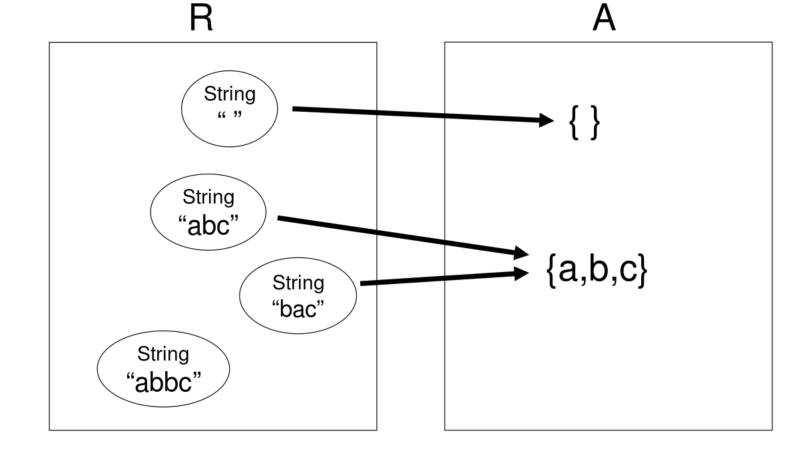
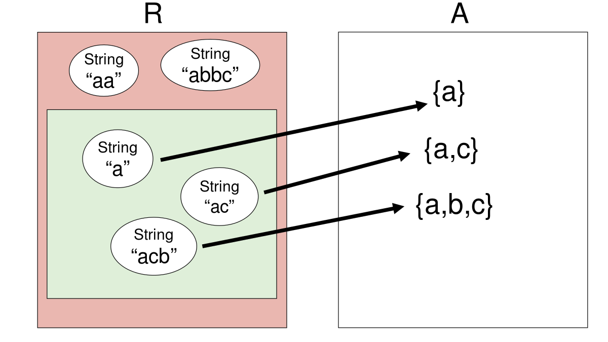
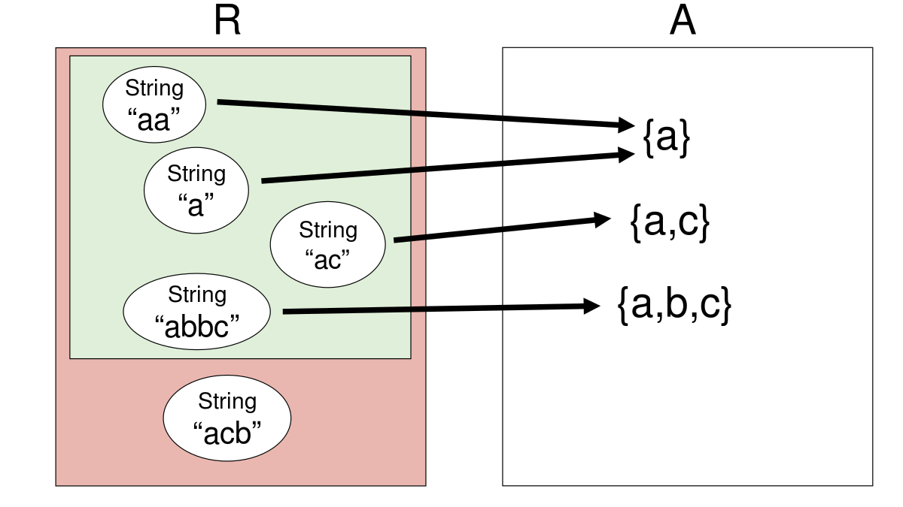
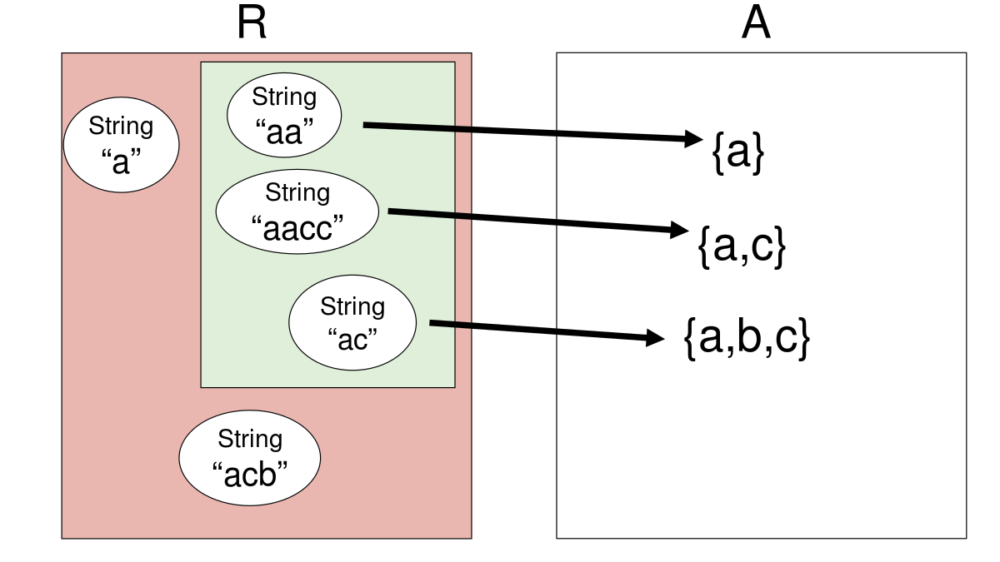
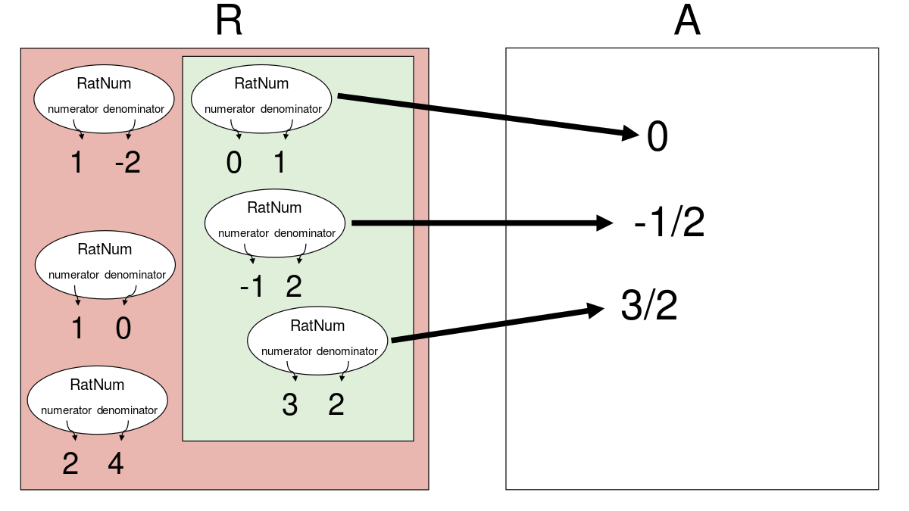
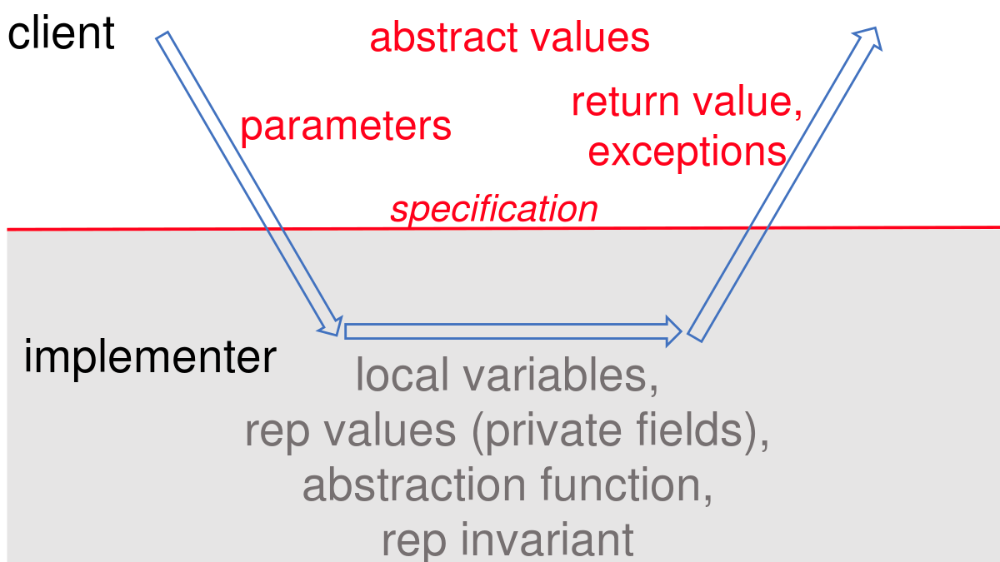

**本文内容来自[MIT_6.031_sp18: Software Construction](http://web.mit.edu/6.031/www/sp18/)课程的Readings部分，采用[CC BY-SA 4.0](http://creativecommons.org/licenses/by-sa/4.0/)协议。**

由于我们学校（哈工大）大二软件构造课程的大部分素材取自此，也是推荐的阅读材料之一，于是打算做一些翻译工作，自己学习的同时也能帮到一些懒得看英文的朋友。另外，该课程的阅读资料中有的练习题没有标准答案，所给出的“正确答案”为译者所写，有错误的地方还请指出。

*（更新：从第10章开始只翻译正确答案）*

<br />

------

<br />

译者：[李秋豪](http://www.cnblogs.com/liqiuhao/)

审校：

V1.0 Sun Apr  1 22:23:37 CST 2018

<br />

#### 本次课程的目标

今天我们会介绍以下几个思想：

- 不变量（invariants）
- 表示暴露（representation exposure）
- 抽象函数（abstraction functions）
- 表示不变量（representation invariants）

在这篇阅读中，我们会学习用一种正规的数学思想（抽象函数和表示不变量）去理解抽象数据类型ADT的实现。这些思想在软件设计的实践中非常重要。其中，抽象函数会让我们清晰的定义对两个ADT判断相等的操作（我们会在后面的课程中深入介绍），而表示不变量会让我们更易发现破坏数据结构导致的bug。

<br />

## 不变量

回想我们之前讨论过的关于ADT的内容，什么设计会产生好的ADT？其中最重要的一点就是**它会保护/保留自己的不变量。** *不变量*是一种属性，它在程序运行的时候总是一种状态，而*不变性*就是其中的一种：一旦一个不变类型的对象被创建，它总是代表一个不变的值。当一个ADT能够确保它内部的不变量恒定不变（不受使用者/外部影响），我们就说这个ADT*保护/保留自己的不变量*.

当一个ADT保护/保留自己的不变量时，对代码的分析会变得更简单。例如，你能够依赖字符串不变性的特点，在分析的时候跳过那些关于字符串的代码；或者当你尝试基于字符串建立其他的不变量的时候，也会变得更简单。与此相对，对于可变的对象，你将不得不对每一处使用它的代码处进行审查。

### 不变性

在这篇阅读的后面，我们会看到许多关于不变量的例子，现在我们先看一看不变性：

```java
/**
 * This immutable data type represents a tweet from Twitter.
 */
public class Tweet {

    public String author;
    public String text;
    public Date timestamp;

    /**
     * Make a Tweet.
     * @param author    Twitter user who wrote the tweet
     * @param text      text of the tweet
     * @param timestamp date/time when the tweet was sent
     */
    public Tweet(String author, String text, Date timestamp) {
        this.author = author;
        this.text = text;
        this.timestamp = timestamp;
    }
}
```

我们应该怎么样做才能确保Tweet对象是不可变的（一旦被创建，author, message, 和 date都不能被改变）？

第一个威胁就是使用者可以直接访问Tweet内部的数据，例如：

```java
Tweet t = new Tweet("justinbieber", 
                    "Thanks to all those beliebers out there inspiring me every day", 
                    new Date());
t.author = "rbmllr";
```

这就是一个**表示暴露（Rep exposure）**的例子，就是说类外部的代码可以直接修改类内部存储的数据。上面的表示暴露不仅影响到了不变量，也影响到了表示独立性（译者注：[“抽象数据类型”](http://www.cnblogs.com/liqiuhao/p/8667447.html)），如果我们改变类内部数据的表示方法，使用者也会受到影响。

幸运地是，Java给我们提供了处理这样的表示暴露的方法：

```java
public class Tweet {

    private final String author;
    private final String text;
    private final Date timestamp;

    public Tweet(String author, String text, Date timestamp) {
        this.author = author;
        this.text = text;
        this.timestamp = timestamp;
    }

    /** @return Twitter user who wrote the tweet */
    public String getAuthor() {
        return author;
    }

    /** @return text of the tweet */
    public String getText() {
        return text;
    }

    /** @return date/time when the tweet was sent */
    public Date getTimestamp() {
        return timestamp;
    }

}
```

其中， `private` 表示这个区域只能由同类进行访问；而`final`确保了该变量的索引不会被更改，对于不可变的类型来说，就是确保了变量的值不可变。

但是这并没有解决全部问题，表示还是会暴露！思考下面这个代码：

```java
/** @return a tweet that retweets t, one hour later*/
public static Tweet retweetLater(Tweet t) {
    Date d = t.getTimestamp();
    d.setHours(d.getHours()+1);
    return new Tweet("rbmllr", t.getText(), d);
}
```

`retweetLater` 希望接受一个Tweet对象然后修改Date后返回一个新的Tweet对象。

问题出在哪里呢？其中的 `getTimestamp` 调用返回一个一样的`Date`对象，它会被 `t`.`t.timestamp` 和 `d` 同时索引。所以当我们调用 `d.setHours()`后，`t`也会受到影响，如下图所示：


这样，`Tweet`的不变性就被破坏了。这里的问题就在于`Tweet`将自己内部对于可变对象的索引“泄露”了出来，因此整个对象都变成可变的了，使用者在使用时也容易造成隐秘的bug。

我们可以通过防御性复制来弥补这个问题：在返回的时候复制一个新的对象而不会返回原对象的索引。

```java
public Date getTimestamp() {
    return new Date(timestamp.getTime());
}
```

可变类型通常都有一个专门用来复制的构造者，你可以通过它产生一个一模一样的复制对象。在上面的例子中，`Date`的复制构造者就接受了一个timestamp值，然后产生了一个新的对象。另一个复制可变对象的方法是使用`clone()` ，但是它没有被很多类支持（译者注：标准库里面只有5%支持），在Java中，使用`clone()`可能会带来一些麻烦。你可以在 [Josh Bloch, *Effective Java*, item 11](https://books.google.com/books?id=ka2VUBqHiWkC&lpg=PA33&pg=PA54#v=onepage&q&f=false), 或者 [Copy Constructor vs. Cloning](http://www.artima.com/intv/bloch13.html)获得更多有关这方面的信息。

现在我们已经通过防御性复制解决了 `getTimestamp`返回值的问题，但是我们还没有完成任务！思考这个使用者的代码：

```java
/** @return a list of 24 inspiring tweets, one per hour today */
public static List<Tweet> tweetEveryHourToday () {
    List<Tweet> list = new ArrayList<Tweet>(); 
    Date date = new Date();
    for (int i = 0; i < 24; i++) {
        date.setHours(i);
        list.add(new Tweet("rbmllr", "keep it up! you can do it", date));
    } 
    return list;
}
```

这个代码尝试创建24个Tweet对象，每一个对象代表一个小时，如下图所示：


但是，Tweet的不变性再次被打破了，因为每一个Tweet创建时对Date对象的索引都是一样的。所以我们应该对创建者也进行防御性编程：

```java
public Tweet(String author, String text, Date timestamp) {
    this.author = author;
    this.text = text;
    this.timestamp = new Date(timestamp.getTime());
}
```

通常来说，你要特别注意ADT操作中的参数和返回值。如果它们之中有可变类型的对象，确保你的代码没有直接使用索引或者直接返回索引。

你可能会提出异议。这样不会很浪费吗？毕竟你要复制创建这么多新的对象。为什么不直接在规格说明中解决这个问题：

```java
/**
 * Make a Tweet.
 * @param author    Twitter user who wrote the tweet
 * @param text      text of the tweet
 * @param timestamp date/time when the tweet was sent. Caller must never 
 *                   mutate this Date object again!
 */
public Tweet(String author, String text, Date timestamp) {
```

这种方法一般只在迫不得已的时候使用——例如，这个可变对象的数据量非常大，如果进行防御性复制的话会花费很多资源（当然，这取决于你对程序的判断）。如果不是极端情况，确保ADT会保留/保护自己的不变量总比通过规格说明来限定使用者要好。

而更好的解决方案是使用不可变类型。例如上面的例子中，如果我们使用的是 `java.time.ZonedDateTime`而非 `java.util.Date`, 那么我们只需要添加 `private`和`final`即可，不用再担心表示保留。

### 可变类型的不可变包装

Java的collections类提供了一种有趣的“折中”：不可变包装。

`Collections.unmodifiableList()` 会接收一个（可变）`List`然后将其包装为一个不可变对象——它的 `set()`, `add()`, `remove()`,等操作都会抛出异常。所以你可以将一个`List`包装为不可变对象（记得将以前对于`List`的索引丢掉），然后将它传入其他地方使用。

这种方法的缺点就是你只能在运行时获得不可变性，而不是编译时。Java不会在编译的时候对你对“不可变”列表的修改提出警告。但是这总比什么都不做好，所以使用不可变的列表、映射、和集合也是减少bug的好方法。

#### 阅读小练习

**Rep exposure**

思考下面这个有问题的数据类型：

```java
      /** Represents an immutable right triangle. */
      class RightTriangle {
/*A*/     private double[] sides;

/*B*/     public final int hypotenuse = 2;

          /** Make a right triangle.
           * @param legA, legB  the two legs of the triangle
           * @param hypotenuse    the hypotenuse of the triangle.
 *C*       *        Requires hypotenuse^2 = legA^2 + legB^2 
           *           (within the error tolerance of double arithmetic)
           */
          public RightTriangle(double legA, double legB, double hypotenuse) {
/*D*/         this.sides = new double[] { legA, legB };
/*D*/         this.hypotenuse = hypotenuse;
          }

          /** Get the two sides of the right triangle.
           *  @return two-element array with the triangle's side lengths
           */
          public double[] getAllSides() {
/*E*/         return sides;
          }

          /** @param factor to multiply the sides by
           *  @return a triangle made from this triangle by 
           *  multiplying all side lengths by factor.
           */
          public RightTriangle scale(double factor) {
              return new RightTriangle(sides[0]*factor, sides[1]*factor, hypotenuse*factor);
          }

          /** @return a regular triangle made from this triangle.
           *  A regular right triangle is one in which
           *  both legs have the same length.
           */
          public RightTriangle regularize() {
              double bigLeg = Math.max(side[0], side[1]);
              return new RightTriangle (bigLeg, bigLeg, hypotenuse);
          }

      }
```

以下哪些说法是正确的？

- [ ] The line marked `/*A*/` is a problem for rep exposure because arrays are mutable.
- [x]  `/*B*/` 处有问题，因为这种表示方法会让使用者依赖于类型内部的表示。
- [ ] The line marked `*C*` is a problem because creator operations should not have preconditions.
- [ ] The two lines marked `/*D*/` are a problem because they put legA, legB, and hypotenuse into the rep without doing a defensive copy first.
- [x] `/*E*/` 处有问题，因为这影响到了类的不可变性。


<br />

## 表示不变量和抽象函数

我们现在深入理解一下抽象数据类型背后的理论，这些理论不仅本身很有趣，它们在ADT的设计与实现中也很有意义。如果你能够很好的理解它们，你将会设计出更好的抽象类型，并且远离那些隐晦的陷阱。

在研究抽象类型的时候，先思考一下两个值域之间的关系：

表示域（space of representation values）里面**包含的是值具体的实现实体**。在简单的情况下，一个抽象类型只需要实现为单个的对象，但是更常见的情况是使用一个很多对象的网络。

抽象域里面包含的则是类型设计时支持使用的值。**这些值是由表示域“抽象/想象”出来的，也是使用者关注的。**例如，一个无限整数对象的抽象域是整个整数域，但是它的实现域可能是一个由原始整数类型（有限）组成的数组实现的，而使用者只关注抽象域。

但是，实现者是非常“在意”表示域（和抽象域）的，因为实现者的责任就是实现表示域到抽象域的转换（映射）。

例如，我们选择用字符串来表示一个字符集合：

```java
public class CharSet {
    private String s;
    ...
}
```



如上图所示，表示域R包含的是我们的实现实体（字符串），而抽象域里面是抽象类型表示的字符集合，我们用箭头表示这两个域之间的映射关系。这里要注意几点：

- **每一个抽象值都是由表示值映射而来** 。我们之前说过实现抽象类型的意义在于支持对于抽象值的操作，即我们需要能够创建和管理所有的抽象值，因此它们也必须是可表示的。
- **一些抽象值是被多个表示值映射而来的。**这是因为表示方法并不是固定的，我们可以灵活的表示一个抽象值。
- **不是所有的表示值都能映射到抽象域中。**在上面这个例子中，“abbc”就没有被映射。因为我们已经确定了表示值的字符串中不能含有重复的字符——这样我们的 `remove` 方法就能在遇到第一个对应字符的时候停止，因为我们知道没有重复的字符。

由于我们不可能对每一个映射一一解释，为了描述这种对应关系和这两个域，我们再定义两个概念：

*抽象函数abstraction function*是表示值到其对应的抽象值的映射：

> AF : R → A

快照图中的箭头表示的就是抽象函数，可以看出，这种映射是满射，但不一定是单射（不一定是双射）。

*表示不变量rep invariant*是表示值到布尔值的映射：

> RI : R → boolean

对于表示值r，当且仅当r被AF映射到了A，RI(r)为真。换句话说，RI告诉了我们哪些表示值是“良好组织”的（能够去表示A中的抽象值），在下图中，绿色表示的就是RI(r)为真的部分，AF只在这个子集上有定义。



例如上图中，CharSet这种类型的实现禁止有重复字符，所以 *RI(“a”)* = true, *RI(“ac”)* = true, *RI(“acb”)* = true, 但是 *RI(“aa”)* = false, *RI(“abbc”)* = false.其中为假的集合用红色区域表示，合法的（为真）的字符串集合用绿色表示。

表示不变量和抽象函数都应该在表示声明后注释出来：

```java
public class CharSet {
    private String s;
    // Rep invariant:
    //   s contains no repeated characters
    // Abstraction function:
    //   AF(s) = {s[i] | 0 <= i < s.length()}
    ...
}
```

一个常见的疑惑就是，抽象函数和表示不变量似乎是被表示域和抽象域决定的，甚至似乎抽象域就可以决定它。如果是这样的话，那么它们的定义似乎没什么用。

首先证明抽象域并不能独立决定AF和RI：对于同样的抽象类型可以有多种表示方法。例如对于一个字符集合，我们既可以用字符串来表示，也可以用比特向量来表示，每一个比特位对应一个可能的字符。显然我们需要两个不同的抽象函数来表示这两种不同的映射。

现在我们再来证明表示域和抽象域也不能决定AF和RI。这里的关键点在于，当我们确定表示域（表示值的空间）后，我们并不能决定哪一些表示值是合法的，以及如果它是合法的，它会被怎么解释/映射。例如在上面的例子中，我们也可以允许表示值有重复的字符，但是我们要求表示值中的字符必须是排好序的，因为这样我们就可以对其进行二分查找而非线性的遍历了。**对于同一个表示域，我们得到了不同的表示不变量：**



```java
public class CharSet {
    private String s;
    // Rep invariant:
    //   s[0] <= s[1] <= ... <= s[s.length()-1]
    // Abstraction function:
    //   AF(s) = {s[i] | 0 <= i < s.length()}
    ...
}
```

最后，即使是同样的抽象域和表示域以及同样的表示不变量，我们也可能有不同的解释方法/抽象函数。还是上面的例子，我们可以对表示值中相邻的字符做不同的解释： `"acgg"` 被解释为[a-c] 和 [g-g]中的字符，即{a,b,c,g}。现在的映射如下图所示：



```java
public class CharSet {
    private String s;
    // Rep invariant:
    //   s.length() is even
    //   s[0] <= s[1] <= ... <= s[s.length()-1]
    // Abstraction function:
    //   AF(s) = union of { c | s[2i] <= c <= s[2i+1] } 
    //           for all 0 <= i < s.length()/2
    ...
}
```

**总之，一个ADT的实现不仅是选择表示域（规格说明）和抽象域（具体实现），同时也要决定哪一些表示值是合法的（表示不变量），合法表示会被怎么解释/映射（抽象函数）。**

所以，你必须像我们一样在代码中写出这些设计，以便别的程序员（或者未来的你）明白这些表示到底意味着什么。为什么呢？当程序员不明白表示的含义时会发生什么问题呢？请完成下面的阅读小练习。

> 你可以在Github上找到上面例子中`CharSet`的[三种实现的代码](https://github.com/6031-sp18/ex11-adt-examples/tree/master/src/charset)。

#### 阅读小练习

**Exploring a rep**

请思考上面 `CharSet` 的最后一种实现方式：

```java
public class CharSet {
    private String s;
    // Rep invariant:
    //   s.length() is even
    //   s[0] <= s[1] <= ... <= s[s.length()-1]
    // Abstraction function:
    //   AF(s) = union of { c | s[2i] <= c <= s[2i+1] } 
    //           for all 0 <= i < s.length()/2
    ...
}
```

下面哪个选项的 `s` 满足了表示不变量？

- [ ] `"abc"`

- [x] `"abcd"`

- [ ] `"eeee"`

- [x] `"ad"`

- [ ] `"adad"`

- [ ] `""`

`AF("acfg")` 会映射到哪一个集合？

- [ ] {a,b,c,d,e,f,g}

- [x] {a,b,c,f,g}

- [ ] {a,c,f,g}

- [ ] some other abstract value

- [ ] no abstract value, because `"acfg"` does not satisfy the rep invariant

下面哪一个选项会和 `"tv"`映射到同一个抽象值？

- [ ] `"ttv"`

- [x] `"ttuuvv"`

- [x] `"ttuv"`

- [ ] `"tuv"`


**Who knows what?**

以下哪一些选项是使用者需要了解的？

- [x] 抽象域

- [ ] 抽象函数

- [x] 创建者

- [x] 观察者

- [ ] 表示域

- [ ] 表示不变量

以下哪一些选项是开发者需要了解的？

- [x] 抽象域
- [x] 抽象函数
- [x] 创建者
- [x] 观察者
- [x] 表示域
- [x] 表示不变量


**Rep invariant pieces**

假设 `C` 这种抽象数据类型的表示用到了两个字符串：

```java
class C {
    private String s;
    private String t;
    ...
}
```

假设你不知道任何关于`C`抽象的信息，以下哪一些选项可能是`C`的表示不变量？

- [x] `s` 只能包含字母

- [x] `s.length() == t.length()`

- [ ] `s` represents a set of characters

- [ ] `C`’s observers

- [x] `s` 是 `t`反序过来的结果

- [ ] `s+t`


**Trying to implement without an AF/RI**

假设Louis 是这样表示`CharSet`的： 

```java
public class CharSet {
    private String s;
    ...
}
```

不幸的是，Louis忘记写下抽象函数（AF）和表示不变量（RI）了。这里有四中可能的AF/RI对。它们在之前的例子中已经提到过了：

SortedRep:

```java
// AF(s) = {s[i] | 0 <= i < s.length()}
// RI: s[0] < s[1] < ... < s[s.length()-1]
```

SortedRangeRep:

```java
// AF(s) = union of { c | s[2i] <= c <= s[2i+1] } 
//         for all 0 <= i < s.length()/2
// RI: s.length() is even, and s[0] <= s[1] <= ... <= s[s.length()-1]
```

NoRepeatsRep:

```java
// AF(s) = {s[i] | 0 <= i < s.length()}
// RI: s contains no character more than once
```

AnyRep:

```java
// AF(s) = {s[i] | 0 <= i < s.length()}
// RI: true
```

假设Louis有三个不同的朋友在帮助他分别实现该类型的三个操作: `add()`, `remove()`, and `contains()`，**每一个朋友对这种类型的表示都有自己的猜想。**

对于下面 `add()`的实现，哪一种AF/RI是可以对的上的？

```java
/**
 * Modifies this set by adding c to the set.
 * @param c character to add
 */
public void add(char c) {
    s = s + c;
}
```

- [ ] SortedRep

- [ ] SortedRangeRep

- [ ] NoRepeatsRep

- [x] AnyRep


**Trying to implement without an AF/RI #2**

对于下面 `remove()`的实现，哪一种AF/RI是可以对的上的？

```java
/**
 * Modifies this set by removing c, if found.
 * If c is not found in the set, has no effect.
 * @param c character to remove
 */
public void remove(char c) {
    int position = s.indexOf(c);
    if (position >= 0) {
        s = s.substring(0, position) + s.substring(position+1, s.length());
    }
}
```

- [x] SortedRep

- [ ] SortedRangeRep

- [x] NoRepeatsRep

- [ ] AnyRep


**Trying to implement without an AF/RI #3**

对于下面 `contains()`的实现，哪一种AF/RI是可以对的上的？

```java
/**
 * Test for membership.
 * @param c a character
 * @return true iff this set contains c
 */
public boolean contains(char c) {
    for (int i = 0; i < s.length(); i += 2) {
        char low = s.charAt(i);
        char high = s.charAt(i+1);
        if (low <= c && c <= high) {
            return true;
        }
    }
    return false;
}
```

- [ ] SortedRep

- [x] SortedRangeRep

- [ ] NoRepeatsRep

- [ ] AnyRep


### 例子：有理数

这里列出了一个表示有理数的例子。仔细观察表示不变量和抽象函数。我们似乎可以允许更多的表示值是合法的，但是这样做会让一些操作的实现变得复杂（假设变了），另一些操作则可能变得简单。



```java
public class RatNum {

    private final int numerator;
    private final int denominator;

    // Rep invariant:
    //   denominator > 0
    //   numerator/denominator is in reduced form

    // Abstraction function:
    //   AF(numerator, denominator) = numerator/denominator

    /** Make a new RatNum == n.
     *  @param n value */
    public RatNum(int n) {
        numerator = n;
        denominator = 1;
        checkRep();
    }

    /** Make a new RatNum == (n / d).
     *  @param n numerator
     *  @param d denominator
     *  @throws ArithmeticException if d == 0 */
    public RatNum(int n, int d) throws ArithmeticException {
        // reduce ratio to lowest terms
        int g = gcd(n, d);
        n = n / g;
        d = d / g;

        // make denominator positive
        if (d < 0) {
            numerator = -n;
            denominator = -d;
        } else {
            numerator = n;
            denominator = d;
        }
        checkRep();
    }
}
```
#### 阅读小练习

**RatNum**

阅读上面的代码和快照图，对于下面的每一种现象/属性，哪一行代码“负有最大的责任”（导致）？

`RatNum(1,-2)` 出现在 R的红色区域：

- [ ] `private final int numerator;`

- [ ] `private final int denominator;`

- [ ] `// Rep invariant:`

- [x] `// denominator > 0`

- [ ] `// numerator/denominator is in reduced form`

- [ ] `// Abstraction function:`

- [ ] `// AF(numerator, denominator) = numerator/denominator`

`RatNum(2,4)` 出现在 R的红色区域：

- [ ] `private final int numerator;`

- [ ] `private final int denominator;`

- [ ] `// Rep invariant:`

- [ ] `// denominator > 0`

- [x] `// numerator/denominator is in reduced form`

- [ ] `// Abstraction function:`

- [ ] `// AF(numerator, denominator) = numerator/denominator`

`RatNum(-1,2)`到 -1/2 有一个箭头：

- [ ] `private final int numerator;`

- [ ] `private final int denominator;`

- [ ] `// Rep invariant:`

- [ ] `// denominator > 0`

- [ ] `// numerator/denominator is in reduced form`

- [ ] `// Abstraction function:`

- [x] `// AF(numerator, denominator) = numerator/denominator`


### 检查表示不变量

表示不变量不仅是一个简洁的数学概念，你还可以通过断言检查它的不变属性来动态捕捉bug。例如上面的`RatNum`，这里就举出了一种检查的方法：

```java
// Check that the rep invariant is true
// *** Warning: this does nothing unless you turn on assertion checking
// by passing -enableassertions to Java
private void checkRep() {
    assert denominator > 0;
    assert gcd(Math.abs(numerator), denominator) == 1;
}
```

你应该在每一个创建或者改变表示数据的操作后调用 `checkRep()` 检查不变量，换句话说，就是在使用创建者、生产者以及改造者之后。在上面的`RatNum`中，你可以看到我们在两个创建者的最后都使用了 `checkRep()` 进行检查。

虽然说观察者通常不需要使用 `checkRep()` 进行检查，但这也是一个不错的主意。为什么？因为在每一个操作中调用 `checkRep()` 检查不变量更能够帮助你捕捉因为表示暴露而带来的bug。

为什么 `checkRep()` 是私有的？谁应该为为表示不变量负责？使用者还是实现者？

#### 阅读小练习

**Checking the rep invariant**

以下哪一个选项的说法是正确的？

- [ ] `checkRep()` is the abstraction function

- [x] `checkRep()` 断言检查了表示不变量

- [x] 对于实现者来说，在每一个类的公共方法返回前调用 `checkRep()` 进行检查是一个好主意

- [ ] it’s good for a client to call `checkRep()` just after calling a public method of an ADT class


### 不要在表示中使用Null

回忆一下我们之前说过的使用null的坏处（译者注：[“规格说明”](http://www.cnblogs.com/liqiuhao/p/8566500.html)），我们应该尽可能在编程中避免它。正因为如此，我们之前说如果没有特殊说明，前置条件和后置条件中都隐式包含不会有null值出现。

现在我们将这种闲置扩展到抽象数据类型的表示中。默认情况下，我们不允许表示中的索引出现null值（包括数组或者列表中的元素）。例如，如果你的表示是：

```java
class CharSet {
    String s;
}
```

那么表示不变量中默认就会有 `s != null` ——你不需要专门在表示不变量的注释中进行说明。

然而，当你在实现检查表示不变量的 `checkRep()` 时，你应该显式的检查 `s != null`，确保当 `s` 是 `null` 的时候会快速失败。通常来说，这种检查会是自动的，因为很多操作在内容是null时会自动抛出异常，例如: 

```java
private void checkRep() {
    assert s.length() % 2 == 0;
    ...
}
```

这个时候你就不需要使用 `assert s != null`,因为对 `s.length()` 的调用会在`s`为null的时候自动失败报错。但是如果没有对null的自动检查，你就需要显式的使用 `assert s != null`了。

<br />

## 友善改动

回忆之前我们对于不可变类型的定义：对象一旦被创建其值不会发生更改。现在我们学习了抽象数据类型中的表示域和抽象域，我们可以将这个定义更加细化一下：对象一旦被创建，其抽象值不会发生改变。也就是说，对于使用者来说，其代表的值是不会变的，但是实现者可以在底层对表示域做一些改动，这些不会影响到抽象域的改动就称为**友善改动（beneficent mutation）.**

这里举出了一个之前提到的`RatNum`类型，不过我们将表示不变量的限制放宽了，不再要求分子和分母必须是最简形式：

```java
public class RatNum {

    private int numerator;
    private int denominator;

    // Rep invariant:
    //   denominator != 0

    // Abstraction function:
    //   AF(numerator, denominator) = numerator/denominator

    /**
     * Make a new RatNum == (n / d).
     * @param n numerator
     * @param d denominator
     * @throws ArithmeticException if d == 0
     */
    public RatNum(int n, int d) throws ArithmeticException {
        if (d == 0) throw new ArithmeticException();
        numerator = n;
        denominator = d;
        checkRep();
    }

    ...
}
```

这样的话，再显示值之前，我们要对其进行简化：

```java
    /**
     * @return a string representation of this rational number
     */
    @Override
    public String toString() {
        int g = gcd(numerator, denominator);
        numerator /= g;
        denominator /= g;
        if (denominator < 0) {
            numerator = -numerator;
            denominator = -denominator;
        }
        checkRep();
        return (denominator > 1) ? (numerator + "/" + denominator) 
                                 : (numerator + "");
    }
```

注意到 `toString` 实现更改了私有区域 `numerator` 和 `denominator`, 即它改变了表示域——虽然这还是一个观察者！但是关键点在于，这种改动并没有改变映射到的抽象值。我们对分子分母进行的约分和同乘-1的操作并没有改变`AF(numerator, denominator) = numerator/denominator`的行为。也可以这样想，AF是一种多对一函数，即一个表示值可以用多种表示值来实现。所以这种改动是无害的，也就是“友善”的。

我们会在后面的课程中看到很多使用友善改动的例子。这种实现上的自由通常可以带来性能上的提升，例如缓冲、数据结构再平衡、延迟清除等策略。

<br />

## AF, RI以及表示暴露安全性的注解

你应该在抽象类型（私有的）表示声明后写上对于抽象函数和表示不变量的注解，这是一个好的实践要求。我们在上面的例子中也是这么做的。

当你在描述抽象函数和表示不变量的时候，注意要清晰明确：

- 对于RI（表示不变量），仅仅宽泛的说什么区域是合法的并不够，你还应该说明是什么使得它合法/不合法。
- 对于AF（抽象函数）来说，仅仅宽泛的说抽象域表示了什么并不够。抽象函数的作用是规定合法的表示值会如何被解释到抽象域。作为一个函数，我们应该清晰的知道从一个输入到一个输入是怎么对应的。

本门课程还要求你将**表示暴露的安全性**注释出来。这种注释应该说明表示的每一部分，它们为什么不会发生表示暴露，特别是处理的表示的参数输入和返回部分（这也是表示暴露发生的位置）。

下面是一个`Tweet`类的例子，它将表示不变量和抽象函数以及表示暴露的安全性注释了出来：

```java
// Immutable type representing a tweet.
public class Tweet {

    private final String author;
    private final String text;
    private final Date timestamp;

    // Rep invariant:
    //   author is a Twitter username (a nonempty string of letters, digits, underscores)
    //   text.length <= 140
    // Abstraction function:
    //   AF(author, text, timestamp) = a tweet posted by author, with content text, 
    //                                 at time timestamp 
    // Safety from rep exposure:
    //   All fields are private;
    //   author and text are Strings, so are guaranteed immutable;
    //   timestamp is a mutable Date, so Tweet() constructor and getTimestamp() 
    //        make defensive copies to avoid sharing the rep's Date object with clients.

    // Operations (specs and method bodies omitted to save space)
    public Tweet(String author, String text, Date timestamp) { ... }
    public String getAuthor() { ... }
    public String getText() { ... }
    public Date getTimestamp() { ... }
}
```

注意到我们并没有对 `timestamp` 的表示不变量进行要求（除了之前说过的默认 `timestamp!=null`）。但是我们依然需要对`timestamp` 的表示暴露的安全性进行说明，因为整个类型的不变性依赖于所有的成员变量的不变性。

下面是关于 `RatNum`的另一个例子：

```java
// Immutable type representing a rational number.
public class RatNum {
    private final int numerator;
    private final int denominator;

    // Rep invariant:
    //   denominator > 0
    //   numerator/denominator is in reduced form, i.e. gcd(|numerator|,denominator) = 1
    // Abstraction function:
    //   AF(numerator, denominator) = numerator/denominator
    // Safety from rep exposure:
    //   All fields are private, and all types in the rep are immutable.

    // Operations (specs and method bodies omitted to save space)
    public RatNum(int n) { ... }
    public RatNum(int n, int d) throws ArithmeticException { ... }
    ...
}
```

可以看到，对于不可变类型的表示，表示暴露的安全性说明会简单很多。

> 你可以在GitHub[获取`RatNum`的所有代码 ](https://github.com/6031-sp18/ex11-adt-examples/blob/master/src/RatNum.java)

#### 阅读小练习

**Arguing against rep exposure**

思考这个抽象数据类型：

```java
// Mutable type representing Twitter users' followers.
public class FollowGraph {
    private final Map<String,Set<String>> followersOf;

    // Rep invariant:
    //    all Strings in followersOf are Twitter usernames
    //           (i.e., nonempty strings of letters, digits, underscores)
    //    no user follows themselves, i.e. x is not in followersOf.get(x)
    // Abstraction function:
    //    AF(followersOf) = the follower graph where Twitter user x is followed by user y
    //                      if and only if followersOf.get(x).contains(y)
    // Safety from rep exposure:
    //    All fields are private, and ..???..

    // Operations (specs and method bodies omitted to save space)
    public FollowGraph() { ... }
    public void addFollower(String user, String follower) { ... }
    public void removeFollower(String user, String follower) { ... }
    public Set<String> getFollowers(String user) { ... }
}
```

对于上面代码中的注解，下面哪一个选项可以正确的替代 `..???..` ，从而使得表示暴露的安全性得到说明？

**1.** “Strings are immutable.”

No

**2.** “`followersOf` 是一个可变的 `Map`， 其包含着可变的 `Set` 对象，但是 `getFollowers()` 在返回时会对 `Set` 进行防御性复制，并且其他的参数和返回值都是不可变类型的 `String` 或者 `void` .”

Yes

**3.** “This class is mutable, so rep exposure isn’t an issue.”

No

**4.** “`followersOf` is a mutable Map, but it is never passed or returned from an operation.”

No

**5.** “`FollowGraph()` does not expose the rep; `addFollower()` does not expose the rep; `removeFollower()` does not expose the rep; `getFollowers()` does not expose the rep.”

No

**6.** “`String` 是不可变的, 并且表示中的 `Set` 对象都使用了不可变包装。虽然`Map`类型是可变的，但是没有操作传入或者返回这种类型的对象。”

Yes


### 一个ADT的规格说明应该写什么？ 

由于我们已经讲了如何对表示不变量和抽象函数做注解，现在我们就来更新一下我们对于规格说明的理解，即一个ADT的规格说明应该写什么？ 



如上图所示，规格说明在使用者和实现者之间构建起了一道“防火墙”。抽象类型的**规格说明（包含操作的说明）应该只关注使用者可见的部分，**这包括参数、返回值、可能抛出的异常。例如规格说明需要引用T的值时，它应该是抽象域的值而非表示域。

规格说明不应该谈论具体的表示/实现细节，例如表示域里面的值。它应该认为表示本身（私有区域）对于使用者是不可见的，就像是方法里面的局部变量对外部不可见。这也是为什么我们在注解表示不变量和抽象函数的时候使用的是"\\\\"注释而非典型的Javadoc格式。如果我们使用Javadoc注释的话，内部的实现细节会出现在规格说明中，而这会影响表示独立性以及信息隐藏。

<br />

## 用ADT不变量替换前置条件

良好设计的ADT的一个大优点在于我们**可以使用它将本该写在前置条件中的限制封装起来**。例如，现在有一个规格说明是这样：

```java
/** 
 * @param set1 is a sorted set of characters with no repeats
 * @param set2 is likewise
 * @return characters that appear in one set but not the other,
 *  in sorted order with no repeats 
 */
static String exclusiveOr(String set1, String set2);
```

我们可以利用ADT（`SortedSet`）的不变量属性要求这种前置条件：

```java
/** @return characters that appear in one set but not the other */
static SortedSet<Character> exclusiveOr(SortedSet<Character>  set1, SortedSet<Character> set2);
```

这满足了我们所有的要求：

- 远离bug：因为要求的条件（排序、无重复）都已经是ADT的不变量了，所以Java可以对其进行静态检查，在编译期阻止所有不满足的操作。
- 易于理解：因为这样写更简单，并且ADT `SortedSet` 的名字就已经表明了它该有的属性。
- 可改动：因为我们可以改变 `SortedSet` 的内部实现而不影响 `exclusiveOr` 或其他的使用者代码。

我们以前很多用前置条件的地方现在都可以用定制的ADT来替换。

#### 阅读小练习

**Encapsulating preconditions in ADTs**

思考下面这个方法：

```java
/**
 * Find tweets written by a particular user.
 * 
 * @param tweets a list of tweets with distinct timestamps, not modified by this method.
 * @param username Twitter username (a nonempty sequence of letters, digits, and underscore)
 * @return all and only the tweets in the list whose author is username,
 *         in the same order as in the input list.
 */
public static List<Tweet> writtenBy(List<Tweet> tweets, String username) { ... }
```

你会创建一个什么ADT来避开这种繁杂的前置要求？

- [ ] `TweetsAndUsername`

- [x] `TweetList`

- [x] `Username`

- [ ] `UsernameCharacter`


### 如何建立不变量

不变量是一种在程序中一直为真的属性，对于对象而言，就是从对象创建开始一直具有的属性。

为了保持一个不变量，我们需要：

- 确保在对象创建的时候不变量成立
- 确保对对象在接下来的每一个改变后不变量依然成立
- 译者注：这就是状态机中的不变性 [状态机：如何构建稳定的婚姻](http://www.cnblogs.com/liqiuhao/p/7810369.html)

翻译成对于ADT的操作，就是：

- 创建者和生产者必须对新的对象就建立不变量
- 改造者和观察者必须保持/保护这种不变量

表示暴露会使得情况更加复杂，如果一个表示被暴露出来，那么程序的任何地方都可能对其进行修改，我们也就没法确保不变量一直成立了。所以使用不变量完整的规则应该是：

**结构归纳法**. 如果一个抽象数据类型的不变量满足：

1. 被创建者或生产者创建；
2. 被改造者和观察者保持；
3. 没有表示暴露。

那么这种类型的所有实例的不变量都是成立的。

#### 阅读小练习

**Structural induction**

Recall this data type from the first exercise in this reading:回忆在第一个练习中的数据类型：

```java
/** Represents an immutable right triangle. */
class RightTriangle {
    private double[] sides;
    // RI: ???
    // AF: ???

    // sides[0] and sides[1] are the two legs,
    // and sides[2] is the hypotenuse, so declare it to avoid having a
    // magic number in the code:
    public static final int HYPOTENUSE = 2;

    /** Make a right triangle.
     * @param legA, legB  the two legs of the triangle
     * @param hypotenuse    the hypotenuse of the triangle.
     *        Requires hypotenuse^2 = legA^2 + legB^2 
     *           (within the error tolerance of double arithmetic)
     */
    public RightTriangle(double legA, double legB, double hypotenuse) {
        this.sides = new double[] { legA, legB, hypotenuse };
    }

    /** Get all the sides of the triangle.
     *  @return three-element array with the triangle's side lengths
     */
    public double[] getAllSides() {
        return sides;
    }

    /** @return length of the triangle's hypotenuse */ 
    public double getHypotenuse() {
        return sides[HYPOTENUSE];
    }

    /** @param factor to multiply the sides by
     *  @return a triangle made from this triangle by 
     *  multiplying all side lengths by factor.
     */
    public RightTriangle scale(double factor) {
        return new RightTriangle (sides[0]*factor, sides[1]*factor, sides[2]*factor);
    }

    /** @return a regular triangle made from this triangle.
     *  A regular right triangle is one in which
     *  both legs have the same length.
     */
    public RightTriangle regularize() {
        double bigLeg = Math.max(sides[0], sides[1]);
        return new RightTriangle (bigLeg, bigLeg, sides[2]);
    }

}
```

这个数据类型中有一个重要的不变量，那就是直角边和斜边之间的勾股关系。

假设使用者遵守了规格说明，以下哪一个说法是正确的？

- [x] 创建者 `RightTriangle()` 建立的不变量


- [ ] The observer `getAllSides()` preserves the invariant
- [x] 观察者 `getHypotenuse()` 保持了不变量
- [x] 生产者 `scale()` 保持了不变量
- [ ] The producer `regularize()` preserves the invariant


<br />

## 总结

- 不变量是指对于一个对象，它有一种能够在整个生命周期保证为真的属性。
- 一个好的ADT会确保它的不变量为真。不变量是由创建者和生产者创建，被观察者和改造者保持。
- 表示不变量明确了什么是合法的表示值，并且这些表示应该在运行时调用`checkRep()`检查。
- 抽象函数将具体的表示映射到抽象值上。
- 表示暴露会威胁到表示独立性和表示不变量。

下面将这篇阅读的知识点与我们的三个目标联系起来：

- **远离bug.** 一个好的ADT会确保它的不变量为真，因此它们不会被使用者代码中的bug所影响。同时，通过显式的声明和动态检查不变量，我们可以尽早的发现bug，而不是让错误的行为继续下去。
- **易于理解.** 表示不变量和抽象函数详细的表述了抽象类型中表示的意义，以及它们是如何联系到抽象值的。
- **可改动.** 抽象数据类型分离了抽象域和表示域，这使得实现者可以改动具体实现而不影响使用者的代码。