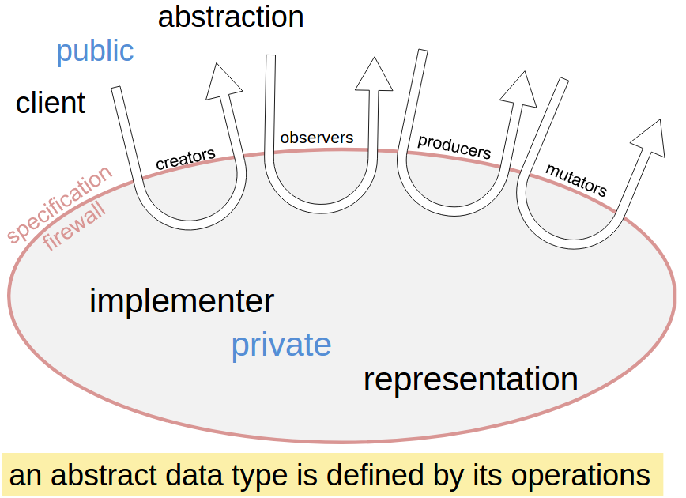
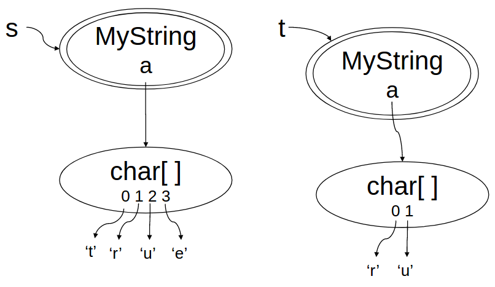

**本文内容来自[MIT_6.031_sp18: Software Construction](http://web.mit.edu/6.031/www/sp18/)课程的Readings部分，采用[CC BY-SA 4.0](http://creativecommons.org/licenses/by-sa/4.0/)协议。**

由于我们学校（哈工大）大二软件构造课程的大部分素材取自此，也是推荐的阅读材料之一，于是打算做一些翻译工作，自己学习的同时也能帮到一些懒得看英文的朋友。另外，该课程的阅读资料中有许多练习题，但是没有标准答案，所给出的“正确答案”均为译者所写，有错误的地方还请指出。

*（更新：从第10章开始，只提供正确答案，不再翻译错误答案）*

<br />

------

<br />

译者：[李秋豪](http://www.cnblogs.com/liqiuhao/) [江家伟](http://jiangjiawei.pw/blog/)

审校：[李秋豪](http://www.cnblogs.com/liqiuhao/)

V1.0 Thu Mar 29 00:41:23 CST 2018

<br />

#### 本次课程的目标

- 理解“抽象数据类型(ADT)”
- 理解“表示独立”

在这篇阅读中，我们将会讲解一个重要的概念——抽象数据类型，它会帮助我们将数据结构的使用和数据结构的具体实现分开。

抽象数据类型解决了一个很危险的问题：使用者可能对类型的内部表示做假设。我们在后面会探讨为什么这种假设是危险的，以及如何避免它。我们也会讨论操作符的分类和如何设计好的抽象数据类型。

<br />

### Java中的访问控制

> 阅读: [**Controlling Access to Members of a Class**](http://docs.oracle.com/javase/tutorial/java/javaOO/accesscontrol.html)

#### 阅读小练习

阅读以下代码并回答问题：

```java
    class Wallet {
        private int amount;

        public void loanTo(Wallet that) {
            // put all of this wallet's money into that wallet
/*A*/       that.amount += this.amount;
/*B*/       amount = 0;
        }

        public static void main(String[] args) {
/*C*/       Wallet w = new Wallet();
/*D*/       w.amount = 100;
/*E*/       w.loanTo(w);
        }
    }

    class Person {
        private Wallet w;

        public int getNetWorth() {
/*F*/       return w.amount;
        }

        public boolean isBroke() {
/*G*/       return Wallet.amount == 0;
        }
    }
```


假设程序在运行 `/*A*/` 语句后立即停止，上图列出了此时的内部状态，请问各个数字所标出的方框内应该填上什么？

1 -> w

2 -> that

3 -> loanTo

4 -> 200


**Access control A**

关于语句 `/*A*/`，以下哪一个说法是正确的？

```java
that.amount += this.amount;
```

- [x] 在Java中允许对`this.amount`的索引

- [x] 在Java中允许对 `that.amount` 的索引


**Access control B**

关于语句 `/*B*/`，以下哪一个说法是正确的？

```java
amount = 0;
```

- [x] 在Java中允许对 `amount` 的索引


**Access control C**

关于语句 `/*C*/`，以下哪一个说法是正确的？

```java
Wallet w = new Wallet();
```

- [x] 在Java中允许对 `Wallet()` 构造函数的调用


**Access control D**

关于语句 `/*D*/`，以下哪一个说法是正确的？

```java
w.amount = 100;
```

- [x] 在Java中允许对 `w.amount` 的访问


**Access control E**

关于语句 `/*E*/` ，以下哪一个说法是正确的？

```java
w.loanTo(w);
```

- [x] 在Java中允许对 `loanTo()` 的调用
- [x] 在这句代码执行之后，`w`指向的`Wallet`对象的金额将会是0


**Access control F**

关于语句 `/*F*/`，以下哪一个说法是正确的？ 

```java
return w.amount;
```

- [x] 这里关于 `w.amount` 的索引不会被允许，因为 `amount` 是在另一个类中的私有区域

- [x] 这个非法访问会被静态捕捉


**Access control G**

关于语句 `/*G*/`，以下哪一个说法是正确的？ 

```java
return Wallet.amount == 0;
```

- [x] 这里关于 `Wallet.amount` 的索引不会被允许，因为 `amount` 是一个私有地址
- [x] 这里关于 `Wallet.amount` 的索引不会被允许，因为 `amount` 是一个实例变量
- [x] 这个非法访问会被静态捕捉


<br />

## 什么是抽象

抽象数据类型是软件工程中一个普遍原则的实例，从它衍生出很多意思相近的名词。这里列出了几个能够表达其中思想的词：

- **抽象：** 忽略底层的细节而在高层思考
- **模块化：**将系统分为一个模块，每个模块可以单独的进行设计、实现、测试、推倒，并且在剩下的开发中进行复用。
- **封装：**在模块的外部建立起一道“围墙”，使它只对自己内部的行为负责，并且系统别处的bug不会影响到它内部的正确性。
- **信息隐藏：**将模块的实现细节隐藏，使未来更改模块内部时不必改变外部代码。
- **功能分离：**一个模块仅仅负责一个特性/功能，而不是将一个特性运用在很多模块上或一个模块拥有很多特性。

作为一个软件工程师，你应该知道这些名词，因为你会在以后的工作中经常遇到它们。这些思想的本质目的都是为了实现我们这门课的三个目标：远离bug、易于理解、可改动。

事实上，我们在之前的课程中已经碰到过这些思想，特别是在设计方法和规格说明的时候：

- 抽象：规格说明使得使用者只需要弄懂规格说明并遵守前置条件，而不是让他们去弄懂底层的代码实现
- 模块化：单元测试和规格说明都帮助了将方法模块化
- 封装：方法中的局部变量都是被封装的，因为他们仅仅可以在方法内部使用。与此相对的是全局变量和指向可变对象的别名，它们会对封装带来很大损害。
- 信息隐藏：规格说明就是一种信息隐藏，它使得实现者可以自由的更改实现代码。
- 功能分离：一个规格说明应该是逻辑明确的，即它不能有很多特性，而应该完成好一个功能。

从今天的课程开始，我们将跳出对方法的抽象，看看对数据的抽象。但是在我们描述数据抽象时方法也会扮演很重要的角色。

### 用户定义类型

在早期的编程语言中，用户只能自己定义方法，而所有的类型都是规定好的（例如整型、布尔型、字符串等等）。而现代编程语言允许用户自己定义类型对数据进行抽象，这是软件开发中的一个巨大进步。

对数据进行抽象的核心思想就是类型是通过其对应的操作来区分的：一个整型就是你能对它进行加法和乘法的东西；一个布尔型就是你能对它进行取反的东西；一个字符串就是你能对它进行链接或者取子字符串的东西，等等。在一定意义上，用户在以前的编程语言上似乎已经能够定义自己的类型了，例如定义一个名叫Date的结构体，里面用int表示天数和年份。但是真正使得抽象类型变得新颖不同的是对操作的强调：用户不用管这个类型里面的数据是怎么保存表示的，就好像是程序员不用管编译器是怎么存储整数一样。起作用的只是类型对应的操作。

和很多现代语言一样，在Java中内置类型和用户定义类型之间的关系很模糊。例如在 `java.lang`中的类 `Integer` 和 `Boolean` 就是内置的——Java标准中规定它们必须存在，但是它们的定义又是和用户定义类型的方式一样的。另外，Java中还保留了原始类型，它们不是类和对象，例如 `int` 和 `boolean` ，用户无法对它们进行继承。

#### 阅读小练习

**Abstract Data Types**

思考抽象数据类型 `Bool`，它有如下操作：

**true** : Bool 
**false** : Bool

**and** : Bool × Bool → Bool 
**or** : Bool × Bool → Bool 
**not** : Bool → Bool

头两个操作构建了这个类型对应的两个值，后三个操作对应逻辑操作 和、或、取非。

以下哪些选项可以是 `Bool` 具体的实现方法（并且满足上面的操作符）？

- [x] 一个比特位，1代表true，0代表false
- [x] 一个`int`值，5代表true，8代表false
- [x] 一个对`String`对象的索引，`"false"`代表true， `"true"` 代表false
- [x] 一个`int`值，大于1的质数代表true，其余的代表false


<br />

## 类型和操作的分类

对于类型，不管是内置的还是用户定义的，都可以被分为**可改变** 和 **不可变**两种。其中可改变类型的对象能够被改变：它们提供了改变对象内容的操作，这样的操作执行后可以改变其他对该对象操作的返回值。所以 `Date` 就是可改变的，因为你可以通过调用`setMonth`操作改变 `getMonth` 操作的返回值。但 `String` 就是不可改变的，因为它的操作符都是创建一个新的 `String` 对象而不是改变现有的这个。有时候一个类型会提供两种形式，一种是可改变的一种是不可改变的。例如 `StringBuilder`就是一种可改变的字符串类型。

而抽象类型的操作符大致分类：

- **创建者creator：**创建一个该类型的新对象。一个创建者可能会接受一个对象作为参数，但是这个对象的类型不能是它创建对象对应的类型。
- **生产者producer：**通过接受同类型的对象创建新的对象。例如， `String`类里面的 `concat` 方法就是一个生产者，它接受两个字符串然后据此产生一个新的字符串。
- **观察者observer：**接受一个同类型的对象然后返回一个不同类型的对象/值。例如`List`的 `size` 方法，它返回一个 `int`。
- **改造者mutator：**改变对象的内容，例如 `List`的 `add` 方法，它会在列表中添加一个元素。

我们可以将这种区别用映射来表示：

- creator : t* → T
- producer : T+, t* → T
- observer : T+, t* → t
- mutator : T+, t* → void | t | T

其中T代表抽象类型本身；t代表其他的类型；`+`代表这个参数可能出现一次或多次；`*`代表这个参数可能出现零次或多次。例如， [`String.concat()`](http://docs.oracle.com/javase/8/docs/api/java/lang/String.html#concat-java.lang.String-) 这个接受两个参数的生产者：

- concat : String × String → String

有些观察者不会接受其他类型的参数，例如：

- [size](http://docs.oracle.com/javase/8/docs/api/java/util/List.html#size--) : List → int

而有些则会接受很多参数：

- [regionMatches](http://docs.oracle.com/javase/8/docs/api/java/lang/String.html#regionMatches-boolean-int-java.lang.String-int-int-) : String × boolean × int × String × int × int → boolean

构造者通常都是用构造函数实现的，例如 [`new ArrayList()`](https://docs.oracle.com/javase/8/docs/api/java/util/ArrayList.html#ArrayList--) ，但是有的构造体是静态方法（类方法），例如 [`Arrays.asList()`](http://docs.oracle.com/javase/8/docs/api/java/util/Arrays.html#asList-T...-)和 [`String.valueOf`](http://docs.oracle.com/javase/8/docs/api/java/lang/String.html#valueOf-boolean-) ，这样的静态方法也称为**工厂方法。**

改造者通常没有返回值（`void`）。一个没有返回值的方法**一定有副作用** ，因为不然这个方法就没有任何意义了。但是不是所有的改造者都没有返回值。例如[`Set.add()`](http://docs.oracle.com/javase/8/docs/api/java/util/Set.html#add-E-) 会返回一个布尔值用来提示这个集合是否被改变了。在Java图形库接口中，[`Component.add()`](http://docs.oracle.com/javase/8/docs/api/java/awt/Container.html#add-java.awt.Component-) 会将它自己这个对象返回，因此`add()`可以被[连续链式调用](http://en.wikipedia.org/wiki/Method_chaining)。

### 抽象数据类型的例子

**int** 是Java中的原始整数类型，它是不可变类型，没有改造者。

- creators: 字面量 `0`, `1`, `2`, …
- producers: 算术符 `+`, `-`, `*`, `/`
- observers: 比较符号 `==`, `!=`, `<`, `>`
- mutators: 无

**List** 是Java中的列表类型，它是可更改类型。另外，`List`也是一个接口，所以对于它的实现可以有很多类，例如 `ArrayList` 和 `LinkedList`.

- creators: `ArrayList` 和 `LinkedList` 的构造函数, [`Collections.singletonList`](http://docs.oracle.com/javase/8/docs/api/java/util/Collections.html#singletonList-T-)
- producers: [`Collections.unmodifiableList`](http://docs.oracle.com/javase/8/docs/api/java/util/Collections.html#unmodifiableList-java.util.List-)
- observers: `size`, `get`
- mutators: `add`, `remove`, `addAll`, [`Collections.sort`](http://docs.oracle.com/javase/8/docs/api/java/util/Collections.html#sort-java.util.List-)

**String** 是Java中的字符串类型，它是不可变类型。

- creators: `String` 构造函数, `valueOf` 静态方法（工厂方法）
- producers: `concat`, `substring`, `toUpperCase`
- observers: `length`, `charAt`
- mutators: 无

这个分类告诉了我们一些有用的术语，但它不是完美的。例如对于复杂的数据类型，有些操作可能既是生产者也是改造者。

#### 阅读小练习

**Operations**

下面都是我们从Java库中选取的几个抽象数据类型的操作，试着通过阅读文档将这些操作分类。

提示：注意类型本身是不是参数或者返回值，同时记住实例方法（没有`static`关键词的）有一个隐式的参数。

[`Integer.valueOf()`](http://docs.oracle.com/javase/8/docs/api/java/lang/Integer.html#valueOf-java.lang.String-)

creator

[`BigInteger.mod()`](http://docs.oracle.com/javase/8/docs/api/java/math/BigInteger.html#mod-java.math.BigInteger-)

producer

[`List.addAll()`](http://docs.oracle.com/javase/8/docs/api/java/util/List.html#addAll-java.util.Collection-)

mutator

[`String.toUpperCase()`](http://docs.oracle.com/javase/8/docs/api/java/lang/String.html#toUpperCase--)

producer

[`Set.contains()`](http://docs.oracle.com/javase/8/docs/api/java/util/Set.html#contains-java.lang.Object-)

observer

[`Map.keySet()`](https://docs.oracle.com/javase/8/docs/api/java/util/Map.html#keySet--)

observer

[`BufferedReader.readLine()`](http://docs.oracle.com/javase/8/docs/api/java/io/BufferedReader.html#readLine--)

mutator

<br />

## 抽象类型是通过它的操作定义的

这一节的重要思想就是**抽象类型是通过它的操作定义的.**

对于类型T来说，它的操作集合和规格说明完全定义和构造了它的特性。例如，当我们谈到`List`类型时，我们并没有特指一个数组或者链接链表，而是一系列模糊的值——哪些对象可以是`List`类型——满足该类型的规格说明和操作规定，例如 `get()`, `size()`, 等等。



上一段说到的“模糊的值”是指我们不能去检查数据具体是在类型中怎么存储的，而是要通过特定的操作去处理。例如上图中画出的，通过规格说明这道“防火墙”，我们将类型中具体的实现和这些实现共享的私有数据封装起来，而用户只能看到和使用接口上的操作。

<br />

## 设计抽象类型

设计一个抽象类型包括选择合适的操作以及它们对应的行为，这里列出了几个重要的规则。

设计**少量，简单，可以组合实现强大功能**的操作而非设计很多复杂的操作。

每个操作都应该有一个被明确定义的目的，并且应该设计为对不同的数据结构有**一致的**行为，而不是针对某些特殊情况。例如，或许我们不应该为`List`类型添加一个`sum`操作。因为这虽然可能对想要操作一个整数列表的用户有帮助，但是如果用户想要操作一个字符串列表呢？或者一个嵌套的列表? 所有这些特殊情况都将会使得`sum`成为一个难以理解和使用的操作。

操作集合应该**充分地**考虑到用户的需求，也就是说，用户可以用这个操作集合做他们可能想做的计算。一个较好测试方法是检查抽象类型的每个属性是否都能被操作集提取出来。例如，如果没有`get`操作，我们就不能提取列表中的元素。抽象类型的基本信息的提取也不应该特别困难。例如，`size`方法对于`List`并不是必须的，因为我们可以用`get`增序遍历整个列表，直到`get`执行失败，但是这既不高效，也不方便。

抽象类型可以是通用的：例如，列表、集合，或者图。或者它可以是适用于特定领域的：一个街道的地图，一个员工数据库，一个电话簿等等。但是**一个抽象类型不能兼有上述二者的特性**。被设计用来代表一个纸牌序列的`Deck`类型不应该有一个通用的`add`方法来向类型实例中添加任意对象，比如整型和字符串类型。反过来说，对于像`dealCards`这样的只对特定领域(译者注：纸牌游戏)有效的方法，把它加入`List`这样的通用类型中也是没有意义的。

<br />

## 表示独立

特别地，一个好的抽象数据类型应该是**表示独立**的。这意味着它的使用和它的内部表示（实际的数据结构和实现）无关，所以内部表示的改变将对外部的代码没有影响。例如，`List`就是表示独立的——它的使用与它是用数组还是连接链表实现无关。

如果一个操作完全在规格说明中定义了前置条件和后置条件，使用者就知道他应该依赖什么，而你也可以安全的对内部实现进行更改（遵循规格说明）。

### 例子: 字符串的不同表示

让我们先来看看一个表示独立的例子，然后想想它为什么很有用。下面的 `MyString`抽象类型是我们举出的例子，虽然它远远没有Java中的`String`操作多，规格说明也有些不同，但是还是有解释力的。下面是规格说明：

```java
/** MyString represents an immutable sequence of characters. */
public class MyString { 

    //////////////////// Example of a creator operation ///////////////
    /** @param b a boolean value
     *  @return string representation of b, either "true" or "false" */
    public static MyString valueOf(boolean b) { ... }

    //////////////////// Examples of observer operations ///////////////
    /** @return number of characters in this string */
    public int length() { ... }

    /** @param i character position (requires 0 <= i < string length)
     *  @return character at position i */
    public char charAt(int i) { ... }

    //////////////////// Example of a producer operation ///////////////    
    /** Get the substring between start (inclusive) and end (exclusive).
     *  @param start starting index
     *  @param end ending index.  Requires 0 <= start <= end <= string length.
     *  @return string consisting of charAt(start)...charAt(end-1) */
    public MyString substring(int start, int end) { ... }
}
```

使用者只需要/只能知道这个类型的公共方法和规格说明。

现在让我们看一个`MyString`简单的表示方法，仅仅使用一个字符数组，而且它的大小刚好是字符串的长度，没有多余的空间：

```java
private char[] a;
```

如果使用这种表示方法，我们对操作的实现可能就是这样的：

```java
public static MyString valueOf(boolean b) {
    MyString s = new MyString();
    s.a = b ? new char[] { 't', 'r', 'u', 'e' } 
            : new char[] { 'f', 'a', 'l', 's', 'e' };
    return s;
}

public int length() {
    return a.length;
}

public char charAt(int i) {
    return a[i];
}

public MyString substring(int start, int end) {
    MyString that = new MyString();
    that.a = new char[end - start];
    System.arraycopy(this.a, start, that.a, 0, end - start);
    return that;
}
```

这里想一个问题：为什么 `charAt` 和 `substring` 不去检查参量在合法的范围内？你认为这种类型的对象对于非法的输入会有什么反应？

下面的快照图展示了在使用者进行`substring`操作后的数据状态：



```java
MyString s = MyString.valueOf(true);
MyString t = s.substring(1,3);
```

这种实现有一个性能上的问题，因为这个数据类型是不可变的，那么 `substring` 实际上没有必要真正去复制子字符串到一个新的数组中。它可以仅仅指向原来的 `MyString` 字符数组，并且记录当前的起始位置和终止位置。

为了实现这种优化，我们可以将内部表示改为：

```java
private char[] a;
private int start;
private int end;
```

通过这种新的表示方法，我们可以这样实现操作：

```java
public static MyString valueOf(boolean b) {
    MyString s = new MyString();
    s.a = b ? new char[] { 't', 'r', 'u', 'e' } 
            : new char[] { 'f', 'a', 'l', 's', 'e' };
    s.start = 0;
    s.end = s.a.length;
    return s;
}

public int length() {
    return end - start;
}

public char charAt(int i) {
  return a[start + i];
}

public MyString substring(int start, int end) {
    MyString that = new MyString();
    that.a = this.a;
    that.start = this.start + start;
    that.end = this.start + end;
    return that;
}
```

现在进行`substring`操作后的数据状态：


```java
MyString s = MyString.valueOf(true);
MyString t = s.substring(1,3);
```

因为 `MyString`的使用者只使用到了它的公共方法和规格说明（没有使用私有的存储表示），我们可以“私底下”完成这种优化而不用担心影响使用者的代码。这就是表示独立的力量。

#### 阅读小练习

**Representation 1**

思考下面这个抽象类型：

```java
/**
 * Represents a family that lives in a household together.
 * A family always has at least one person in it.
 * Families are mutable.
 */
class Family {
    // the people in the family, sorted from oldest to youngest, with no duplicates.
    public List<Person> people;

    /**
     * @return a list containing all the members of the family, with no duplicates.
     */
    public List<Person> getMembers() {
        return people;
    }
}
```

下面是一个使用者的代码：

```java
void client1(Family f) {
    // get youngest person in the family
    Person baby = f.people.get(f.people.size()-1);
    ...
}
```

假设所有的代码都能顺利运行（ `Family` 和 `client1`）并通过测试。

现在 `Family`的数据表示从 `List` 变为了 `Set` ：

```java
/**
 * Represents a family that lives in a household together.
 * A family always has at least one person in it.
 * Families are mutable.
 */
class Family {
    // the people in the family
    public Set<Person> people;

    /**
     * @return a list containing all the members of the family, with no duplicates.
     */
    public List<Person> getMembers() {
        return new ArrayList<>(people);
    }
}
```

以下哪一个选项是在 `Family` 更改后对 `client1` 的影响？

- [x] `client1` 依赖于 `Family`的数据表示, 并且这种依赖会导致静态错误。


**Representation 2**

原始版本:

```java
/**
 * Represents a family that lives in a
 * household together. A family always
 * has at least one person in it.
 * Families are mutable. */
class Family {
    // the people in the family,
    // sorted from oldest to youngest,
    // with no duplicates.
    public List<Person> people;

    /** @return a list containing all
     *  the members of the family,
     *  with no duplicates. */
    public List<Person> getMembers() {
        return people;
    }
}
```

新版本：

```java
/**
 * Represents a family that lives in a
 * household together. A family always
 * has at least one person in it.
 * Families are mutable. */
class Family {
    // the people in the family
    public Set<Person> people;


    /**
     * @return a list containing all
     * the members of the family,
     * with no duplicates. */
    public List<Person> getMembers() {
        return new ArrayList<>(people);
    }
}
```

使用者 `client2`的代码：

```java
void client2(Family f) {
    // get size of the family
    int familySize = f.people.size();
    ...
}
```

以下哪一个选项是新版本对 `client2` 的影响？

- [x] `client2` 依赖于 `Family`的表示，这种依赖不会被捕捉错误但是会（幸运地）得到正确答案。


**Representation 3**

原始版本：

```java
/**
 * Represents a family that lives in a
 * household together. A family always
 * has at least one person in it.
 * Families are mutable. */
class Family {
    // the people in the family,
    // sorted from oldest to youngest,
    // with no duplicates.
    public List<Person> people;

    /** @return a list containing all
     *  the members of the family,
     *  with no duplicates. */
    public List<Person> getMembers() {
        return people;
    }
}
```

新版本：

```java
/**
 * Represents a family that lives in a
 * household together. A family always
 * has at least one person in it.
 * Families are mutable. */
class Family {
    // the people in the family
    public Set<Person> people;


    /**
     * @return a list containing all
     * the members of the family,
     * with no duplicates. */
    public List<Person> getMembers() {
        return new ArrayList<>(people);
    }
}
```

使用者 `client3`的代码：

```java
void client3(Family f) {
    // get any person in the family
    Person anybody = f.getMembers().get(0);
    ...
}
```

以下哪一个选项是新版本对 `client3` 的影响？

- [x] `client3` 独立于 `Family`的数据表示, 所以它依然能正确的工作


**Representation 4**

对于上面的`Family`数据类型，对每行/段判断他是规格说明（specification）还是数据表示（representation）还是具体实现（implementation）？

```java
/**
 * Represents a family that lives in a household together.
 * A family always has at least one person in it.
 * Families are mutable.
 */
```

--> 规格说明

```java
public class Family {
```

--> 规格说明

```java
    // the people in the family, sorted from oldest to youngest, with no duplicates.
```

--> 数据表示

```java
    private List<Person> people;
```

--> 数据表示

```java
  /**
     * @return a list containing all the members of the family, with no duplicates.
     */
```

--> 规格说明

```java
 public List<Person> getMembers() {
```

--> 规格说明

```java
return people;
```

--> 具体实现

<br />

## 抽象数据类型在Java中的实现

让我们总结一下我们在这篇文章中讨论过的主要思想以及使用JAVA语言特性实现它们的具体方法，这些思想对于使用任何语言编程一般都是适用的。重点在于有很多种方式来实现，很重要的一点是：既要对大概念（比如构造操作：creator operation）有较好的理解，也要理解它们不同的实现方式。

| ADT concept          | Ways to do it in Java   | Examples                                                     |
| -------------------- | ----------------------- | ------------------------------------------------------------ |
| *Abstract data type* | Class                   | [`String`](http://docs.oracle.com/javase/8/docs/api/?java/lang/String.html) |
|                      | Interface + class(es)   | [`List`](http://docs.oracle.com/javase/8/docs/api/?java/util/List.html) and [`ArrayList`](http://docs.oracle.com/javase/8/docs/api/?java/util/ArrayList.html) |
|                      | Enum                    | [`DayOfWeek`](http://docs.oracle.com/javase/8/docs/api/?java/time/DayOfWeek.html) |
| *Creator operation*  | Constructor             | [`ArrayList()`](http://docs.oracle.com/javase/8/docs/api/java/util/ArrayList.html#ArrayList--) |
|                      | Static (factory) method | [`Collections.singletonList()`](http://docs.oracle.com/javase/8/docs/api/java/util/Collections.html#singletonList-T-), [`Arrays.asList()`](http://docs.oracle.com/javase/8/docs/api/java/util/Arrays.html#asList-T...-) |
|                      | Constant                | [`BigInteger.ZERO`](http://docs.oracle.com/javase/8/docs/api/java/math/BigInteger.html#ZERO) |
| *Observer operation* | Instance method         | [`List.get()`](http://docs.oracle.com/javase/8/docs/api/java/util/List.html#get-int-) |
|                      | Instance method         | [`Collections.max()`](http://docs.oracle.com/javase/8/docs/api/java/util/Collections.html#max-java.util.Collection-) |
| *Producer operation* | Instance method         | [`String.trim()`](http://docs.oracle.com/javase/8/docs/api/java/lang/String.html#trim--) |
|                      | Static method           | [`Collections.unmodifiableList()`](http://docs.oracle.com/javase/8/docs/api/java/util/Collections.html#unmodifiableList-java.util.List-) |
| *Mutator operation*  | Instance method         | [`List.add()`](http://docs.oracle.com/javase/8/docs/api/java/util/List.html#add-E-) |
|                      | Static method           | [`Collections.copy()`](http://docs.oracle.com/javase/8/docs/api/java/util/Collections.html#copy-java.util.List-java.util.List-) |
| *Representation*     | `private` fields        |                                                              |

这个表中有三项我们还没有在之前的阅读中讲过：

1. 使用接口来定义一个抽象数据类型。我们已经看到 [`List`](http://docs.oracle.com/javase/8/docs/api/?java/util/List.html) 和 [`ArrayList`](http://docs.oracle.com/javase/8/docs/api/?java/util/ArrayList.html) 这些例子，并且我们将会在以后的阅读中讨论接口。
2. 使用枚举类型(`enum`)定义一个抽象数据类型。枚举对于有固定取值集合的ADTs(例如一周中有周一、周二等等)来说,是很理想的类型。我们将会在以后的阅读中讨论枚举。
3. 用不变的对象作为构造者操作。这种模式在不可变类型中很常见，在不可变类型中，最简单或者空（emptiest译者：喵喵喵？）的值仅仅是一个属性为public的不变量，基于这个不变量，生产者被用来从中构造更复杂的值。

<br />

## 测试抽象数据类型

当我们测试一个抽象数据类型的时候，我们分别测试它的各个操作。而这些测试不可避免的要互相交互：我们只能通过观察者来判断其他的操作的测试是否成功，而测试观察者的唯一方法是创建对象然后使用观察者。

下面是我们测试 `MyString` 类型时对输入空间的一种可能划分方案：

```java
// testing strategy for each operation of MyString:
//
// valueOf():
//    true, false
// length(): 
//    string len = 0, 1, n
//    string = produced by valueOf(), produced by substring()
// charAt(): 
//    string len = 1, n
//    i = 0, middle, len-1
//    string = produced by valueOf(), produced by substring()
// substring():
//    string len = 0, 1, n
//    start = 0, middle, len
//    end = 0, middle, len
//    end-start = 0, n
//    string = produced by valueOf(), produced by substring()
```

现在我们试着用测试用例覆盖每一个分区。注意到 `assertEquals` 并不能直接应用于 `MyString`对象，因为我们没有在 `MyString`上定义判断相等的操作，所以我们只能使用之前定义的 `valueOf`, `length`, `charAt`, 以及 `substring`，例如：

```java
@Test public void testValueOfTrue() {
    MyString s = MyString.valueOf(true);
    assertEquals(4, s.length());
    assertEquals('t', s.charAt(0));
    assertEquals('r', s.charAt(1));
    assertEquals('u', s.charAt(2));
    assertEquals('e', s.charAt(3));
}

@Test public void testValueOfFalse() {
    MyString s = MyString.valueOf(false);
    assertEquals(5, s.length());
    assertEquals('f', s.charAt(0));
    assertEquals('a', s.charAt(1));
    assertEquals('l', s.charAt(2));
    assertEquals('s', s.charAt(3));
    assertEquals('e', s.charAt(4));
}

@Test public void testEndSubstring() {
    MyString s = MyString.valueOf(true).substring(2, 4);
    assertEquals(2, s.length());
    assertEquals('u', s.charAt(0));
    assertEquals('e', s.charAt(1));
}

@Test public void testMiddleSubstring() {
    MyString s = MyString.valueOf(false).substring(1, 2);
    assertEquals(1, s.length());
    assertEquals('a', s.charAt(0));
}

@Test public void testSubstringIsWholeString() {
    MyString s = MyString.valueOf(false).substring(0, 5);
    assertEquals(5, s.length());
    assertEquals('f', s.charAt(0));
    assertEquals('a', s.charAt(1));
    assertEquals('l', s.charAt(2));
    assertEquals('s', s.charAt(3));
    assertEquals('e', s.charAt(4));
}

@Test public void testSubstringOfEmptySubstring() {
    MyString s = MyString.valueOf(false).substring(1, 1).substring(0, 0);
    assertEquals(0, s.length());
}
```

#### 阅读小练习

**Partition covering**

哪一个测试覆盖了分区“`charAt()` 以及字符串长度=1”？

- [x] `testMiddleSubstring`


哪一个测试覆盖了分区“子字符串的子字符串”？

- [x] `testSubstringOfEmptySubstring`

哪一个测试覆盖了分区“`valueOf(true)`”？

- [x] `testValueOfTrue`

- [x] `testEndSubstring`


**Unit testing an ADT**

`testValueOfTrue`测试的是哪一个“单元”？

- [x] `valueOf` 操作
- [x] `length` 操作
- [x] `charAt` 操作


<br />


## 总结

- 抽象数据类型(ADT)是通过它们对应的操作区分的。
- 操作可以分类为创建者、生产者、观察者、改造者。
- ADT的标识由它的操作集合和规格说明组成。
- 一个好的ADT应该是简单，逻辑明确并且表示独立的。
- 对于ADT的测试应该对每一个操作进行测试，并同时利用到创建者、生产者、观察者、改造者。

T将本次阅读的内容和我们的三个目标联系起来：

- **远离bug.** 一个好的ADT会在使用者和实现者之间建立“契约”，使用者知道应该如何使用，而实现者有足够的自由决定具体实现。
- **易于理解.** 一个好的ADT会将其内部的代码和信息隐藏起来，而使用者只需要理解它的规格说明和操作即可。
- **可改动.** 表示独立使得实现者可以在不通知使用者的情况下对ADT内部进行改动。