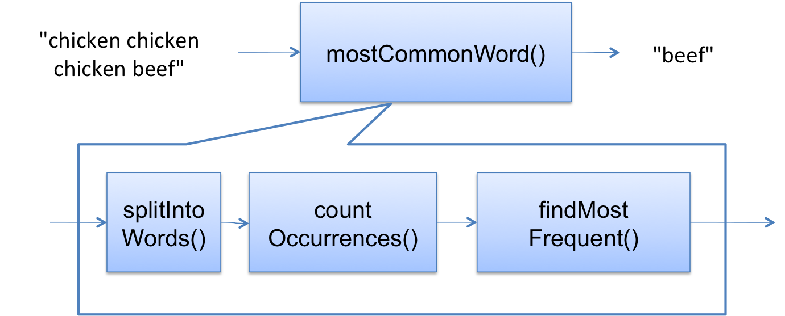

**本文内容来自[MIT_6.031_sp18: Software Construction](http://web.mit.edu/6.031/www/sp18/)课程的Readings部分，采用[CC BY-SA 4.0](http://creativecommons.org/licenses/by-sa/4.0/)协议。**

由于我们学校（哈工大）大二软件构造课程的大部分素材取自此，也是推荐的阅读材料之一，于是打算做一些翻译工作，自己学习的同时也能帮到一些懒得看英文的朋友。另外，该课程的阅读资料中有的练习题没有标准答案，所给出的“正确答案”为译者所写，有错误的地方还请指出。

*（更新：从第10章开始只翻译正确答案）*

<br />

------

<br />

译者：[李秋豪](http://www.cnblogs.com/liqiuhao/)

审校：

V1.0 Sun Apr 22 17:13:43 CST 2018

<br />

#### 本次课程的目标

今天的课程旨在告诉你如何系统的进行调试（systematic debugging）。

有时候你除了调试别无选择——特别是bug只在整合整个系统后才出现，或者是由用户使用后报告的（一般很难定位bug的位置）。对于这些情况，我们就可以使用系统的策略来提高调试的效率。

关于调试有一本很好的书： [*Why Programs Fail*](http://www.whyprogramsfail.com/toc.php)，本次阅读材料的很大部分素材都来自于它。

<br />

## 复现bug

首先我们要做的是找到一个小、能够重复产生bug/failure的测试用例。如果这个bug是在回归测试中发现的，那么很幸运，你已经有了这样的测试用例。但如果这个bug是由用户报告的，你可能需要一些努力才能复现它。特别是对于GUI和多线程程序，bug的产生可能依赖于事件的事件和线程的执行，其复现会变得很困难。

然而，你为找到测试用例所付出的努力都会是值得的，因为你在后面搜寻bug和修复bug的时候都会不断用到它。另外，当你成功修复bug后，应该将复现bug的测试用例添加到测试套件中进行回归测试，确保bug不会再次发生。当你有针对bug的测试用例后，让测试通过就变成了你的目标。

下面给出了一个例子。假设你写了这样一个方法：

```java
/**
 * Find the most common word in a string.
 * @param text string containing zero or more words, where a word
 *     is a string of alphanumeric characters bounded by nonalphanumerics.
 * @return a word that occurs maximally often in text, ignoring alphabetic case.
 */
public static String mostCommonWord(String text) {
    ...
}
```

一个用户将莎士比亚的戏剧作为输入调用了这个方法，比如说`mostCommonWord(allShakespearesPlaysConcatenated)`, 并且发现这个方法并没有像 `"the"` 或 `"a"` 这样的英语单词，而是返回了意料之外的`"e"`.

莎士比亚的戏剧有超过100000行的规模以及超过800000个单词的丰富度，所以这样的输入会让普通的调试变得非常困难，例如使用print或者断点来调试。所以我们的第一个工作就是减少输入的规模，同事确保程序会产生相同或相似的bug，这有很多思路：

- 只使用原输入的前一半，bug还会发生吗？（二分查找！这总是一个不错的主意）
- 戏剧中单行的输入会有同样的bug吗？
- 戏剧中单章的输入会有同样的bug吗？

一旦你找到了小的测试用例，接下来就使用这个测试用例来修复bug，然后用原输入再次测试，确保你修复了相同的bug。

#### 阅读小练习

**Reducing a bug to a test case**

假设用户报告说 `mostCommonWord("chicken chicken chicken beef")` 返回 `"beef"` 而非 `"chicken"`.

为了在调试前缩短和简化输入，以下哪一个输入是值得尝试的？

- [x] `mostCommonWord("chicken chicken beef")`

- [ ] `mostCommonWord("Chicken Chicken Chicken beef")`

- [ ] `mostCommonWord("chicken beef")`

- [ ] `mostCommonWord("a b c")`

- [x] `mostCommonWord("b b c")`

注意，选出所有可能的选项而不只是最简单的那个（因为最简单的测试用例可能不会复现bug！）

**Regression testing**

假设你将输入 `"chicken chicken chicken beef"` 简化为了 `"c c b"` （依然能够触发bug）。随后你利用这个测试修复了bug，然后观察到 `"c c b"` 和 `"chicken chicken chicken beef"` 都可以返回正确的答案。

现在你应该在测试用例套件中加上哪一个测试用例？

- [ ] `assertEquals("chicken", mostCommonWord("chicken chicken chicken beef"))`
- [x] `assertEquals("c", mostCommonWord("c c b"))`
- [ ] `assertEquals("c", mostCommonWord("c b"))`
- [ ] you shouldn’t change the test suite, because you haven’t changed the spec


<br />

## 用科学的方法发现bug

为了找到bug和它产生的原因，你可以使用以下方法：

1. **研究数据.** 通过推敲产生bug的测试用例，产生的错误结果，失败的断言检查及其对应的栈情况。
2. **提出假设.** 针对刚刚的研究提出假设：bug大概是在什么位置，不可能在什么位置，大概是什么原因。首先做一个大致的假设总是有帮助的。
3. **进行试验.** 针对你的假设进行试验。试验时记得对过程进行观察——例如放置“探针”收集数据（对系统的影响越小越好）。
4. **重复之前步骤.** 分析刚刚试验的数据，结合你已经知道和推理出来的结论，做出新的假设。这通常意味着你将bug的范围缩小或者产生的原因明确了。

上述的4个步骤并不一定对每一个bug都是需要的。如果你设计符合“快速失败”，那么bug很可能就在异常附近，栈踪迹也会帮助你很快发现错误的位置。那么什么时候需要使用上面提到的调试方法呢？一个不错的判断方法就是**“十分钟规则”。**如果你利用非系统的/ad-hoc（译者注：指临时决定的）手段调试超过10分钟，那么你就需要利用科学系统的方法重头开始调试了。

作为这种转变的一部分，你也需要将你的调试过程从脑袋中拿出来——它的“内存”很有限——并开始做笔记（纸上或者电脑上），内容包括：

- *假设.* 基于现在你知道到的，对bug的位置和原因提出假设。
- *试验.* 你将会怎么对假设进行试验。
- *预言.* 基于你的假设，试验的结果会是什么？
- *观察.* 试验的最终结果是什么。

这些笔记应该和你之前上过的科学课的笔记很像。在接下来的几节中，我们会介绍在调试代码时会用到的各种类型的假设、试验。

#### 阅读小练习

**Scientific method**

基于我们上面讲过的“科学调试方法”，判断以下各个陈述应该属于调试的哪一个阶段？

用户报告 `mostCommonWord("chicken chicken chicken beef")` 返回 `"beef"` 而不是 `"chicken"`. 

--> 研究数据

并不是造成错误的原因，真正应该在意的是它们出现的次数。

--> 提出假设

运行测试用例 `mostCommonWord("a a a b")`. 

--> 进行试验

<br />

## 1. 研究数据

栈踪迹（stack trace）是异常中很重要的一个信息，因为它们会告诉你关于bug位置和原因的各种信息。

在栈踪迹中，顶部是最近一次的调用，最早的调用在底部。有时候顶部的调用是你自己的代码，但是异常也可能是由你的代码调用的库函数抛出的，这时顶部的调用就不是你的代码了。与此相似，底部的调用即可能是你的 `main` 方法，也可能是最终调用你的方法的系统代码。

总之，你的代码（bug最可能发生的地方）经常会出现在栈踪迹的中间部分。

#### 阅读小练习

**Reading a stack trace**

假设你在运行Java程序后收到了一个异常，并得到了以下栈踪迹：

```java
java.lang.NullPointerException
  at java.util.Objects.requireNonNull(Objects.java:203)
  at java.util.AbstractSet.removeAll(AbstractSet.java:169)
  at turtle.TurtleSoup.drawPersonalArt(TurtleSoup.java:29)
  at turtle.TurtleSoupTest.testPersonalArt(TurtleSoupTest.java:39)
  at sun.reflect.NativeMethodAccessorImpl.invoke0(Native Method)
  at sun.reflect.NativeMethodAccessorImpl.invoke(NativeMethodAccessorImpl.java:62)
  at sun.reflect.DelegatingMethodAccessorImpl.invoke(DelegatingMethodAccessorImpl.java:43)
  at java.lang.reflect.Method.invoke(Method.java:498)
  at org.junit.runners.model.FrameworkMethod$1.runReflectiveCall(FrameworkMethod.java:50)
  at org.junit.internal.runners.model.ReflectiveCallable.run(ReflectiveCallable.java:12)
  at org.junit.runners.model.FrameworkMethod.invokeExplosively(FrameworkMethod.java:47)
  at org.junit.internal.runners.statements.InvokeMethod.evaluate(InvokeMethod.java:17)
  at org.junit.runners.ParentRunner.runLeaf(ParentRunner.java:325)
  at org.junit.runners.BlockJUnit4ClassRunner.runChild(BlockJUnit4ClassRunner.java:78)
  at org.junit.runners.BlockJUnit4ClassRunner.runChild(BlockJUnit4ClassRunner.java:57)
  at org.junit.runners.ParentRunner$3.run(ParentRunner.java:290)
  at org.junit.runners.ParentRunner$1.schedule(ParentRunner.java:71)
  at org.junit.runners.ParentRunner.runChildren(ParentRunner.java:288)
  at org.junit.runners.ParentRunner.access$000(ParentRunner.java:58)
  at org.junit.runners.ParentRunner$2.evaluate(ParentRunner.java:268)
  at org.junit.runners.ParentRunner.run(ParentRunner.java:363)
  at org.eclipse.jdt.internal.junit4.runner.JUnit4TestReference.run(JUnit4TestReference.java:86)
  at org.eclipse.jdt.internal.junit.runner.TestExecution.run(TestExecution.java:38)
  at org.eclipse.jdt.internal.junit.runner.RemoteTestRunner.runTests(RemoteTestRunner.java:459)
  at org.eclipse.jdt.internal.junit.runner.RemoteTestRunner.runTests(RemoteTestRunner.java:678)
  at org.eclipse.jdt.internal.junit.runner.RemoteTestRunner.run(RemoteTestRunner.java:382)
  at org.eclipse.jdt.internal.junit.runner.RemoteTestRunner.main(RemoteTestRunner.java:192)
```

**哪一行代码真正抛出了这个异常？**

文件名: Objects.java

行数: 203

**当异常被抛出时，你的代码所执行的最后一句是什么？**

文件名: TurtleSoup.java

行数: 29

**你的代码的入口点是什么？即你的代码被第一次调用是在哪里？**

方法名称: testPersonalArt

<br />

## 2. 提出假设

我们知道，异常抛出的地方并不一定是bug的起源位置，即有bug的代码可能会将错误结果传给正常代码，正常代码在执行后才会抛出异常。所以你的假设应该是针对bug的起源位置以及它产生的原因。

一个很有帮助的方法就是将你的程序想象成一个数据流，或者是一个算法的几个步骤。现在让我们思考一下 `mostCommonWord()` 这个例子（通过三个帮助方法明确了步骤）：

```java
/**
 * Find the most common word in a string.
 * ...
 */
public static String mostCommonWord(String text) {
    List<String> words = splitIntoWords(text);
    Map<String,Integer> frequencies = countOccurrences(words);
    String winner = findMostFrequent(frequencies);
    return winner;
}
```

`mostCommonWord()` 的数据流如下图所示：



假设我们在 `countOccurrences()`中得到了一个异常。那么我们可以在分析错误的时候将 `countOccurrences()`以后的数据流排除在外，例如我们没有必要去 `findMostFrequent()`中检查bug，因为异常以后的控制流在异常发生时还没有执行到。

基于已知的信息，我们可以逆序对错误的原因进行假设：

- bug在 `countOccurrences`之中：它的输入合法但是却抛出了异常。
- bug存在于 `splitIntoWords` 和 `countOccurrences`的连接中：这两个方法都遵守了契约，但前者的后置条件没有满足后者的前置条件，所以产生了bug。
- bug存在于 `splitIntoWords`中：它的输入合法但是却抛出了异常
- bug存在于 `mostCommonWord`的输入：即`text`未能满足这个方法的前置条件。 

应该从哪一个假设开始呢？调试是一个搜索的过程，所以你可以使用**二分查找**来加速这个过程——先将数据流对半分开，例如假设bug存在于第一个方法和第二个方法的连接中，然后利用下面会提到方法（例如打印状态、断点、断言）来对假设进行试验。最后通过试验的结果判断bug存在于前半部分还是后半部分。

### 切片

上面 `mostCommonWord()` 的数据流就是一个*切片（slicing）*的例子。它意思是说找到程序中计算出特定值的那个片段（slice）。当你的程序报错时——即程序计算出了一个错误的值，对应的片段就是那些（帮助）计算出错误的值的代码。bug就存在于这个片段之中，也就是你的搜索范围。

对于切片操作有自动化工具，不过它们还不是很有效。但是程序员也会自然的进行切片——在脑海里——对bug可能存在或不可能存在的地方做出假设。这对于程序审查是很有用的技巧，我们接下来就对它加深一下理解。

这里有一个例子。假设`x`是一个整型局部变量，它的值不应该为负。但是在某一个时候调试的print语句输出了错误的结果：

```java
int x = 0; // must be >= 0
...
System.out.println("x=" + x);  // prints a negative number
```

产生错误结果的片段会是哪一个呢？让我们对`...`部分做一下研究，找出合理的代码。

首先我们要找出直接对`x`赋值的语句：

```java
int x = 0; // must be >= 0
...
    x += bonus;
...
System.out.println("x=" + x);  // prints a negative number
```

由于 `bonus` 会对`x`的结果产生影响，所以和它相关的代码也应该在片段之中：

```java
int x = 0; // must be >= 0
final int bonus = getBonus();
...
    x += bonus;
...
System.out.println("x=" + x);  // prints a negative number
```

所以现在 `getBonus()` 也应该在片段之中，因为它负责计算 `bonus` 。

片段也应该包括能够影响已有片段的分支控制语句：

```java
int x = 0;
final int bonus = getBonus();
...
  if (isWorthABonus(s)) {
    x += bonus;
  }
...
System.out.println("x=" + x);  // prints a negative number
```

 `if` 语句控制了 `x += bonus` 是否会被执行，而这也让方法 `isWorthABonus()`成为了片段的一部分，而 `s` 又是该方法的参数，所以和`s`有关的语句也属于片段：

```java
int x = 0;
final int bonus = getBonus();
...
for (final Sale s : salesList) {
  ...
  if (isWorthABonus(s)) {
    x += bonus;
  }
  ...
}
...
System.out.println("x=" + x);  // prints a negative number
```

 `for` 不仅决定了`s`值，间接决定了 `x += bonus`是否会被执行，也影响了 `x += bonus`会被执行了次数。

现在，由于 `for` 语句使用到了 `salesList`，所以我们也应该将其包含到片段之中，我们发现 `salesList`是一个参数：

```java
int calculateTotalBonus(final List<Sale> salesList) {
  ...
  int x = 0;
  final int bonus = getBonus();
  ...
  for (final Sale s : salesList) {
    ...
    if (isWorthABonus(s)) {
      x += bonus;
    }
    ...
  }
  ...
  System.out.println("x=" + x);  // prints a negative number
  ...
}
```

我们可以继续深入，分析 `salesList` 是如何生成并传入的，但是现在先停下来。我们已经找到了这个方法内计算`x`语句的片段（代码）。接下来要做的就是研究这个片段中的代码并提出有用的假设：

-  `x+=bonus` 赋值语句：可能是由于 `bonus` 为负数，所以 `x+=bonus` 最终的结果为负了。这个假设也间接指明了 `getBonus()` 返回了负的结果。
- `if` 分支控制：可能 `isWorthABonus()` 返回太多次true，导致 `x` 的加法溢出，产生了负的结果。
-  `for` 循环语句：可能是这个循环的次数过多，最终导致 `x` 的加法溢出，产生了负的结果。
- 方法的参数：可能 `salesList`传入了一个不好的值，里面有太多的“sales”。

通过小心的切片操作（阅读代码），我们成功分析出了哪一些代码是可能存在bug的，哪一些是不会对bug产生贡献的。例如上面的 `...` 在查找bug时就可排除在外。

值得一提的是，我们的设计可以帮助（或者阻碍）我们进行切片。其中一个良好的设计就是使用不变性（immutability）。例如在上面对 `bonus`进行切片时，我们看到它的声明是`final int bonus = getBonus()`, 我们立即意识到这是一个不变索引指向的不变对象，所以我们也不用再寻找 `bonus`的代码片段了。这会大大节省我们的时间。不过，当我们看到 `final Sale s`时，虽然`s`的索引不可能改变，但是`Sale`是一个可变类型，所以我们依然要注意`s`的改造者的使用。

另一个良好的设计就是将作用域最小化。上面的例子中所有的变量都是局部变量，而且作用域都是最小的，所以我们的搜索范围也会跟着减少。相反，如果我们是用的实例成员，那么搜索范围将扩大到整个类，如果使用的是全局变量，那么搜索范围将扩大到整个程序。

#### 阅读小练习

**Slicing**

在以下代码中，哪些行属于 `tax` 对应的切片片段？

```java
double total = 0.0;
double tax = 0.0;
double taxRate = 0.06;
for (final Item item : items) {
  total += item.getPrice();
  if (isOutOfStateCustomer) {
    taxRate /= 2;
  }
  if (item.isTaxable()) {
    tax += item.getPrice() * taxRate;
  }
}
total += tax;
return total;
```

- [ ] `double total = 0.0;`

- [x] `double tax = 0.0;`

- [x] `double taxRate = 0.06;`

- [x] `for (final Item item : items) {`

- [ ] `total += item.getPrice();`

- [x] `if (isOutOfStateCustomer) {`

- [ ] `taxRate /= 2;`

- [x] `if (item.isTaxable()) {`

- [x] `tax += item.getPrice() * taxRate;`

- [ ] `total += tax;`

- [ ] `return total;`

**Slicing 2**

在以下代码中，哪些行属于 `a` 对应的切片片段？

```java
int[] incrementAll(int[] a) {
  int[] b = a;
  for (int i = 0; i < a.length; ++i) {
    ++b[i];
  }
  return b;
}
```

- [x] `int[] incrementAll(int[] a) {`

- [x] `int[] b = a;`

- [x] `for (int i = 0; i < a.length; ++i) {`

- [x] `++b[i];`

- [ ] `return b;`

*译者注：这里注意别名*

### Delta(Δ)调试法

这种调试方法主要是用到了测试用例之间的区别，即如果两个相似的测试用例测试后有不同的结果，那么bug很可能就是由它们的差别部分导致的。例如 `mostCommonWords("c c b")`测试工作正常，但是 `mostCommonWords("c c, b")` 却失败了，那么问题很可能就出在`c,`和`c`之间的差别上。

这种调试方法由于看重于成功与失败的差异，被称作 [*delta 调试*](https://en.wikipedia.org/wiki/Delta_Debugging) 。delta调试也有自动化的工作，不过现在还没有广泛的应用。

### 假设的优先级

当你在对bug的位置和原因提出假设时，心里应该有一个大致的构想，哪一个区域的产生bug的可能性大，哪一个区域可能性小。例如，对于已经被良好测试过并长期使用过的模块，我们就会认为它出现bug的可能性很低。Java的编译器，JVM，操作系统，Java库设置硬件都应该比你写的代码更加可信（译者注：当然你也可能是Linus这样的天才...），因为它们都经过大量的调试和测试。在没有好的理由前，你不应该怀疑这些（底层）的模块和平台。

#### 阅读小练习

**Priorities**

假设你正在调试 `quadraticRoots` 方法：

```java
/**
 * Solves quadratic equation ax^2 + bx + c = 0.
 * 
 * @param a quadratic coefficient, requires a != 0
 * @param b linear coefficient
 * @param c constant term
 * @return a list of the real roots of the equation
 */
public static List<Double> quadraticRoots(int a, int b, int c) { ... }
```

将下面的行为做一个优先级排序，即你应该先进行什么假设:

将 `ArrayList`替换为 `LinkedList`. --> 4

在方法中嵌入一些 `println()` 语句打印出计算过程的中间值 --> 3

写出能够使bug复现的测试用例 --> 1

使用覆盖率工具检查是否有测试没有覆盖到的代码 --> 2

<br />

## 3. 进行试验

你提出的假设应该有前置条件，例如“我认为`x`在这个时刻有一个不合法的值”或者“我认为这一行代码永远不会被执行”。而你的试验应该去测试这个前置条件是否被满足。最好的试验应该像“探针（probe）”一样，在最小化对系统的影响下观察系统的状态。

一个常见的探针就是**print语句。**它的一个优点就是几乎能在所有的编程语言中实现。缺点在于你必须记住在试验完成后去掉这些print。要注意的是，不要在多个print中输出同样或者没有描述性的语句，例如在很多位置都仅仅输出`hi!`，你很可能就会不知道到底是哪一个位置在输出，与此相反， `start of calculateTotalBonus`这样的输出就很有意义，也很清楚。

另一种常用的探针是**断言检查**，它会测试变量的值或者对象的内部状态。在上面的例子中，`x`不允许为负数，我们就可以插入 `assert(x >= 0);` 语句。断言的优点在于你不需要自己去检查状态，而且断言不会在调试和测试完成后残留在程序中。它的缺点在于Java默认是关闭断言的，所以有时间你会发现断言检查总是通过，其实是它们没有被执行。我们在之前的阅读中谈到过断言相关的问题。

第三种探针是调试器（debugger）中的**断点**，它会使程序在特定的地方停下来，并允许你进行单步执行或检查此时程序的各种状态。调试器是一种很强大的工具，你应该花一些时间去学习它。

#### 阅读小练习

**Probes**

下面是一个已经被调试过的程序，不过里面还残留了一些“探针”：

```java
/**
 * Convert from one currency to another.
 * @param fromCurrency currency that customer has (e.g. DOLLAR)
 * @param fromValue value of fromCurrency that customer has (e.g. $145.23)
 * @param toCurrency currency that customer wants (e.g. EURO).  
 *                   Must be different from fromCurrency.
 * @return value of toCurrency that customer will get,
 *         after applying the conversion rate and bank fee
 */
public static double convertCurrency(Currency fromCurrency, double fromValue, Currency toCurrency) {
  assert(fromCurrency != null && toCurrency != null);
  assert(! fromCurrency.equals(toCurrency));

  double rate = getConversionRate(fromCurrency, toCurrency);
  System.out.println("conversion rate is " + rate);

  double fee = getFee();
  assert(fee == 0.01); // right now the bank charges 1%

  return fromValue * rate * (1-fee);
}
```

 在提交（commit+push）代码之前，哪一些语句应该被移除？

- [ ] `assert(fromCurrency != null && toCurrency != null);`

- [ ] `assert(! fromCurrency.equals(toCurrency));`

- [ ] `double rate = getConversionRate(fromCurrency, toCurrency);`

- [x] `System.out.println("conversion rate is " + rate);`

- [ ] `double fee = getFee();`

- [x] `assert(fee == 0.01); // right now the bank charges 1%`

- [ ] `return fromValue * rate * (1-fee);`

**Using a debugger**

在这个练习中，你需要使用到Eclipse或其他IDE。

创建一个新的Java类Hailstone.java：

```java
import java.util.ArrayList;
import java.util.List;

public class Hailstone {
    public static List<Integer> hailstoneSequence(int n) {
        List<Integer> list = new ArrayList<Integer>();
        while (n != 1) {
            list.add(n);
            if (n % 2 == 0) {
                n = n / 2;
            } else {
                n = 3 * n + 1;
            }
        }
        list.add(n);
        return list;
    }

    public static void main(String[] args) {
        System.out.println("hailstoneSequence(5)=" + hailstoneSequence(5));
    }

}
```

在第8行 (`list.add(n)`) 设置断点，然后使用Run → Debug来运行调试器，程序应该在断点位置停下来，通过调试器检查相应的变量和程序状态回答以下问题：

**现在列表中有几个元素？** 

0

**现在使用单步执行 Step Over (Run → Step Over, 在工具栏上也有对应的按钮) 来执行第8行语句，现在列表中有几个元素？**

1

**现在继续单步执行直到（或者Run → Resume）再次遇到第8行 `list.add(n)` ，然后使用Run → Step Into，现在你所在的方法叫什么名字？**

Integer.valueOf()

**最后使用Step Return返回刚刚的调用位置，然后再次执行Step Into，现在你所在的方法叫什么名字？**

ArrayList.add()

### 交换内容

如果你假设bug存在的模块是可以更换的，例如有不同的实现类，那么你可以试着将其更换为另一种接口相同的模块，观察bug是否依然存在，例如：

- 如果你怀疑 `binarySearch()` 的实现，那么将其更换为一个更简单的 `linearSearch()`
- 如果你怀疑是t`java.util.ArrayList`的锅，将其换为 `java.util.LinkedList` 
- 如果你怀疑JVM（Java运行时），试着使用一个不同版本的Java
- 如果你怀疑是操作系统的锅，换一个操作系统试试。
- 如果你怀疑是硬件的锅，那么在另一台机器上试试

然而，你可能会在这种更换上浪费很多精力，正如前面所说，除非你有好的理由，不要首先怀疑这些经过大量测试或使用的模块和平台。

### 别急着修复

很多时候，程序员会试着在试验的过程中同时修复bug，而不仅仅是设置并观察探针。这中方法基本上都是错误的。首先，这会导致ad-hoc（译者注：指临时决定的）和猜想-测试编程。其次，你的修改通常仅仅“掩盖”了bug而不是修复了它——就好比你是在治疗症状而不是病理本身。

例如，如果你得到了 `ArrayOutOfBoundsException`异常，不要仅仅加上处理异常的语句（甚至忽略它），或者加上一个测试索引的语句。你应该弄清除异常发生的本质原因，已经它能否被完全避免。

#### 阅读小练习

**Premature Fixes**

下面这段代码已经调试了好一会儿了：

```java
/**
 * @return true if and only if word1 is an anagram of word2
 *         (i.e. a permutation of its characters)
 */
boolean isAnagram(String word1, String word2) {
  try {
    if (word1.equals("")) return word2.equals("");

    for (int i = 0; i < word1.length; ++i) {
      if (! word2.contains(word1.charAt(i))) return false;
    }

    if (! isAnagram(word2, word1)) return false;
    else if (word2.length() == word1.length()) return true;
    else return false;

  } catch (StackOverflowError e) { return true; }
}
```

以下六个选项中哪一些可能仅仅“掩盖”了bug而不是完全修复了它？

- [x] `if (word1.equals("")) return word2.equals("")`
- [ ] `if (! word2.contains(word1.charAt(i))) return false;`
- [ ] `if (! isAnagram(word2, word1)) return false;`
- [ ] `else if (word2.length() == word1.length()) return true;`
- [ ] `else return false;`
- [x] `catch (StackOverflowError e) { return true; }`

<br />

## 4. 重复之前步骤

在试验之后，思考并修改你的假设。如果你发现试验的结果和假设的前置条件相悖，那么就重新进行假设。如果符合前置条件，就重新设计假设，让它更有针对性，即能够将bug产生的位置范围进一步缩小。然后重复进行上述步骤。

**要注意的是，确保你的源代码和目标文件是最新的。**如果你的所有观察都显得不正常，一个可能的原因就是你正在运行的程序不是你现在的代码。这个时候需要删除所有编译好的文件然后重新编译（在Eclipse中是Project → Clean）。

<br />

## 修复bug

当你找到bug的位置并分析出它的本质原因后，接下来的步骤就是修复它。还是那句话，不要仅仅“掩盖”住bug，而是要问问自己这个bug到底是怎么产生的，它是一个代码拼写错误？还是参数设计错误，还是接口不一致导致的错误？

在修改bug时，也要考虑到bug本身是否和其他位置的代码或者位置的模块有关联，即修改代码会不会带来副作用。另外，也要想一想这种bug在别处是否存在（只是还没有出现）。

在修复完成后，记得在你的测试套件中添加上这个bug的测试用例（回归测试），然后重新进行测试，确保没有新的bug出现。

<br />

## 一些别的建议

**寻求别人的帮助.** 向别人解释你的设计通常都会帮助你理清思路，即使对方根本不知道你在说什么。这种方法被称为 [小黄鸭调试法](https://en.wikipedia.org/wiki/Rubber_duck_debugging) 或者泰迪熊调试法。即在计算机实验室里放一只巨大的泰迪熊，定下一条规则：当你试图告诉别人你的设计前，先“告诉”这只泰迪熊——令人惊讶的是，这只泰迪熊解决了很多问题。向别人称述你的代码设计将有助于你认识到问题所在。


**睡一觉.** 如果你太累的话，调试会变得没有效率，毕竟磨刀不误砍柴工（Trade latency for efficiency）。

<br />

## 总结

在这篇阅读中，我们学习了如何系统的进行调试：

- 构建测试用例复现bug，并将其添加到测试套件中
- 使用科学的方法发现bug：
  - 调试提出假设
  - 利用探针（print、assert、debugger）来观察程序的行为并测试假设的前置条件是否满足
- 彻底而非草率的修复bug

对于我们课程的三个目标，这篇阅读主要针对的是**远离bug**：我们试着剔除bug，并利用回归测试防止bug重新出现。