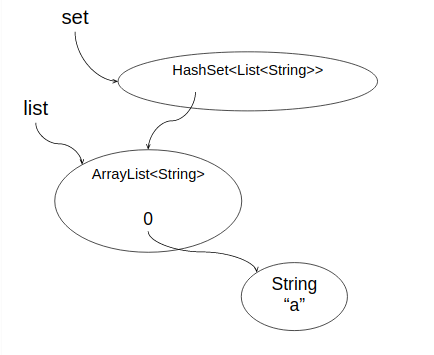
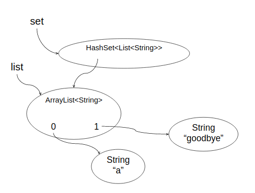

**本文内容来自[MIT_6.031_sp18: Software Construction](http://web.mit.edu/6.031/www/sp18/)课程的Readings部分，采用[CC BY-SA 4.0](http://creativecommons.org/licenses/by-sa/4.0/)协议。**

由于我们学校（哈工大）大二软件构造课程的大部分素材取自此，也是推荐的阅读材料之一，于是打算做一些翻译工作，自己学习的同时也能帮到一些懒得看英文的朋友。另外，该课程的阅读资料中有的练习题没有标准答案，所给出的“正确答案”为译者所写，有错误的地方还请指出。

*（更新：从第10章开始只翻译正确答案）*

<br />

------

<br />

译者：[李秋豪](http://www.cnblogs.com/liqiuhao/)

审校：

V1.0 Thu Apr 12 21:02:06 CST 2018

<br />

#### 本次课程的目标

- 理解分别通过抽象函数、等价关系以及观察定义的“相等”。
- 能够辨别索引相等和对象相等的不同。
- 能够辨别可变类型中的观察相等和行为相等的不同。
- 理解“对象契约”（Object contract）并能够正确地为可变/不可变类型设计相等操作。

<br />

## 介绍

在之前的阅读材料中，我们已经描述了抽象数据类型（ADT）是由它对应的操作而非内部表示决定的。而ADT中的抽象函数解释了该类型是如何将内部表示映射为使用者理解的抽象数据的，我们也看到了抽象函数决定了我们应该如何实现ADT的各个操作。

在这篇阅读中我们会聚焦于如何定义ADT的相等：抽象函数会给我们对相等操作一个清晰的定义。

在现实物理世界中，任何对象都是不相等的——在某些层次，即使是两片雪花也是不同的，即使这种不同只是在空间中的位置（严格一点的话，在原子层次不能这么说，不过对于现实生活中“大”的对象已经足够正确了）。所以任何物理对象都不会真正相等，它们只会在某一些方面相似。

但是对于人类语言，或者对于数学世界，你可以有很多完全相同的东西。例如有两个相等的表达式是很正常的，又例如√9 和 3表现了完全相同的数值。 

<br />

## 看待“相等”的三种方式

严格来说，我们可以从三个角度定义相等：

**抽象函数：**回忆一下抽象函数（AF: R → A ），它将具体的表示数据映射到了抽象的值。如果AF(a)=AF(b)，我们就说a和b相等。

**等价关系：**等价是指对于关系E ⊆ T x T ，它满足：

- 自反性: E(t,t) ∀ t ∈ T
- 对称性: E(t,u) ⇒ E(u,t)
- 传递性: E(t,u) ∧ E(u,v) ⇒ E(t,v)

我们说a等于b当且仅当E(a,b)。

以上两种角度/定义实际上是一样的，通过等价关系我们可以构建一个抽象函数（译者注：就是一个封闭的二元关系运算）；而抽象函数也能推出一个等价关系。

第三种判定抽象值相等的方法是从使用者/外部的角度去观察。

**观察：**我们说两个对象相等，当且仅当使用者无法观察到它们之间有不同，即每一个观察总会都会得到相同的结果。例如对于两个集合对象 {1,2} 和 {2,1}，我们就无法观察到不同：

- |{1,2}| = 2, |{2,1}| = 2
- 1 ∈ {1,2} is true, 1 ∈ {2,1} is true
- 2 ∈ {1,2} is true, 2 ∈ {2,1} is true
- 3 ∈ {1,2} is false, 3 ∈ {2,1} is false
- … 

从ADT来说，“观察”就意味着使用它的观察者/操作。所以我们也可以说两个对象相等当且仅当它们的所有观察操作都返回相同的结果。

这里要注意一点，**“观察者/操作”都必须是ADT的规格说明中规定好的。**Java允许使用者跨过抽象层次去观察对象的不同之处。例如`==`就能够判断两个变量是否是索引到同一个存储地方的，而 `System.identityHashCode()` 则是根据存储位置计算返回值的。但是这些操作都不是ADT规格说明中的操作，所以我们不能根据这些“观察”去判断两个对象是否相等。

### 例子: 时间跨度

这里有一个不可变ADT的例子：

```java
public class Duration {
    private final int mins;
    private final int secs;
    // Rep invariant:
    //    mins >= 0, secs >= 0
    // Abstraction function:
    //    AF(min, secs) = the span of time of mins minutes and secs seconds

    /** Make a duration lasting for m minutes and s seconds. */
    public Duration(int m, int s) {
        mins = m; secs = s;
    }
    /** @return length of this duration in seconds */
    public long getLength() {
        return mins*60 + secs;
    }
}
```

那么下面哪一些变量/对象应该被认为是相等的呢？

```java
Duration d1 = new Duration (1, 2);
Duration d2 = new Duration (1, 3);
Duration d3 = new Duration (0, 62);
Duration d4 = new Duration (1, 2);
```

试着分别从抽象函数、等价关系以及使用者观察这三个角度分析。

#### 阅读小练习

**Any second now**

思考上面的 `Duration` 以及变量 `d1`, `d2`, `d3`, `d4` ，从抽象函数或等价关系来看，哪一些选项和`d1`相等？

- [x] `d1`

- [ ] `d2`

- [x] `d3`

- [x] `d4`


**Eye on the clock**

从使用者观察的角度，哪一些选项和`d1`相等？

- [x] `d1`

- [ ] `d2`

- [x] `d3`

- [x] `d4`


<br />

## == vs. equals()

和很多其他语言一样，Java有两种判断相等的操作—— `==` 和 `equals()` 。

- `==`比较的是索引。更准确的说，它测试的是指向相等（referential equality）。如果两个索引指向同一块存储区域，那它们就是==的。对于我们之前提到过的快照图来说，`==`就意味着它们的箭头指向同一个对象。
- `equals()`操作比较的是对象的内容，换句话说，它测试的是对象值相等（object equality）。e在每一个ADT中，quals操作必须合理定义。

作为对比，这里列出来了几个语言中的相等操作：

|             | *referential equality* | *object equality* |
| ----------- | ---------------------- | ----------------- |
| Java        | `==`                   | `equals()`        |
| Objective C | `==`                   | `isEqual:`        |
| C#          | `==`                   | `Equals()`        |
| Python      | `is`                   | `==`              |
| Javascript  | `==`                   | n/a               |

注意到`==`在Java和Python中的意义正好相反，别被这个弄混了。

作为程序员，我们不能改变测试指向相等操作的意义。在Java中，`==`总是判断指向是否相等。但是当我们定义了一个新的ADT，我们就需要判断对于这个ADT来说对象值相等意味着什么，即如何判断对象值相等/如何实现`equals()` 操作。

<br />

## 不可变类型的相等

`equals()` 是在 `Object` 中定义的，它的（默认）实现方式如下： 

```java
public class Object {
    ...
    public boolean equals(Object that) {
        return this == that;
    }
}
```

可以看到， **`equals()` 在`Object`中的实现方法就是测试指向/索引相等。**对于不可变类型的对象来说，这几乎总是错的。所以你需要**覆盖(override) `equals()` 方法，将其替换为你的实现。**

我们来看一个例子，`Duration` 的相等操作：

```java
public class Duration {
    ...   
    // Problematic definition of equals()
    public boolean equals(Duration that) {
        return this.getLength() == that.getLength();        
    }
}
```

运行下面的测试代码：

```java
Duration d1 = new Duration (1, 2);
Duration d2 = new Duration (1, 2);
Object o2 = d2;
d1.equals(d2) → true
d1.equals(o2) → false
```

如下图所示，可以看到，虽然`d2`和`o2`最终指向的是同一个对象/存储区域，但是我们的 `equals()`却得到的不同的结果。


这是怎么回事呢？**事实上， `Duration` 只是重载(overloaded)了 `equals()` 方法，因为它的方法标识和`Object`中的不一样**，也就是说，这是 `Duration`中有两个 `equals()` 方法：一个是从 `Object`隐式继承下来的`equals(Object)` ，还有一个就是我们写的 `equals(Duration)`。

```java
public class Duration extends Object {
    // explicit method that we declared:
    public boolean equals(Duration that) {
        return this.getLength() == that.getLength();
    }
    // implicit method inherited from Object:
    public boolean equals(Object that) {
        return this == that;
    }
}
```

我们在之前的[“静态检查”](http://www.cnblogs.com/liqiuhao/p/8486545.html)阅读中已经说过重载了，回忆一下，编译器会在重载操作之间根据参数类型做出选择。例如，当你使用`/`操作符的时候，编译器会根据参数是ints还是floats选择整数除法或浮点数触发。同理，如果我们对`equals()`传入的是 `Duration` 索引，编译器就会选择`equals(Duration)` 这个操作。这样，相等性就变得不确定了。

这是一个很容易犯的错误，即因为方法标识的原因重载而不是覆盖了的方法。在Java中，你可以使用 [`@Override`](https://docs.oracle.com/javase/tutorial/java/annotations/predefined.html)来提示编译器你是要后面的方法覆盖父类中的方法，而编译器会自动检查这个方法是否和父类中的方法有着相同的标识（产生覆盖），否则编译器会报错。

现在我们更正 `Duration `的 `equals()` ：

```java
@Override
public boolean equals(Object that) {
    return that instanceof Duration && this.sameValue((Duration)that);
}

// returns true iff this and that represent the same abstract value
private boolean sameValue(Duration that) {
    return this.getLength() == that.getLength();
}
```

它首先测试了传入的`that`是 `Duration`（译者注：这里`that`还可以是 `Duration`的子类），然后调用`sameValue()` 去判断它们的值是否相等。表达式 `(Duration)that` 是一个类型转换操作，它告诉编译器你确信 `that`指向的是一个 `Duration`对象。

我们再次运行测试代码，结果正确：

```java
Duration d1 = new Duration(1, 2);
Duration d2 = new Duration(1, 2);
Object o2 = d2;
d1.equals(d2) → true
d1.equals(o2) → true
```

### instanceof

 [`instanceof` 操作符](https://docs.oracle.com/javase/tutorial/java/nutsandbolts/op2.html) 是用来测试一个实例是否属于特定的类型。 `instanceof` 是动态检查而非我们更喜欢的静态检查。普遍来说，在面向对象编程中使用 `instanceof` 是一个不好的选择。在本门课程中——在很多Java编程中也是这样——**除了实现相等操作，`instanceof`不能被使用。**这也包括其他在运行时确定对象类型的操作，例如 [`getClass`](http://docs.oracle.com/javase/8/docs/api/java/lang/Object.html#getClass--) 。

我们会在以后学习如何使用更安全、可改动的代码而不是 `instanceof`。

*译者注：关于在`equals()`中使用 [`getClass`](http://docs.oracle.com/javase/8/docs/api/java/lang/Object.html#getClass--) 还是 [`instanceof` 操作符](https://docs.oracle.com/javase/tutorial/java/nutsandbolts/op2.html)存在一些争议，焦点集中于使用 [`instanceof` 操作符](https://docs.oracle.com/javase/tutorial/java/nutsandbolts/op2.html)可能会影响相等的对称性（父子类）。《Java核心技术 卷一 第十版》的5.2.2节对此做了说明，读者可以参考一下。*

<br />

## 对象契约

由于`Object`的规格说明实在太重要了，我们有时也称它为“对象契约”（the Object Contract）。你可以在`object`类中找到这些规格说明。我们在这里主要研究`equals`的规格说明。当你在覆盖`equals`时，要记得遵守这些规定：

- `equals` 必须定义一个等价关系。即一个满足自反性、对称性和传递性关系。
- `equals` 必须是确定的。即连续重复的进行相等操作，结果应该相同。
- 对于不是null的索引`x`， `x.equals(null)` 应该返回false。
- 如果两个对象使用 `equals` 操作后结果为真，那么它们各自的`hashCode` 操作的结果也应该相同。

### 破坏等价关系

正如前面所说，`equals()`操作必须构建出一个满足自反性、对称性、传递性的等价关系。如果没有满足，那么与相等相关的操作（例如集合、搜索）将变得不可预测。例如你肯定不希望`a`等于`b`但是后来发现`b`不等于`a`，这都是非常隐秘的bug。

这里举出了一个例子，它试图将相等变得更复杂，结果导致了错误。假设我们希望在判断 `Duration` 相等的时候允许一些误差，因为不同的电脑同步的时间可能会有一小点不同：

```java
@Override
public boolean equals(Object that) {
    return that instanceof Duration && this.sameValue((Duration)that);
}

private static final int CLOCK_SKEW = 5; // seconds

// returns true iff this and that represent the same abstract value within a clock-skew tolerance
private boolean sameValue(Duration that) {
    return Math.abs(this.getLength() - that.getLength()) <= CLOCK_SKEW;
}
```

上面相等操作违背了等价关系里面的什么属性？

#### 阅读小练习

**Equals-ish**

思考上面提到的 `Duration` ：

```java
public class Duration {
    private final int mins;
    private final int secs;
    // Rep invariant:
    //    mins >= 0, secs >= 0
    // Abstraction function:
    //    AF(min, secs) = the span of time of mins minutes and secs seconds

    /** Make a duration lasting for m minutes and s seconds. */
    public Duration(int m, int s) {
        mins = m; secs = s;
    }
    /** @return length of this duration in seconds */
    public long getLength() {
        return mins*60 + secs;
    }

    @Override
    public boolean equals(Object that) {
        return that instanceof Duration && this.sameValue((Duration)that);
    }

    private static final int CLOCK_SKEW = 5; // seconds

    // returns true iff this and that represent the same abstract value within a clock-skew tolerance
    private boolean sameValue(Duration that) {
        return Math.abs(this.getLength() - that.getLength()) <= CLOCK_SKEW;
    }
}
```

假设下面这些 `Duration` 对象被创建：

```java
Duration d_0_60 = new Duration(0, 60);
Duration d_1_00 = new Duration(1, 0);
Duration d_0_57 = new Duration(0, 57);
Duration d_1_03 = new Duration(1, 3);
```

以下哪一些选项会返回真？

- [x] `d_0_60.equals(d_1_00)`

- [x] `d_1_00.equals(d_0_60)`

- [x] `d_1_00.equals(d_1_00)`

- [x] `d_0_57.equals(d_1_00)`

- [ ] `d_0_57.equals(d_1_03)`

- [x] `d_0_60.equals(d_1_03)`


**Skewed up**

上面相等操作违背了等价关系里面的什么属性？（忽略null索引）

- [ ] recursivity

- [ ] 自反性

- [ ] sensitivity

- [ ] 对称性

- [x] 传递性


**Buggy equality**

如果你想证明上面的`equals`违反了自反性，你需要创建几个对象？

- [ ] none

- [x] 1 object

- [ ] 2 objects

- [ ] 3 objects

- [ ] all the objects in the type


**Null, null, null**

和我们之前说过的不同，`equals`操作允许参数为`null`，这是因为`Object`的规格说明中提到了这种前置条件：

- 对于非null的 `x`, `x.equals(null)` 应该返回false

如果 `x.equals(null)` 返回true，`equals`将会违背等价的什么属性？

- [ ] recursivity

- [ ] 自反性

- [ ] sensitivity

- [x] 对称性

- [ ] 传递性

哪一行代码会让 `equals()` 在 `that` 是null时返回false？

```java
1 @Override
2 public boolean equals(Object that) {
3     return that instanceof Duration 
4            && this.sameValue((Duration)that);
  }

  // returns true iff this and that represent the same abstract value
5 private boolean sameValue(Duration that) {
6     return this.getLength() == that.getLength();
  }
```

--> 3

### 破坏哈希表

为了理解契约中有关`hashCode`的部分，你需要对哈希表的工作原理有一定的了解。两个常见的聚合类型 `HashSet` 和 `HashMap` 就用到了哈希表的数据结构，并且依赖`hashCode`保存集合中的对象以及产生合适的键（key）。

一个哈希表表示的是一种映射：从键值映射到值的抽象数据类型。哈希表提供了常数级别的查找，所以它通常比数或者列表的性能要好。键不一定是有序的，也不一定有什么特别的属性，除了类型必须提供 `equals` 和 `hashCode`两个方法。

哈希表是怎么工作的呢？它包含了一个初始化的数组，其大小是我们设计好的。当一个键值对准备插入时，我们通过hashcode计算这个键，产生一个索引，它在我们数组大小的范围内（例如取模运算）。最后我们将值插入到数组索引对应的位置。

哈希表的一个基本不变量就是键必须在hashcode规定的范围内。

Hashcode最好被设计为键计算后的索引应该平滑、均匀的分布在所有范围内。但是偶尔冲突也会发生，例如两个键计算出了同样的索引。因此哈希表通常存储的是一个键值对的列表而非一个单个的值，这通常被称为哈希桶（hash bucket）。而在Java中，键值对就是一个有着两个域的对象。当插入时，你只要像计算出的索引位置插入一个键值对。当查找时，你先根据键哈希出对应的索引，然后在索引对应的位置找到键值对列表，最后在这个列表中查找你的键。

现在你应该知道了为什么`Object`的规格说明要求相等的对象必须有同样的hashcode。如果两个相等的对象hashcode不同，那么它们在聚合类存储的时候位置也就不一样——如果你存入了一个对象，然后查找一个相等的对象，就可能在错误的索引处进行查找，也就会得到错误的结果。

`Object`默认的 `hashCode()` 实现和默认的 `equals()`保持一致：

```java
public class Object {
  ...
  public boolean equals(Object that) { return this == that; }
  public int hashCode() { return /* the memory address of this */; }
}
```

对于索引`a`和`b`，如果 `a == b`，那么a和b的存储地址也就相同，`hashCode()`的结果也就相同。所以`Object`的契约满足。

但是对于不可变对象来说，它们需要重新实现`hashCode()`。例如上面提到的 `Duration`，因为我们还没有覆盖默认的 `hashCode()` ，实际上打破了对象契约：

```java
Duration d1 = new Duration(1, 2);
Duration d2 = new Duration(1, 2);
d1.equals(d2) → true
d1.hashCode() → 2392
d2.hashCode() → 4823
```

`d1` 和 `d2` 是 `equals()`为真的，但是它们的hashcode不一样，所以我们需要修复它。

一个简单粗暴的解决办法就是让`hashCode`总是返回相同的常量，这样每一个对象的hashcode就都一样了。这样确实满足了对象契约，但是会给性能带来灾难性的后果，因为我们必须将每一个键值对都保存到相同的位置，而且查找会是线性遍历所有插入过的对象。

而一个普遍（更合理）的方法就是计算对象每一个内容的hashcode然后对它们进行一系列算术运算，最终返回一个综合hashcode。对于 `Duration`而言就更简单了，因为它只有一个整型内容：

```java
@Override
public int hashCode() {
    return (int) getLength();
}
```

更多有关于hashcode的细节，你可以参考Josh Bloch的书 *Effective Java*，他详细介绍了hashcode应该注意的问题和设计方法。另外[StackOverflow](http://stackoverflow.com/questions/113511/hash-code-implementation)上面也有关于这个的问答。在近些版本的Java中，你可以利用 [`Objects.hash()`](http://docs.oracle.com/javase/8/docs/api/java/util/Objects.html#hash-java.lang.Object...-) 方便的计算多个域的综合hashcode。

要注意的是，只要你满足了相等的对象产生相同的hashcode，不管你的hashcode是如何实现的，你的代码都会是正确的。哈希碰撞仅仅只会性能，而一个错误哈希方法则会带来错误！

最重要的是，如果你没有覆盖默认的`hashCode`，你就会继承`Object`中根据存储地址获得的`hashCode`。如果你又覆盖了`equals`，这就意味着你很大可能破坏了对象契约，所以一个通用准则就是：

> **当你覆盖`equals`后，将`hashCode`也覆盖**

在很多年前，一个本课程的学生花了几个小时找到了一个bug：他将 `hashCode` 拼成了 `hashcode`，也就是说他没有将默认的 `hashCode` 覆盖，最终奇怪的事情就发生了。所以记得使用 `@Override`！

#### 阅读小练习

**Give me the code**

思考下面这个ADT：

```java
class Person {
  private String firstName;
  private String lastName;
  ...

  @Override
  public boolean equals(Object that) {
      return that instanceof Person && this.sameValue(that);
  }

  // returns true iff this and that represent the same abstract value
  private boolean sameValue(Person that) {
      return this.lastName.toUpperCase().equals(that.lastName.toUpperCase());
  }

  public int hashCode() {
      // TODO
  }
}
```

`TODO` 的地方可以使用以下哪些选项，让 `hashCode()` 和 `equals()`保持一致？

- [x] `return 42;`
- [ ] `return firstName.toUpperCase();`
- [x] `return lastName.toUpperCase().hashCode();`
- [ ] `return firstName.hashCode() + lastName.hashCode();`


<br />

## 可变类型的相等

之前我们已经对不可变对象的相等性进行了讨论，那么可变类型对象会是怎样呢？

回忆之前我们对于相等的定义，即它们不能被使用者观察出来不同。而对于可变对象来说，它们多了一种新的可能：通过在观察前调用改造者，我们可以改变其内部的状态，从而观察出不同的结果。

所以让我们重新定义两种相等：

- **观察相等：**两个索引在不改变各自对象状态的前提下不能被区分。例如，只调用观察者、生产者、创建者。它测试的是这两个索引在当前程序状态下“看起来”相等。
- **行为相等：**两个所以在任何代码的情况下都不能被区分，即使有一个对象调用了改造者。它测试的是两个对象是否会在未来所有的状态下“行为”相等。

对于不可变对象，观察相等和行为相等是完全等价的，因为它们没有改造者改变对象内部的状态。

**对于可变对象，Java通常实现的是观察相等。**例如两个不同的 `List` 对象包含相同的序列元素，那么`equals()` 操作就会返回真。

但是使用观察相等会带来隐秘的bug，并且也会让我们很容易的破坏聚合类型的表示不变量。假设我们现在有一个 `List`，然后我们将其存入一个 `Set`：

```java
List<String> list = new ArrayList<>();
list.add("a");

Set<List<String>> set = new HashSet<List<String>>();
set.add(list);
```



我们可以检查这个集合是否包含我们存入的列表：

```java
set.contains(list) → true
```

但是如果我们修改这个存入的列表：

```java
list.add("goodbye");
```



它似乎就不在集合中了！

```java
set.contains(list) → false!
```

事实上，更糟糕的是：当我们（用迭代器）循环遍历这个集合时，我们依然会发现集合存在，但是`contains()` 还是说它不存在！

```java
for (List<String> l : set) { 
    set.contains(l) → false! 
}
```

如果一个集合的迭代器和`contains()`都互相冲突的时候，显然这个集合已经被破坏了。

发生了什么？我们知道 `List<String>` 是一个可变对象，而在Java对可变对象的实现中，改造操作通常都会影响 `equals()` 和 `hashCode()`的结果。所以列表第一次放入 `HashSet`的时候，它是存储在这时 `hashCode()` 对应的索引位置。但是后来列表发生了改变，计算 `hashCode()` 会得到不一样的结果，但是 `HashSet` 对此并不知道，所以我们调用`contains`时候就会找不到列表。

当 `equals()` 和 `hashCode()` 被改动影响的时候，我们就破坏了哈希表利用对象作为键的不变量。

下面是 `java.util.Set`规格说明中的一段话：

> 注意：当可变对象作为集合的元素时要特别小心。如果对象内容改变后会影响相等比较而且对象是集合的元素，那么集合的行为是不确定的。

不幸的是，Java库坚持它对可变类型的 `equals()` 的实现，即聚合类使用观察相等，不过也有一些可变类型（例如 `StringBuilder`）使用的是行为相等。

我们从上面的例子和分析可以知道**可变类型的equals()应该实现为行为相等。**这通常都意味着两个对象只有在是索引别名的时候`equals()`才会返回真。索引可变类型的 `equals()` 和 `hashCode()` 应该直接从 `Object`继承。

对于需要观察相等操作的可变类型（即当前状态下是否“看起来”一样），最好是设计一个新的操作，例如`similar()` 或 `sameValue()`. 它们的实现或许和上文中的私有方法 `sameValue()` 相似（但是是公有的）。不幸的是Java没有采取这种设计。

<br />

## equals() 和 hashCode()的总结

**对于不可变类型：**

- `equals()` 应该比较抽象值是否相等。这和 `equals()` 比较行为相等性是一样的。
- `hashCode()` 应该将抽象值映射为整数。

所以不可变类型应该同时覆盖 `equals()` 和 `hashCode()`.

**对于可变类型：**

- `equals()` 应该比较索引，就像 `==`一样。同样的，这也是比较行为相等性。
- `hashCode()` 应该将索引映射为整数。

所以可变类型不应该将 `equals()` 和 `hashCode()` 覆盖，而是直接继承 `Object`中的方法。Java没有为大多数聚合类遵守这一规定，这也许会导致上面看到的隐秘bug。

#### 阅读小练习

**Bag**

假设 `Bag<E>` 是一个可变聚合类型，它表示的是一个multiset（元素可以出现多次而且无序）。它的操作如下：

```java
/** make an empty bag */
public Bag<E>()

/** modify this bag by adding an occurrence of e, and return this bag */
public Bag<E> add(E e)

/** modify this bag by removing an occurrence of e (if any), and return this bag */
public Bag<E> remove(E e)

/** return number of times e occurs in this bag */
public int count(E e)
```

运行下面的代码：

```java
Bag<String> b1 = new Bag<>().add("a").add("b");
Bag<String> b2 = new Bag<>().add("a").add("b");
Bag<String> b3 = b1.remove("b");
Bag<String> b4 = new Bag<>().add("b").add("a"); // swap!
```

以下那些选项在运行过后为真？

- [x] `b1.count("a") == 1`

- [ ] `b1.count("b") == 1`

- [x] `b2.count("a") == 1`

- [x] `b2.count("b") == 1`

- [x] `b3.count("a") == 1`

- [ ] `b3.count("b") == 1`

- [x] `b4.count("a") == 1`

- [x] `b4.count("b") == 1`


**Bag behavior**

如果 `Bag` 实现的是行为相等，以下哪一些表达式为真？

- [ ] `b1.equals(b2)`

- [x] `b1.equals(b3)`

- [ ] `b1.equals(b4)`

- [ ] `b2.equals(b3)`

- [ ] `b2.equals(b4)`

- [x] `b3.equals(b1)`


**Bean bag**

如果 `Bag` 是Java API的一部分，即它可能实现的是观察相等，以下哪一些表达式为真？

- [ ] `b1.equals(b2)`

- [x] `b1.equals(b3)`

- [ ] `b1.equals(b4)`

- [ ] `b2.equals(b3)`

- [x] `b2.equals(b4)`

- [x] `b3.equals(b1)`


### 自动装箱(Autoboxing)与相等

我们之前提到过原始/基本类型和它们的对应的包装（对象）类型，例如`int`和`Integer`。包装类型的`equals()`比较的是两个对象的值：

```java
Integer x = new Integer(3);
Integer y = new Integer(3);
x.equals(y) → true
```

但是这里有一个隐秘的问题： `==` 被重载了。对于 `Integer`这样的类型， `==` 判断的是索引相等：

```java
x == y // returns false
```

但是对于基本类型 `int`, `==` 实现的是行为相等：

```java
(int)x == (int)y // returns true
```

所以你不能真正的将 `Integer` 和`int`互换。事实上Java会自动对 `int` 和`Integer`进行转换（这被称作自动装箱和拆箱 *autoboxing*  *autounboxing*），这也会导致bug，你应该意识到编译期发生的类型转换。思考下面的代码：

```java
Map<String, Integer> a = new HashMap(), b = new HashMap();
a.put("c", 130); // put ints into the map
b.put("c", 130);
a.get("c") == b.get("c") → ?? // what do we get out of the map?
```

#### 阅读小练习

**Boxes**

在上面的代码中：

表达式 `130`在编译期的类型是什么？

--> int

在 `a.put("c", 130)`执行后，Map中表示130的值会是什么类型？

--> Integer

`a.get("c")`在编译期中的类型是什么？

--> Integer

**Circles**

```java
Map<String, Integer> a = new HashMap<>(), b = new HashMap<>();
a.put("c", 130); // put ints into the map
b.put("c", 130);
```

画出上面代码执行后的快照图，在你的快照图中有几个 `HashMap` 对象？

--> 2

在你的快照图中有几个 `Integer` 对象？

--> 2

**Equals**

```java
Map<String, Integer> a = new HashMap<>(), b = new HashMap<>();
a.put("c", 130); // put ints into the map
b.put("c", 130);
```

在上面代码执行后， `a.get("c").equals(b.get("c"))` 会返回什么？

--> true

`a.get("c") == b.get("c")` 会返回什么？

--> false­

**Unboxes**

现在假设你将 `get()` 的结果存储在`int` 变量中：

```java
int i = a.get("c");
int j = b.get("c");
boolean isEqual = (i == j);
```

在上面代码执行后， `isEqual`的返回值是什么？

--> true

<br />

## 总结

- 相等应该满足等价关系（自反、对称、传递）。
- 相等和哈希必须互相一致，以便让使用哈希表的数据结构（例如 `HashSet` 和 `HashMap`）正常工作。
- 抽象函数是不可变类型相等的比较基础。
- 索引是可变类型相等的比较基础。这也是确保相等一致性和保护哈希表不变量的唯一方法。

相等是实现抽象数据类型中的一部分。现在我们将本文的知识点与我们的三个目标联系起来：

- **远离bug**. 正确的实现相等和哈希对于聚合类型的使用很重要（例如集合和映射），这也是写测试时很需要的。因为每一个对象都会继承`Object`中的实现，实现不可变类型时一定要覆盖它们。
- **易于理解**.使用者和其他程序员在阅读规格说明后会期望我们的ADT实现合理的相等操作。
- **可改动**. 为不可变类型正确实现的相等操作会把索引相等和抽象值相等分离，也对使用者隐藏对象是否进行了共享。为可变类型选择行为相等而非观察相等帮助我们避开了隐秘的bug。